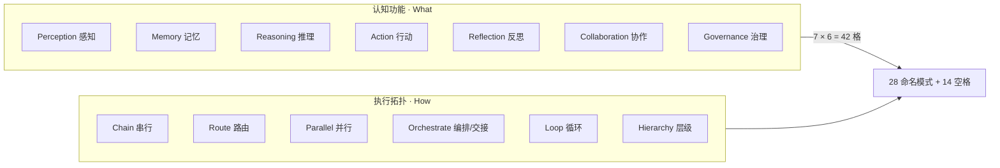

# Agent Design Patterns 项目深度分析

> 分析对象：[`huangjia2019/agent-design-patterns`](https://github.com/huangjia2019/agent-design-patterns)  
> 版本：`0.1.0`（`pyproject.toml`）  
> 论文：[`arXiv:2605.13850`](https://arxiv.org/abs/2605.13850)（Huang & Zhou, 2026）  
> 许可证：**MIT**  
> 仓库状态：约 **150★ / 17 forks**，创建于 2026-05，活跃更新至 2026-07  
> 分析日期：2026-07-10

---

## 1. 项目定位与愿景

### 1.1 一句话定位

**Agent Design Patterns 不是 Agent 运行时框架，而是一套「7×6 双轴坐标系 + 28 个命名模式」的设计词汇表——每个模式有坐标、有可跑的最小诚实实现、有从真实生产 harness 核对过的工程切片。**

### 1.2 核心哲学

| 原则 | 含义 |
|------|------|
| **坐标优先** | 平铺清单只回答「有哪些模式」；矩阵强制回答「问题落在哪一格、为何不在别处」 |
| **模型花钱，Harness 管账** | 设计 Agent = 在固定 token 预算下，对竞争的认知需求做约束分配 |
| **框架中立 / 模型无关** | 模式是策略层词汇；换 LangGraph / agno / OpenHands 不改矩阵 |
| **诚实小实现** | 每个 `pattern.py` 故意 50–250 行，带不变量测试；不是 toy，也不是框架 |
| **可核对的工程切片** | README 引用上游真实文件与行号（Claude Code、Aider、OpenHands、DeerFlow 等），引用漂移视为 bug |

### 1.3 它解决什么问题

现有主流资料几乎都只给**一条轴**：

| 来源 | 侧重 | 盲点 |
|------|------|------|
| Anthropic *Building Effective Agents* | 执行拓扑（6 种） | 同一 Orchestrator-Workers 可实现 Plan-and-Execute / Hierarchical Delegation / Observability Harness，失败模式完全不同 |
| Google ADK / LangChain multi-agent | 工作流 / 协调拓扑 | 缺认知功能轴 |
| Andrew Ng / 认知架构综述 | 反思、工具、规划、协作等能力 | 缺拓扑轴，无法区分「怎么布线」 |

**同一拓扑 ≠ 同一模式；同一认知功能可落在多种拓扑上。** 没有坐标系，就无法讨论「选错格子」——例如贷款 Agent 翻车往往是 Perception 预算把否决性文档挤掉，而不是「缺了 Reflection」。

### 1.4 生态位置

```txt
论文 arXiv:2605.13850     → 双轴框架、28 模式、五条选型定律
Manning *Designing AI Agents* → 工程化全书
极客时间《Agent 设计模式之美》 → 中文逐讲 + 工程切片
本仓库 agent-design-patterns → 独立模式 catalog（可跑代码）
companion: designing-ai-agents → Argus 案例按书章节演进
站点 adpsagent.com            → 模式白皮书 + 企业蓝皮书
```

**选用建议：**

| 你需要… | 用什么 |
|---------|--------|
| 生产 runtime / 状态图 / checkpoint | LangGraph、agno、DeerFlow、OpenHands… |
| 长周期 harness（规划、子代理、文件系统） | Deep Agents 等 |
| **设计语言：问题落在哪、该组合哪些模式** | **本仓库 + 论文 + 书** |
| 按书叙事看完整案例长大 | `huangjia2019/designing-ai-agents`（Argus） |

本仓库明确写着：**Not a framework. Not a flat catalog. Not toy code.**

---

## 2. 双轴框架（核心贡献）

### 2.1 两条正交轴



**认知功能（7）——Agent 在做什么：**

| ID | 类别 | 核心问题 |
|----|------|----------|
| C1 | Perception | 什么信息进入工作记忆？ |
| C2 | Memory | 如何存储、检索、更新知识？ |
| C3 | Reasoning | 如何审议与决策？ |
| C4 | Action | 如何通过工具作用于世界？ |
| C5 | Reflection | 如何评估并改进自身输出？ |
| C6 | Collaboration | 多 Agent 如何协同？ |
| C7 | Governance | 如何边界、观测、控制？ |

**执行拓扑（6）——Runtime 怎么布线：**

| ID | 拓扑 | 结构 |
|----|------|------|
| T1 | Chain | 线性流水线，n → n+1 |
| T2 | Route | 分类器条件分发 |
| T3 | Parallel | 扇出 + 聚合 |
| T4 | Orchestrate | 中心协调器委派并合成 |
| T5 | Loop | 带显式退出条件的迭代 |
| T6 | Hierarchy | 嵌套多级委派 |

论文设计原则：**正交性、完备性、耐久性**——类别描述的是跨框架/跨模型仍成立的结构需求与结构形态。

### 2.2 28 模式完整矩阵

> 拓扑列顺序与 README 表格一致（Chain / Parallel / Route / Loop / Orchestrate / Hierarchy）。  
> ★ = 论文中标注的原创命名。  
> 状态依据仓库树与 README 综合判断（见 §4）。

| 认知 \ 拓扑 | **Chain** | **Parallel** | **Route** | **Loop** | **Orchestrate** | **Hierarchy** |
|-------------|-----------|--------------|-----------|----------|-----------------|---------------|
| **Perceive** | Semantic Compaction ★ ✅ | Multi-Modal Fusion ✅ | Context Triage ★ ✅ | — | Progressive Discovery ★ ✅ | — |
| **Remember** | RAG Pipeline ✅ | — | Hierarchical Retention ★ ✅ | Failure Journal ★ ✅ | Progress Tracking ★ ✅ | — |
| **Reason** | Chain-of-Thought ✅ | Parallel Exploration ✅ | Complexity Routing ★ ✅ | Iterative Hypothesis ★ ✅ | — | — |
| **Act** | Prompt Chaining ✅ | — | Tool Dispatch ✅ | — | Plan-and-Execute ✅ | Guardrail Sandwich ★ ✅ |
| **Reflect** | Generator-Critic 🟡 | — | Skill Package ★ 🟡 | Self-Heal Loop ★ 🟡 | — | Experience Replay 🟡 |
| **Collaborate** | Handoff Chain ✅* | Fan-Out/Gather ✅* | — | Adversarial Review ✅* | — | Hierarchical Delegation ✅* |
| **Govern** | — | Progressive Commitment ★ 🟡 | Approval Gate ★ 🟡 | — | Observability Harness ★ 🟡 | Blast Radius ★ 🟡 |

\* Collaboration 四个模式：README 矩阵标 🟡，但仓库已有完整 `pattern.py` / `example.py` / `test_pattern.py` 以及 `langgraph/` + `claude-agent-sdk/` 教程，实现完备度实际高于矩阵标记。

**14 个空格**的含义（论文）：结构冗余、尚未在生产中结晶、或当前技术下的开放疆域（例如 Reflection × Parallel / Orchestrate——多 critic  ensemble 是假说中的演进方向）。

### 2.3 正交性论证（为何必须两轴）

**同一拓扑，不同认知功能（以 Loop 为例）：**

| 模式 | 坐标 | 循环在服务什么 |
|------|------|----------------|
| Failure Journal | Memory × Loop | 跨任务错误巩固 |
| Iterative Hypothesis | Reasoning × Loop | 假设–探测–修正 |
| Self-Heal Loop | Reflection × Loop | 直到外部验证器通过才停 |

控制结构都是 `while (!done)`，**认知意图完全不同**。

**同一认知功能，不同拓扑（以 Reasoning 为例）：**

| 模式 | 拓扑 | 代价特征 |
|------|------|----------|
| Chain-of-Thought | Chain | 最快、可能漏替代路径 |
| Complexity Routing | Route | 按难度分流，省算力 |
| Parallel Exploration | Parallel | 最贵、覆盖更全 |
| Iterative Hypothesis | Loop | 最慢、靠环境交互 |

**ReAct 为何不进矩阵：** 论文 v2 将 ReAct 式 reason-act 外环降级为 **framework preamble**——它是战术模式运行的基板，不是与 28 个战术模式平级的一格。类比：GoF 不会把「对象」列为第 24 个模式。

### 2.4 与既有框架的对比（论文 Table 4）

| 资源 | 认知轴 | 拓扑轴 | 模式数 | 框架中立 |
|------|--------|--------|--------|----------|
| Anthropic | 否 | 是 (6) | 6 | 是 |
| Google ADK | 否 | 是 (8) | 8 | 否 |
| LangChain multi-agent | 否 | 是 (4) | 4 | 否 |
| Andrew Ng | 是 (4) | 否 | 4 | 是 |
| Liu et al. 模式目录 | 否（扁平） | 否 | 18 | 是 |
| Dao et al. 系统论 | 是 (5) | 否 | 12 | 是 |
| **本工作** | **是 (7)** | **是 (6)** | **28** | **是** |

贡献不是发明单轴，而是 **系统组合为可寻址坐标系**。

---

## 3. 五条模式选型定律

论文在四个真实域（金融信贷、法务尽调、网络运维、急诊分诊）上应用六步选型法后，交叉归纳出五条经验律：

| 定律 | 内容 | 工程含义 |
|------|------|----------|
| **L1 时间压力决定架构复杂度** | 天级 → Hierarchy+Orchestrate(10+)；小时 → Orchestrate(7–8)；分钟 → Route+Loop(5–7)；秒级 → 仅 Chain(3–5) | 原型太慢时，先**删模式**，而不是先优化每个模式 |
| **L2 行动权限决定治理模式** | 仅建议 → Approval Gate；低风险自动 → Blast Radius；高风险不可逆 → Guardrail Sandwich；混合 → 分层治理 | 治理不是「加个人工确认」一刀切 |
| **L3 失败代价不对称重塑反思** | 对称代价 → 追求准确；极端不对称（急诊漏诊致命）→ Critic 有意偏向安全侧错误 | 同一 Generator-Critic，参数化不同 |
| **L4 体量决定协作需求** | 单件 → 无协作；中量 → Fan-Out；高量 → Hierarchy+Fan-Out；连续流 → Route+扩缩 | 协作模式是条件性的，不是默认栈 |
| **L5 同模式不同参数化** | 模板提供 HOW，域提供 WHAT/WHY | 模式是结构模板，不是行为处方 |

**跨域高频「基础模式」：** Context Triage、RAG Pipeline、Complexity Routing、Generator-Critic（出现在 ≥3 个案例）。  
**条件模式：** Blast Radius、Fan-Out/Gather——仅当自主行动权 / 大体量存在时触发。

### 六步选型法（论文）

```txt
Bound → Map → Topology → Select → Impact → Build
 约束    映射   选拓扑      选模式    影响评估   落地
```

仓库中 `composition/a-pattern-selection-card` 与 `b-six-step-methodology` 目前为占位 README，完整展开在书第 9 章 / 专栏 09-xx。

---

## 4. 仓库架构与代码形态

### 4.1 顶层结构

```txt
agent-design-patterns/
├── perception/          # C1  4 模式，均可跑
├── memory/              # C2  4 模式，均可跑
├── reasoning/           # C3  4 模式，均可跑
├── action/              # C4  4 模式，均可跑；2 个有 LangGraph+LangChain 教程
├── reflection/          # C5  4 模式，目前仅双语 README 占位
├── collaboration/       # C6  4 模式，pattern+test+双教程（LangGraph / Claude Agent SDK）
├── governance/          # C7  4 模式，目前仅双语 README 占位
├── composition/         # 选型卡 / 六步法 / Argus / checklist 基准（部分占位）
├── docs/                # 矩阵图、书籍/论文卡片渲染脚本
├── model_config.py      # 教程用共享 LLM 加载（默认 ernie:ernie-5.1）
├── nbtools.py           # 图可视化 show_graph 等
├── REFERENCE_IMPL.md    # LangGraph / LangChain 参考实现路线图与规范
├── pyproject.toml       # 核心 0 依赖；可选 langgraph / claude-agent-sdk / dev
└── .github/workflows/test.yml
```

### 4.2 单个模式文件夹的标准形状

```txt
<function>/<letter>-<pattern-name>/
  README.md / README.zh-CN.md   # Why + 失败模式 + 上游工程切片
  pattern.py                    # 最小诚实实现（50–250 行）
  example.py                    # 拟真场景，无 API key 可跑
  test_pattern.py               # 钉死不变量
  # 可选：
  shared.py                     # LangGraph / LangChain 共用工厂
  langgraph/tutorial.ipynb      # 显式 StateGraph
  langchain/tutorial.ipynb      # middleware / LCEL
  claude-agent-sdk/tutorial.*   # Claude Agent SDK 接线（协作行）
```

设计意图：**自包含、无中心插件系统**——读 README → 看 pattern → 跑 example → 读测试。

### 4.3 实现完备度（按树盘点）

| 区域 | 模式数 | pattern+example+test | 框架教程 | 备注 |
|------|--------|----------------------|----------|------|
| Perception | 4 | ✅ 全 | — | CI 跑全部 example |
| Memory | 4 | ✅ 全 | — | CI 跑全部 example |
| Reasoning | 4 | ✅ 全 | — | CI 跑全部 example |
| Action | 4 | ✅ 全 | Prompt Chaining、Guardrail Sandwich 的 LG+LC 双教程 | RI 最成熟 |
| Collaboration | 4 | ✅ 全 | 每模式 LangGraph + Claude Agent SDK | README 仍标 🟡，与代码不一致 |
| Reflection | 4 | ❌ 仅 README | — | 待专栏/书落地 |
| Governance | 4 | ❌ 仅 README | — | 待专栏/书落地 |
| Composition | 4 | 部分 | checklist 有 notebook + 脱敏案例 JSON | a/b/c 多为占位 |

**结论：** 矩阵「上半区」（Perceive → Act）+ Collaboration 已是可执行知识库；Reflection / Governance / 部分 Composition 仍是文档骨架，与「28 模式全书」叙事之间存在**交付落差**。

### 4.4 依赖与工程实践

| 项 | 内容 |
|----|------|
| Python | ≥ 3.11 |
| 核心依赖 | **无**（`dependencies = []`）——模式参考实现刻意零框架 |
| 可选 | `langgraph` extra（LangChain 1.x + LangGraph 1.x 等）、`claude-agent-sdk`、`dev`（pytest / nbmake / jupyter / ruff） |
| 测试 | pytest `--import-mode=importlib`（各目录同名 `test_pattern.py` 不冲突） |
| CI | Python 3.11 + 3.12；先跑 16 个 example，再 `pytest -v` |
| 包布局 | `packages = []`——**不发布可 import 的库**，是文档化代码仓 |

### 4.5 参考实现（REFERENCE_IMPL）双轨策略

对每个模式规划最多两套框架实现：

| 目录 | 框架 | 教学重点 |
|------|------|----------|
| `langgraph/` | StateGraph | 节点/边/条件路由可见，控制流透明 |
| `langchain/` | create_agent + middleware / LCEL | 代码更少，可见性更低 |

共用 `shared.py`（钩子/门闩工厂）+ 根级 `model_config.py` / `nbtools.py`。约定包括：fail-closed、mock 优先（`FakeListChatModel`）、避免 Mermaid 保留字作节点 id、双实现词汇对齐等。

**路线图进度：** Wave 1 中 Prompt Chaining 与 Guardrail Sandwich 已完成；Context Triage、Semantic Compaction、CoT、Generator-Critic 等仍 in progress / planned。

---

## 5. 代表模式深度拆解

以下挑六种覆盖不同认知行、且代码/论文信息充分的模式，说明「坐标 → 问题 → 最小机制 → 生产映射」。

### 5.1 Context Triage（Perception × Route）

**问题：** 任务启动时信息源过多，FIFO 截断与相关性无关，会把否决性证据挤出窗口。

**机制（`pattern.py`）：**

- 四级优先级 `CRITICAL / IMPORTANT / SUPPORTING / DEFERRABLE`（P0–P3）
- 排序：优先级 ↓ → 错误栈 boost → 内容长度
- DEFERRABLE 永不预加载，只 deferred（工具按需拉取）
- **错误轨迹是不变量**：即使超预算也强制选中
- 每次 triage 产出 `TriageDecision` 审计轨迹

**不变量测试示例：** P3 必 deferred；error 在预算耗尽时仍保留；`tokens_used` 在无 error 时不超过 budget。

**上游切片：** Aider RepoMap、Claude Code 记忆层级、DeerFlow schema 化分诊。

### 5.2 Failure Journals（Memory × Loop）

**问题：** 多数 harness 只做「本回合 try-catch 重试」，失败随会话消失，两周后同项目再犯。

**机制：** Detection → Classification → Recording → Recall 四段：

- 10 类 `FailureCategory`（压缩 Hermes 13 种 FailoverReason + 三 agent 时代类别：`SEMANTIC_DRIFT` / `BOUNDARY_LEAK` / `INDEX_LAG`）
- 结构化 `FailureEntry`（非自由文本日志）
- `recall_for_task`：相似度召回 + **高风险类强制并入**
- `render_for_prompt`：Contextual Experience Replay 式注入
- 分层淘汰：高风险 / 被召回过 / 近期 优先保留

**论点：** 只记录不召回 = 可观测性；召回才把日记变成经验。

### 5.3 Complexity Routing（Reasoning × Route）

**问题：** 简单查询烧 64K thinking、复杂诊断却走启发式——成本和错误双杀。

**论文解法：** 轻量分类器路由到不同推理深度（System 1 / CoT / 扩展审议），对偶 Kahneman 双系统；引用 RouteLLM 量级的成本下降。

**生产映射：** Claude Code `FallbackTriggeredError`、Hermes 多档 `ReasoningEffort`、Aider weak-model。

### 5.4 Guardrail Sandwich（Action × Hierarchy）

**问题：** 破坏性工具调用若无 pre/post 程序化检查，会出现错账、错转等不可逆事故（README 用银行错转叙事）。

**机制：**

```txt
pre-hooks (可 BLOCK) → tool → post-hooks (可 mark rollback)
```

- 唯一入口 `GuardrailSandwich.run`——关闭 composition bypass
- 钩子 crash → **fail-closed**
- `blocks=False` 影子模式：BLOCK 降级为 WARN（监控 → 软执行 → 全量）
- 工厂：金额阈值、blocklist、输出 schema、PII 扫描

**命名失败模式：** Composition bypass / Sandwich overhead tax / Schema drift。

**上游：** Claude Code Hooks（PreToolUse 可拦）、OWASP Agentic Top 10、NeMo / GuardrailsAI / Guidance。

### 5.5 Hierarchical Delegation（Collaboration × Hierarchy）

**问题：** 任务过大时单 Agent 上下文爆炸；需要 supervisor 拆批、隔离 worker、只看结构化产物。

**机制（委托三件套）：**

| 组件 | 含义 |
|------|------|
| **Spec** `WorkerSpec` | 目标、输出形状、工具白名单、边界（不做什么） |
| **Budget** Artifact | Worker 只返回 schema 化结果，原始轨迹不进 supervisor |
| **Gate** `SafetyBoundary` | 金额/置信度/异常确定性验收，不靠 prompt |

**铁律 Manager-Never-Executes：** supervisor 只分解 / 分发 / 合成 / 门闩；worker 互不通信；单 worker 异常降级为 FAILURE artifact，不炸整环。

**教程双轨：** 同一 `dispatch` 缝可插 LangGraph 或 Claude Agent SDK。

### 5.6 Approval Gate & Blast Radius（Governance 行，论文级）

虽仓库多为占位，论文定义完整，工程上极关键：

| 模式 | 坐标 | 要点 |
|------|------|------|
| Approval Gate | Govern × Route | Deny → Allow → Human 三级路由；按可逆性 × 影响分类；防审批疲劳 |
| Blast Radius | Govern × Hierarchy | 进程沙箱 → FS → 网络 → API 限额 → 预算上限嵌套；Codex full-auto 的前提是沙箱有界损害 |

与 L2 定律直接对应：权限模型选错，治理模式整行错位。

---

## 6. 工程切片网络：从哪些生产系统「蒸馏」

框架追踪的 harness 族谱（README）：

**Claude Code · Codex CLI · Aider · OpenCode · OpenClaw · Hermes Agent · DeepAgents · DeerFlow · OpenHands**（以及 Manus 等工程博文）

| 模式簇 | 典型上游证据类型 |
|--------|------------------|
| Perception | RepoMap 相关度排序、condenser 配置、CLAUDE.md 层级、schema triage |
| Memory | 四层记忆、TodoWrite 三字段、DeepAgents TodoListMiddleware、失败分类枚举 |
| Reasoning | thinking 铁律、ReasoningEffort 档位、Self-Consistency / ToT 论文 |
| Action | Tool schema 字段、architect_coder 规划分离、Hooks 生命周期、execpolicy |
| 横向 | OWASP Agentic、Anthropic Building Effective Agents / multi-agent research |

**质量承诺：** 引用为「落稿时核对」的 file:line；漂移开 issue——这在模式仓库里少见，把文档当作可测试契约。

---

## 7. 与本仓库 `analysis/` 中其他项目的关系

| 项目 | 关系 |
|------|------|
| **LangGraph** | 本仓 RI 的一等图运行时；模式是「在图上怎么画」，不是替代图 |
| **Deep Agents** | Progress Tracking 等直接引用其 TodoListMiddleware；Deep Agents 是 opinionated harness，本仓是 harness 之上的设计词汇 |
| **agno / OpenHands / DeerFlow** | README 明确列为生产 runtime 选项；本仓从中抽切片而非 reimplement |
| **Paseo / Omnigent / Clowder 等 L2–L4** | 多实例、控制面、协作平台——可各自在矩阵不同格子落子（Handoff、Fan-out、Approval、Observability…） |

建议读法：

```txt
先用本仓矩阵定位问题坐标
  → 用五条定律剪裁模式集合
    → 在 LangGraph / Deep Agents / 自研 harness 上实现
      → 用 Guardrail / Approval / Blast Radius 封治理
```

---

## 8. 优势、局限与风险

### 8.1 优势

1. **真正可寻址的分类学**：比扁平 18 模式目录更能解释「同拓扑不同失败模式」。  
2. **零依赖可跑核心**：教学与内化成本低，不绑架运行时选型。  
3. **工程切片可审计**：对齐 Claude Code / Aider 等真实 harness，可信度高于纯论文伪代码。  
4. **选型定律可操作**：L1–L5 可直接用于架构评审 checklist。  
5. **双语文档 + 书/专栏/站点闭环**：中文工程社区友好。  
6. **RI 规范清晰**（REFERENCE_IMPL）：LangGraph 可见 vs LangChain 简写的教学对照有价值。

### 8.2 局限

1. **交付不齐**：Reflection / Governance 代码行基本空白；Composition 方法论仍占位；与「28 模式」品牌存在缺口。  
2. **矩阵标记滞后**：Collaboration 已实现却仍 🟡。  
3. **非完美正交**（论文自承）：Governance 天然偏 Route/Hierarchy；28/42 填充不均匀。  
4. **粒度主观**：Generator-Critic vs Self-Heal 的 Chain/Loop 划分、是否合并 CoT 与 Prompt Chaining 等——合理但可争议。  
5. **参考实现进度慢**：仅 2/28 完成双框架 notebook；默认模型偏国产 AI Studio，海外读者需改 `.env`。  
6. **不是性能基准**：不提供 latency/cost 自动 benchmark，定律来自案例归纳而非大规模实验。  
7. **时限性**：推理模型内化 CoT 后，部分模式会「沉入模型」，架构焦点可能转向预算路由——坐标可存、单元格内涵会变。

### 8.3 使用风险

- 把本仓当「可 pip install 的 agent 库」会失望——`packages = []`。  
- 机械地把 28 格全塞进一个系统（违反 L1）。  
- 只抄 `pattern.py` 而不读失败模式与工程切片，容易丢掉「为何在此坐标」。

---

## 9. 软件工程史定位（论文 §7.2）

| 代际 | 代表 | 系统假设 | 组织方式 |
|------|------|----------|----------|
| 1. OO 模式 (1994) | GoF | 确定性对象组合 | 创建/结构/行为 |
| 2. 企业/集成模式 (2000s) | Fowler / EIP | 分布式集成 | 分层与通信风格 |
| 3. **Agent 模式 (2024–)** | 本框架 | **概率执行、运行时选工具、多 Agent** | **认知功能 × 执行拓扑** |

每一代都在回应「系统假设」的断裂；Agent 模式回应的是非确定性与工具/协作成为一等公民。

---

## 10. 快速上手（摘自仓库）

```bash
git clone https://github.com/huangjia2019/agent-design-patterns.git
cd agent-design-patterns
python -m venv .venv && source .venv/bin/activate
pip install -e ".[dev]"

# 无 key 可跑
python perception/a-context-triage/example.py
python action/d-guardrail-sandwich/example.py
python collaboration/a-hierarchical-delegation/example.py

pytest -v

# 可选：LangGraph 教程
pip install -e ".[langgraph]"
# cp .env.example .env  # 仅 Real LLM 单元需要
uv run jupyter lab   # 或按 REFERENCE_IMPL.md
```

模式文档站：https://adpsagent.com/zh/patterns/  
论文：https://arxiv.org/abs/2605.13850  

---

## 11. 总结与实践建议

### 11.1 本质判断

**Agent Design Patterns = Agent 时代的「可坐标化 GoF」：**

- 论文给出分类学与选型定律  
- 本仓给出可执行、可测试、可引用的模式单元  
- 书与专栏负责叙事与完整案例（Argus）

它**不**与 Deep Agents / LangGraph 竞争，而是填补「为什么这样构图」的语言层。

### 11.2 何时值得引入

| 场景 | 建议 |
|------|------|
| 架构评审「我们到底在解决哪类失败」 | 强制给问题打 (C×T) 坐标 |
| 多团队共享 agent 术语 | 用 28 名 + 矩阵代替口号式 Multi-Agent/ReAct |
| 从 Claude Code 等学工程化 | 按模式 README 的上游切片对照 |
| 需要立刻跑生产服务 | 另选 runtime；本仓只提供模式与测试契约 |

### 11.3 可执行下一步（对本 monorepo / 团队）

1. 用五条定律做一次现有 Agent（若有）的模式审计：时间预算、行动权限、失败不对称、体量、参数化。  
2. 优先内化已实现且高频的基础模式：Context Triage、Failure Journals、Complexity Routing、Guardrail Sandwich、Hierarchical Delegation。  
3. 跟踪 Reflection / Governance 代码落地与 REFERENCE_IMPL Wave 进度。

---

## 12. 关键链接

| 资源 | URL |
|------|-----|
| GitHub | https://github.com/huangjia2019/agent-design-patterns |
| 论文 | https://arxiv.org/abs/2605.13850 |
| 模式文档 | https://adpsagent.com/zh/patterns/ |
| 企业案例 | https://adpsagent.com/zh/cases/ |
| Manning 书 | Designing AI Agents（README 内 hub 链接） |
| Argus 配套仓 | https://github.com/huangjia2019/designing-ai-agents |
| Newsletter | https://agentpatterns.substack.com |
| 作者 | https://kage-ai.com |

---

*本分析基于仓库 README（中/英）、`REFERENCE_IMPL.md`、`pyproject.toml`、全量文件树、代表性 `pattern.py`/`test_pattern.py`、以及 arXiv:2605.13850 HTML 全文；未完整逐文件审阅全部 28 模式 README 与全部 notebook 输出。*
