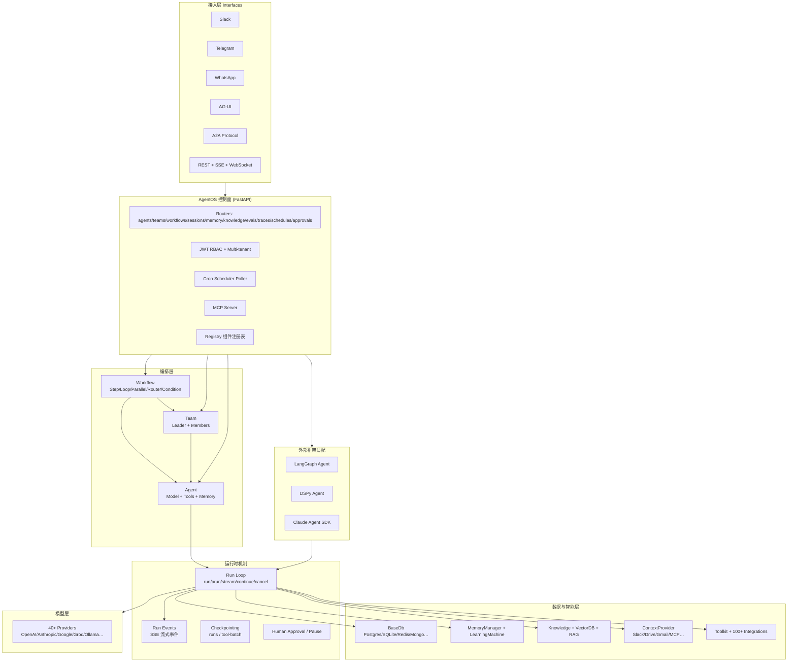

# Agno 项目深度分析

> 分析对象：`reference/agno`（agno-agi/agno 参考克隆）  
> 分析日期：2026-07-06  
> 版本：**2.6.22** | 许可：**Apache 2.0**

---

## 1. 项目定位与愿景

### 一句话

**Agno = 用于构建、运行和管理 Agent 平台的 Python SDK——让你拥有完整的 Agent 技术栈（数据、上下文、工具、权限、记忆、人工审核），并在自有云上以生产服务形态部署。**

### 核心哲学

| 原则 | 含义 |
|------|------|
| **Own your stack** | 数据、会话、记忆、追踪落在自有数据库，不绑定托管 SaaS |
| **三层抽象** | `Agent`（原子）→ `Team`（协作）→ `Workflow`（流程）→ `AgentOS`（控制面） |
| **Framework-agnostic** | 原生 Agno Agent 之外，可接入 LangGraph、DSPy、Claude Agent SDK 等外部框架 |
| **Production-first** | 不止 demo：50+ API、RBAC、调度、HITL、OpenTelemetry、多通道接口 |
| **The programming language for agentic software** | 用 Python 类/dataclass 声明式定义 Agent 行为，cookbook 驱动学习 |

README 强调：Build agents → Run as production services → Manage via control plane。

---

## 2. 整体架构

### 2.1 架构图（Mermaid）



### 2.2 仓库结构

```
agno/
├── libs/
│   ├── agno/              # 核心 SDK（~888 个 .py 文件）
│   │   └── agno/
│   │       ├── agent/     # 单 Agent 定义与 run loop
│   │       ├── team/      # 多 Agent 团队
│   │       ├── workflow/  # 工作流编排
│   │       ├── os/        # AgentOS (FastAPI 控制面)
│   │       ├── run/       # 运行上下文、事件、取消
│   │       ├── session/   # 会话持久化模型
│   │       ├── db/        # 存储抽象 + 多后端
│   │       ├── memory/    # 用户记忆管理
│   │       ├── learn/     # LearningMachine 统一学习
│   │       ├── knowledge/ # RAG 知识库
│   │       ├── context/   # 实时上下文提供者
│   │       ├── tools/     # 工具系统 + 100+ toolkit
│   │       ├── models/    # LLM 提供商抽象
│   │       ├── agents/    # 外部框架适配器
│   │       ├── remote/    # 远程 Agent/Team/Workflow
│   │       ├── registry/  # 组件注册与反序列化
│   │       ├── scheduler/ # 定时任务
│   │       ├── tracing/   # OpenTelemetry
│   │       ├── skills/    # Agent Skills（类 MCP skills）
│   │       └── ...
│   └── agno_infra/        # 基础设施 CLI（Docker/AWS 部署）
├── cookbook/              # ~2108 个示例 .py
│   ├── 02_agents/
│   ├── 03_teams/
│   ├── 04_workflows/
│   ├── 05_agent_os/
│   └── ...
└── scripts/               # 开发/测试脚本
```

### 2.3 分层职责

| 层 | 模块 | 职责 |
|----|------|------|
| **L0 执行** | `agent/`, `models/`, `tools/` | 单 Agent 与 LLM 交互、工具调用 |
| **L1 协作** | `team/` | Leader 协调多 Member（可嵌套 Team） |
| **L2 流程** | `workflow/` | 确定性/半确定性流水线（Step/Loop/Parallel） |
| **L3 平台** | `os/` | HTTP API、认证、调度、UI 协议、多通道 |
| **L4 数据** | `db/`, `memory/`, `learn/`, `knowledge/` | 持久化、记忆、学习、RAG |

---

## 3. 核心概念与数据模型

### 3.1 三大编排原语

```text
Agent  ──► 原子智能体（model + tools + memory + knowledge）
Team   ──► Leader Agent + members: List[Agent | Team]
Workflow ──► steps: List[Step | Steps | Loop | Parallel | Condition | Router | Workflow]
```

### 3.2 Agent（`agno.agent.Agent`）

`@dataclass` 巨型配置对象，核心字段：

| 类别 | 关键字段 |
|------|----------|
| 模型 | `model`, `fallback_models`, `fallback_config` |
| 会话 | `session_id`, `session_state`, `db`, `checkpoint` |
| 记忆 | `memory_manager`, `enable_agentic_memory`, `update_memory_on_run` |
| 知识 | `knowledge`, `knowledge_filters`, `add_knowledge_to_context` |
| 工具 | `tools`, `tool_call_limit`, `tool_choice`, `tool_hooks` |
| 钩子 | `pre_hooks`, `post_hooks`（Guardrail/Eval 可嵌入） |
| 推理 | `reasoning`, `reasoning_model`, `reasoning_tools` |
| 学习 | `learning` → `LearningMachine` |
| 技能 | `skills` → `Skills` |

### 3.3 Team（`agno.team.Team`）

| 字段 | 说明 |
|------|------|
| `members` | `Agent` 或嵌套 `Team` |
| `mode` | `TeamMode`: coordinate / route / broadcast / tasks |
| `model` | Team Leader 使用的模型 |
| `share_member_interactions` | 成员间是否共享本轮交互 |
| `add_team_history_to_members` | 是否向成员注入团队级历史 |
| `max_iterations` | `tasks` 模式下的自主循环上限 |

**TeamMode 语义：**

| 模式 | 行为 |
|------|------|
| `coordinate` | 默认 Supervisor：Leader 选人、派活、综合结果 |
| `route` | 路由器：选一个专家，直接返回其输出 |
| `broadcast` | 广播：同时派给所有成员，再综合 |
| `tasks` | 任务自治：分解任务列表，`execute_task` / `execute_tasks_parallel` 循环执行 |

### 3.4 Workflow（`agno.workflow.Workflow`）

组合原语：

| 类型 | 用途 |
|------|------|
| `Step` | 单步：Agent / Team / 函数 |
| `Steps` | 顺序步骤组 |
| `Parallel` | 并行执行 |
| `Loop` | 循环（支持迭代审核 HITL） |
| `Condition` | 条件分支 |
| `Router` | 动态路由 |
| `HumanReview` | 确认、用户输入、输出审核、超时策略 |

### 3.5 运行时会话模型

```text
RunContext
  ├── run_id, session_id, user_id
  ├── workflow_id, dependencies, session_state
  ├── messages（工具 hook 可读）
  └── tools, knowledge, members（运行时解析）

AgentSession / TeamSession / WorkflowSession
  ├── session_id, runs: List[RunOutput]
  ├── session_data（state, media）
  ├── summary: SessionSummary
  └── created_at / updated_at
```

### 3.6 数据库 Schema（`BaseDb`）

统一表族（可自定义表名）：

- `agno_sessions` — 会话
- `agno_memories` — 用户记忆
- `agno_learnings` — 学习记录
- `agno_knowledge` — 知识条目
- `agno_traces` / `agno_spans` — 追踪
- `agno_components` — Agent/Team/Workflow 组件序列化
- `agno_schedules` — 定时任务
- `agno_approvals` — 人工审批

### 3.7 Registry

管理不可序列化对象（tools、models、dbs、agents、teams），支持 Workflow 从 DB 反序列化后 **rehydrate** 运行时依赖。

---

## 4. 关键技术机制

### 4.1 Agent Run Loop（`agent/_run.py`）

标准 16 步流水线（源码注释）：

```text
1.  Read/create session
2.  Update metadata & session state
3.  Resolve dependencies
4.  Execute pre-hooks
5.  Determine tools for model
6.  Prepare run messages
7.  Start memory creation (background)
8.  Reasoning (if enabled)
9.  Generate model response (+ tool calls loop)
10. Update RunOutput
11. Store media
12. Structured output conversion
13. Execute post-hooks
14. Wait for memory/learning futures
15. Create session summary
16. Cleanup & persist
```

**能力扩展：**

- `run()` / `arun()` — 同步/异步
- `stream=True` — SSE 事件流（`RunStartedEvent`, `ToolCallStartedEvent`, `RunCompletedEvent`…）
- `continue_run()` — 从 checkpoint 恢复（time travel / fork）
- `cancel_run()` — 协作式取消
- `checkpoint`: `runs` | `tool-batch` | `tools`（3.0 预留）

### 4.2 工具系统

```python
# 三层 API
@tool decorator  →  Function
Toolkit class  →  批量注册 + connect/close 生命周期
100+ toolkits  →  DuckDuckGo, GitHub, MCP, SQL, Browser…
```

特性：

- `requires_confirmation_tools` — HITL 门禁
- `external_execution_required_tools` — 跳出 Agent loop 外部执行
- `tool_hooks` — 工具调用中间件
- MCP 原生支持（`mcp>=1.9.2`）

### 4.3 记忆与学习

**MemoryManager**：LLM 驱动的用户记忆 CRUD（add/update/delete/clear），持久化到 `BaseDb`。

**LearningMachine**：统一学习编排，多 Store：

| Store | 用途 |
|-------|------|
| `user_profile` | 用户画像 |
| `user_memory` | 跨会话记忆 |
| `session_context` | 会话上下文 |
| `entity_memory` | 外部实体知识 |
| `learned_knowledge` | 可复用洞察 |
| `decision_log` | 决策日志 |

含 `Curator` 做记忆维护。

### 4.4 Team 编排机制

Leader 通过系统提示 + 委派工具驱动：

- `delegate_task_to_member` — 单成员委派
- `delegate_task_to_members` — 广播
- `execute_task` / `execute_tasks_parallel` — tasks 模式
- `list_tasks` / `mark_all_complete` — 任务板

支持：

- 嵌套 Team（`parent_team_id`）
- Remote Team/Agent（跨 AgentOS 实例）
- 成员 run 级联取消（`cleanup_member_runs`）
- `share_member_interactions` 共享成员对话

### 4.5 Workflow 编排

- 声明式组合 Step 类型
- `HumanReview` 全链路 HITL（确认、输入收集、输出审核、超时）
- `OnError` / `OnReject` / `OnTimeout` 策略
- CEL 表达式（`cel-python` 可选依赖）
- Workflow 可嵌套 Workflow
- 远程 Workflow 执行

### 4.6 AgentOS 控制面

`AgentOS`（FastAPI）聚合：

| Router 域 | 能力 |
|-----------|------|
| agents / teams / workflows | CRUD + run + stream |
| sessions | 会话历史、fork、regenerate |
| memory / knowledge / learnings | 数据管理 |
| traces / metrics | 可观测性 |
| schedules | Cron 调度（无外部 infra） |
| approvals | 人工审批队列 |
| registry / components | 组件持久化 |

**接口**：Slack、Telegram、WhatsApp、Discord、AG-UI、A2A。

**安全**：JWT RBAC、多用户多租户隔离。

### 4.7 Context Providers

`ContextProvider` 抽象实时数据源：

- `query(question)` → `Answer`
- 模式：`default` / `agent`（子 Agent 封装）/ `tools`（直接暴露工具）
- 内置：Gmail、Google Calendar、Database、Slack、Drive 等

### 4.8 外部框架适配（`agents/`）

`BaseExternalAgent` 实现 `AgentProtocol`，统一接入 AgentOS：

- LangGraph
- DSPy
- Claude Agent SDK
- Antigravity

### 4.9 Skills

类 Anthropic Skills 的目录式技能包：`Skill` + `LocalSkills` loader + 校验器，挂到 Agent 的 `skills` 字段。

---

## 5. 技术栈

| 维度 | 选型 |
|------|------|
| **语言** | Python 3.7–3.12 |
| **核心依赖** | Pydantic v2、httpx、typer、rich、PyYAML、gitpython |
| **Web 框架** | FastAPI + Uvicorn（`agno[os]` 可选） |
| **ORM/DB** | SQLAlchemy（Postgres/SQLite/MySQL） |
| **向量库** | pgvector、Chroma、LanceDB、Qdrant、Pinecone、Weaviate 等 15+ |
| **追踪** | OpenTelemetry + OpenInference |
| **协议** | MCP、A2A、AG-UI |
| **CLI/Infra** | `agno-infra`（Docker/AWS 部署） |
| **测试** | pytest + pytest-asyncio + mypy + ruff |

**模型提供商（可选 extras）**：OpenAI、Anthropic、Google、Groq、Ollama、AWS Bedrock、Azure、Cohere、Mistral、IBM WatsonX 等。

---

## 6. 优势与局限

### 6.1 优势

| 优势 | 说明 |
|------|------|
| **全栈覆盖** | Agent → Team → Workflow → OS 一条龙，减少胶水代码 |
| **生产就绪** | 会话持久化、checkpoint、取消、HITL、RBAC、调度、追踪 |
| **生态广度** | 40+ 模型、100+ 工具、15+ 向量库、多通道接口 |
| **Team 模式丰富** | 4 种协作模式 + tasks 自治，覆盖常见多 Agent 模式 |
| **Framework 包容** | 可包裹 LangGraph/DSPy，不必重写现有 Agent |
| **文档与示例** | 2100+ cookbook，03_teams 目录极其详尽 |
| **可自托管** | 数据主权明确，适合企业内网部署 |
| **流式事件** | 细粒度 RunEvent，利于构建 UI |

### 6.2 局限

| 局限 | 说明 |
|------|------|
| **Python 单体** | 与 TypeScript/Node 生态集成需桥接 |
| **Team 语义偏运行时** | 无「队宪 charter / 领域阶段」一等公民，靠 instructions + Workflow 模拟 |
| **配置即代码** | Agent/Team 主要是 Python dataclass，YAML 配置需 AgentOS config，不如纯声明式平台 |
| **复杂度极高** | 核心 `_run.py` 6000+ 行，学习曲线陡峭 |
| **嵌套 Team 调试难** | 多层级委派时追踪与排错成本高 |
| **无内置「团队进化」产品语义** | 有 LearningMachine，但无「编队长期养成」的顶层抽象 |
| **Harness 耦合 LLM** | 深度绑定 Agno Model 抽象，不像 Pi 那样 harness 无关 |
| **依赖可选组爆炸** | `pyproject.toml` extras 极多，环境管理复杂 |

---

## 7. 与多 Agent 团队编排的相关性

### 7.1 典型团队平台诉求（对照）

```text
多专业 Agent 团队平台
  ├── 领域团队（短剧/小说/应用开发）长期存在
  ├── 共性节奏：brainstorm → scheme → delivery
  ├── 各队自定义工作方式（team.yaml + phases）
  └── Harness 无关（Pi 等引擎）+ 团队记忆驱动进化
```

### 7.2 映射关系

| 团队平台概念 | Agno 对应 | 匹配度 |
|--------------|-----------|--------|
| **Team（编队）** | `Team` + `AgentOS` 注册 | ⭐⭐⭐⭐ 高 |
| **Member（成员）** | `Team.members: List[Agent]` | ⭐⭐⭐⭐⭐ |
| **Phase（阶段）** | `Workflow.steps` 或多次 `Team.run` | ⭐⭐⭐ 中（需自建映射） |
| **team.yaml 声明式** | Python 代码 + 可选 `AgentOSConfig` YAML | ⭐⭐ 低 |
| **Harness 抽象（Pi）** | Agno 自有 Model + 外部适配器 | ⭐⭐ 低 |
| **队宪 charter** | `instructions` / `description` 文本 | ⭐⭐⭐ 中 |
| **共享现场** | `session_state` + `share_member_interactions` | ⭐⭐⭐⭐ |
| **团队记忆/进化** | `LearningMachine` + `MemoryManager` | ⭐⭐⭐⭐ |
| **人批门禁** | `HumanReview` + `approvals` router | ⭐⭐⭐⭐⭐ |
| **长期会话** | `TeamSession` 持久化 + summary | ⭐⭐⭐⭐⭐ |

### 7.3 可借鉴的设计

1. **TeamMode 四分法** — hybrid 可映射为 coordinate + workflow 阶段切换
2. **tasks 模式任务板** — delivery 阶段的任务拆分与并行
3. **RunEvent 流** — 驱动队内「共享现场」UI
4. **checkpoint + continue_run** — 支持阶段回退、regenerate
5. **Registry + Component 持久化** — 团队配置版本化存 DB
6. **ContextProvider** — 队内共享知识源（文档、Slack、Drive）
7. **RemoteTeam** — 跨进程/跨节点成员，对应多 harness 实例

### 7.4 差异与集成建议

| 差异 | 建议 |
|------|------|
| **语言栈** | Agno 作 Python 侧编排服务；TS core 可通过 HTTP/A2A 调用 AgentOS |
| **声明式 team.yaml** | 不直接采用 Agno；可参考其 Team/Workflow 语义编写上层编排器 |
| **Harness 无关** | 用 `BaseExternalAgent` 模式包装 Pi RPC，或仅用 Agno 的 Team 编排层 |
| **领域阶段** | 可用 Workflow Step 序列实现，阶段语义仍由上层领域模型持有 |
| **团队进化** | 借鉴 `LearningMachine` 多 Store 架构落地账本/记忆层 |

### 7.5 定位对比

```text
Agno     → 「Agent 平台基础设施」：如何跑、存、管 Agent
团队平台 → 「专业编队养成」：养什么队、怎么协作、如何进化

关系：Agno 可作为 L3 编排/runtime 参考实现之一，
      但不适合在语言/harness 模型不匹配时直接作为唯一底座。
```

---

## 8. 版本、许可与成熟度

| 指标 | 值 |
|------|-----|
| **版本** | `agno` **2.6.22** / `agno-infra` **1.1.1** |
| **许可** | Apache License 2.0 |
| **PyPI 分类** | `Development Status :: 5 - Production/Stable` |
| **作者** | Ashpreet Bedi (agno.com) |
| **源码规模** | 核心 ~888 py + cookbook ~2108 py |
| **文档** | docs.agno.com（仓内无 docs/ 目录，文档外置） |
| **社区** | GitHub agno-agi/agno，X @AgnoAgi，月刊 Newsletter |
| **成熟度判断** | **高** — 2.x 大版本、生产级 OS、详尽 cookbook、多集成、活跃维护 |

**演进信号：**

- 2.x 统一 DB schema（`default_schema_version = "2.0.0"`）
- checkpoint 分级、time travel、fork session 等高级 run 控制
- 外部框架适配层（LangGraph/DSPy/Claude SDK）
- A2A + AG-UI 标准协议支持
- 从「Agent 框架」升级为「Agent 平台 SDK」定位（README 2026 版）

---

## 附录：关键文件索引

| 文件 | 作用 |
|------|------|
| `libs/agno/agno/agent/agent.py` | Agent 定义 |
| `libs/agno/agno/agent/_run.py` | Agent run loop |
| `libs/agno/agno/team/team.py` | Team 定义 |
| `libs/agno/agno/team/mode.py` | TeamMode 枚举 |
| `libs/agno/agno/team/_run.py` | Team run loop |
| `libs/agno/agno/workflow/workflow.py` | Workflow 执行引擎 |
| `libs/agno/agno/os/app.py` | AgentOS 入口 |
| `libs/agno/agno/run/base.py` | RunContext |
| `libs/agno/agno/db/base.py` | 存储抽象 |
| `libs/agno/agno/learn/machine.py` | LearningMachine |
| `libs/agno/agno/agents/base.py` | 外部框架适配基类 |
| `cookbook/03_teams/` | 团队示例全集 |

---

**总结**：Agno 是目前参考库中 **最完整的 Python Agent 平台 SDK**，在 Team 协作、Workflow 编排、生产运行时三方面成熟度极高。对多 Agent 团队平台而言，它是 **编排与生产运行时的最佳参考样本之一**，尤其在 TeamMode、事件流、HITL、记忆学习、组件持久化上值得深度借鉴；但由于 **语言栈与 Harness 模型差异**，更适合作为 **架构与语义参考**，而非直接 fork 为唯一底座。