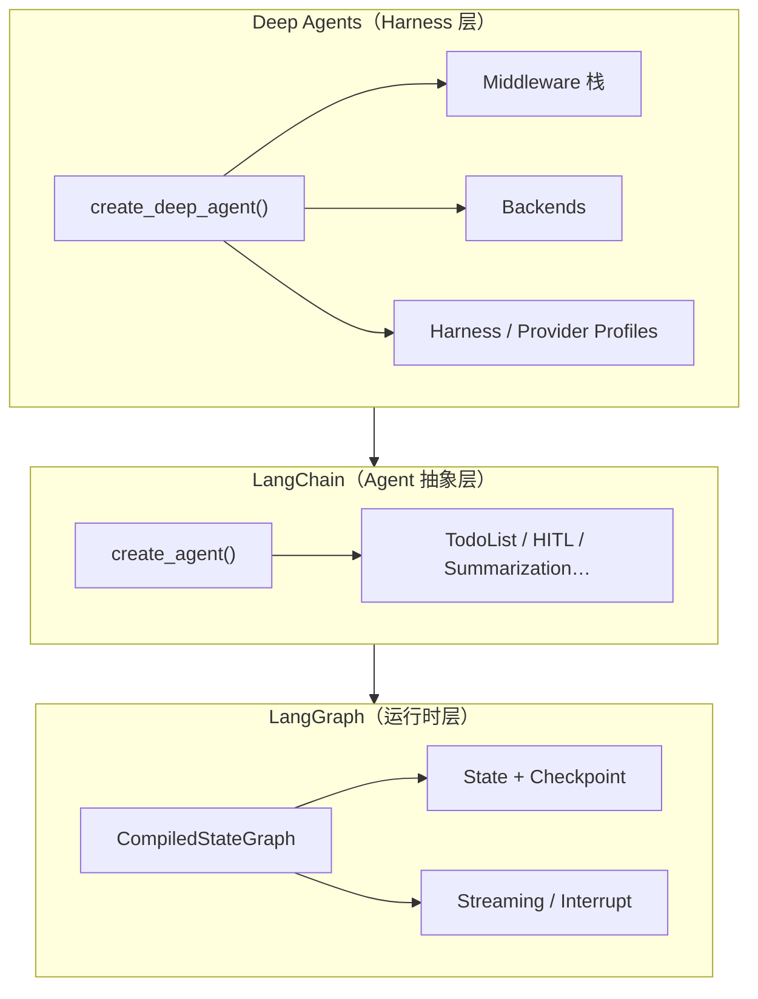
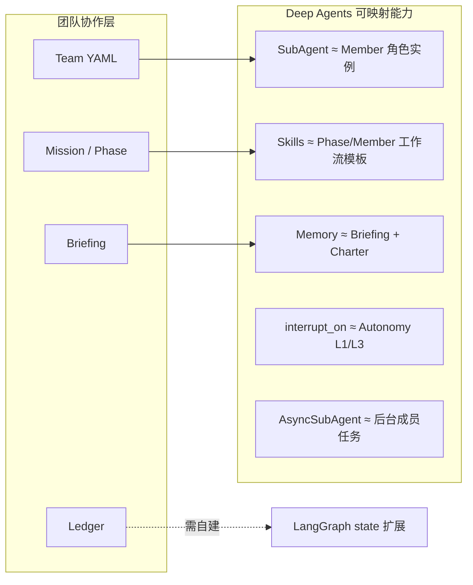

# Deep Agents 项目深度分析

> 分析对象：`reference/deepagents`  
> 核心 SDK 版本：**0.6.12**（`libs/deepagents`）  
> 仓库：`langchain-ai/deepagents`  
> 许可证：**MIT**

---

## 1. 项目定位与愿景

### 1.1 一句话定位

**Deep Agents 是 LangChain 生态中的「开箱即用 Agent Harness」——在 LangGraph 运行时之上，为长周期、多步骤任务提供规划、文件系统、子代理、上下文管理与技能等默认能力。**

### 1.2 核心哲学

| 原则 | 含义 |
|------|------|
| **Opinionated（有主见）** | 默认配置针对长视野、多步骤工作流调优，而非最小内核 |
| **Extensible（可扩展）** | 任何中间件、后端、工具、Profile 均可覆盖或替换，无需 fork |
| **Model-agnostic（模型无关）** | 支持一切具备 tool calling 的 LLM（前沿 API、开源权重、本地 Ollama/vLLM 等） |
| **Production-ready（生产就绪）** | 基于 LangGraph 的流式、持久化、checkpoint；与 LangSmith 追踪/评估/部署深度集成 |
| **Trust the LLM** | 安全边界在工具/沙箱层强制，而非指望模型自我约束 |

### 1.3 设计灵感与愿景

- 受 **Claude Code** 启发：识别其通用性来源，并进一步泛化
- 定位介于 **LangGraph（图运行时）** 与 **LangChain `create_agent`（轻量 harness）** 之间
- 提供参考实现：**Deep Agents Code**（`dcode` 终端编码 Agent）、**Talon**（长运行本地宿主）、**CLI**（LangGraph Platform 部署）
- 与 LangSmith Fleet、Open SWE 等生产案例形成「SDK → 产品 → 平台」闭环

### 1.4 与 LangChain 生态的关系

```txt
LangGraph        → 运行时：状态图、checkpoint、streaming、interrupt
LangChain        → create_agent：model + tools + middleware → agent loop
Deep Agents      →  opinionated harness：默认中间件栈 + backends + profiles
```

**选用建议**（官方 FAQ）：
- 需要完整 harness（规划、上下文、委托）→ **Deep Agents**
- 需要更轻量、自行组装 → **LangChain `create_agent`**
- agent loop 形态不合适、需自定义图 → **LangGraph 直接构图**
- 任意 LangGraph `CompiledStateGraph` 可作为 `CompiledSubAgent` 接入 Deep Agents

---

## 2. 整体架构

### 2.1 三层栈架构



### 2.2 Monorepo 包结构

```txt
deepagents/
├── libs/
│   ├── deepagents/     # 核心 SDK（create_deep_agent、middleware、backends）
│   ├── code/           # deepagents-code：终端编码 Agent（Textual TUI + Agent Server）
│   ├── cli/            # 部署 CLI（init / dev / deploy → LangGraph Platform）
│   ├── acp/            # Agent Client Protocol 集成（Zed 等编辑器）
│   ├── evals/          # 评估套件 + Harbor 集成
│   ├── talon/          # 长运行本地宿主（频道、Cron、MCP、Fleet 导出）
│   └── partners/       # 沙箱/执行环境集成
│       ├── daytona/
│       ├── modal/
│       ├── runloop/
│       ├── vercel/
│       └── quickjs/
├── examples/           # 研究、编码、内容、部署等示例
├── .github/            # CI/CD、release-please、benchmark
├── libs/ARCHITECTURE.md
├── AGENTS.md           # 贡献者/编码 Agent 开发指南
└── README.md
```

### 2.3 构造与执行两阶段

**构造阶段**（`create_deep_agent()`）：
1. 解析 model + Harness/Provider Profile
2. 解析 backend（文件、内存、shell 执行）
3. 组装主 Agent 中间件栈
4. 构建默认 `general-purpose` 子代理 + 用户声明子代理
5. 合成 system prompt（prefix → base → suffix → profile suffix）
6. 调用 `langchain.agents.create_agent()` 产出 `CompiledStateGraph`

**执行阶段**（`invoke` / `stream`）：
- LangGraph 驱动 agent loop：model → tool calls → 结果写回 state → 循环至结束
- Deep Agents 通过 middleware 在 model 调用前/后、工具执行前后介入

### 2.4 Deep Agents Code 双进程架构（参考实现）

```txt
┌──────────── Terminal Client（Textual TUI）────────────┐
│  展示、输入收集、人工审批                              │
└────────────────────┬────────────────────────────────┘
                     │ streaming protocol
                     ▼
┌──────────── Agent Server ────────────────────────────┐
│  Deep Agent 图、模型、工具、memory、skills、backend   │
└──────────────────────────────────────────────────────┘
```

---

## 3. 核心概念与数据模型

### 3.1 状态模型

| 类型 | 说明 |
|------|------|
| `AgentState` | LangChain 基类，含 `messages` |
| `DeepAgentState` | 扩展 `AgentState`；`messages` 使用 `DeltaChannel` reducer，将 checkpoint 增长从 O(N²) 降为 O(N) |
| `MemoryState` | `memory_contents: dict[str, str]`（`PrivateStateAttr`，不泄漏到子代理） |
| `AsyncTask` | 异步子代理任务：`task_id`, `thread_id`, `run_id`, `status`, 时间戳等 |

### 3.2 子代理规格

| 类型 | 用途 |
|------|------|
| `SubAgent` | 声明式同步子代理：`name`, `description`, `system_prompt`, 可选 `tools`/`model`/`middleware`/`skills`/`permissions`/`response_format` |
| `CompiledSubAgent` | 预编译 `Runnable`（须含 `messages` 键）；可接入自定义 LangGraph 图 |
| `AsyncSubAgent` | 远程 Agent Protocol 服务器上的后台任务：`graph_id`, 可选 `url`/`headers` |

默认自动注入 **`general-purpose`** 子代理（除非 Profile 禁用或用户已提供同名 spec）。

### 3.3 Backend 与文件模型

**`BackendProtocol`** 统一文件操作接口，实现包括：

| Backend | 特性 |
|---------|------|
| `StateBackend` | 默认；线程级内存文件，通过 `invoke(files={...})` 注入 |
| `FilesystemBackend` | 本地磁盘根目录 |
| `LocalShellBackend` | 本地 shell + 文件 |
| `StoreBackend` | LangGraph Store 持久化 |
| `CompositeBackend` | 路径路由到不同后端 |
| `ContextHubBackend` | Context Hub 集成 |
| `LangSmithSandbox` | LangSmith 托管沙箱 |

**`FileData`** 支持 v1（`list[str]` 行数组）与 v2（`str` + `encoding`）格式。

### 3.4 Profile 体系

| Profile | 阶段 | 职责 |
|---------|------|------|
| `ProviderProfile` | 模型构造 | 提供商特定模型初始化 |
| `HarnessProfile` | 运行时 | prompt 组装、`excluded_tools`/`excluded_middleware`、`extra_middleware`、默认子代理行为 |
| `GeneralPurposeSubagentProfile` | 子代理 | 控制默认 `general-purpose` 的启用/描述/system_prompt |

内置 Profile 覆盖 Anthropic Sonnet/Opus/Haiku、OpenAI Codex 等前沿模型规格。

### 3.5 权限模型

`FilesystemPermission`：按声明顺序匹配路径规则
- `allow`（默认）
- `deny`：返回权限错误
- `interrupt`：触发 `HumanInTheLoopMiddleware` 人工审批

---

## 4. 关键技术机制

### 4.1 Agent Loop 与中间件栈

**默认主 Agent 中间件顺序**（`graph.py` 文档）：

```txt
[Base]
  TodoListMiddleware
  SkillsMiddleware          （若 skills 参数提供）
  FilesystemMiddleware      （必需脚手架）
  SubAgentMiddleware        （若有同步子代理；必需脚手架）
  SummarizationMiddleware
  PatchToolCallsMiddleware
  AsyncSubAgentMiddleware   （若有 AsyncSubAgent）

[用户 middleware 插入点]

[Tail]
  HarnessProfile.extra_middleware
  _ToolExclusionMiddleware
  AnthropicPromptCachingMiddleware
  BedrockPromptCachingMiddleware（可选）
  MemoryMiddleware            （若 memory 参数提供）
  HumanInTheLoopMiddleware    （若 interrupt_on 或 interrupt 权限）
```

**Middleware vs Tool 的本质区别**：
- **Middleware**：可在 model 调用前改写 tool 列表、注入 prompt、压缩历史、管理 state
- **Tool**：仅在被 model 选中后才执行，无法改写请求面

### 4.2 内置工具面

| 工具 | 来源 | 功能 |
|------|------|------|
| `write_todos` | TodoListMiddleware | 任务规划与进度跟踪 |
| `ls`, `read_file`, `write_file`, `edit_file`, `glob`, `grep`, `delete` | FilesystemMiddleware | 文件读写与搜索 |
| `execute` | FilesystemMiddleware + SandboxBackend | Shell 命令（非沙箱后端会报错/隐藏） |
| `task` | SubAgentMiddleware | 委托同步子代理 |
| `launch_async_task`, `check_async_task`, … | AsyncSubAgentMiddleware | 远程异步子代理生命周期 |
| `compact_conversation` | SummarizationToolMiddleware（可选） | 按需压缩对话 |

大工具输出会被 **offload 到 backend**（`_message_eviction`），避免撑爆 context。

### 4.3 子代理编排（Sub-agents）

**同步子代理**通过 `task` 工具委托：

```txt
主 Agent ──task(name, prompt)──► 子 Agent（独立 context window）
                                    │
                                    ▼
                            返回 ToolMessage（最后 AIMessage 或 structured_response）
```

- 子代理拥有**独立中间件栈**（可继承或覆盖 tools、permissions、skills）
- 支持 **并行** `task` 调用（prompt 明确鼓励并行化）
- LangSmith 追踪标记 `ls_agent_type="subagent"`

**异步子代理**通过 LangGraph SDK 连接 Agent Protocol 服务器：
- 立即返回 `task_id`，主 Agent 可轮询/更新/取消
- 兼容 LangGraph Platform 与自托管

### 4.4 上下文管理

| 机制 | 说明 |
|------|------|
| **SummarizationMiddleware** | token 超阈值（默认 fraction 触发）时 LLM 摘要旧消息 |
| **历史 offload** | 驱逐消息写入 `/conversation_history/{thread_id}.md` |
| **媒体 offload** | base64 媒体写入 `artifacts_root/conversation_history/media/` |
| **DeltaChannel** | messages 增量 checkpoint，控制存储成本 |
| **PatchToolCallsMiddleware** | 修复 tool call 边界情况 |

### 4.5 Memory（持久记忆）

- 遵循 **AGENTS.md** 规范（https://agents.md/）
- 启动时从 backend 加载指定路径，注入 `<agent_memory>` 系统提示块
- 与 Skills 区别：Memory **始终加载**；Skills **按需渐进披露**
- 指导 Agent 通过 `edit_file` 更新记忆（含何时/何时不更新的详细规则）

### 4.6 Skills（技能）

- 遵循 Anthropic Agent Skills 模式（`SKILL.md` + YAML frontmatter）
- 多源叠加：`/skills/base/` → `/skills/user/` → `/skills/project/`（后者覆盖前者）
- 通过 backend API 加载，与存储后端解耦
- Progressive disclosure：元数据先入 prompt，详情按需读取

### 4.7 Human-in-the-Loop

- `interrupt_on` 参数：按工具名配置审批
- `FilesystemPermission(mode="interrupt")` 自动生成 interrupt 配置
- 依赖 LangGraph checkpointer 实现暂停/恢复

### 4.8 Talon 长运行宿主（实验性）

- 单事件循环管理：频道适配器、Cron 调度、Agent 运行时
- WhatsApp 等频道、MCP 工具加载、Fleet 导出托管
- **Alpha 状态**：无完整多租户/HITL/沙箱隔离，不适合企业生产

---

## 5. 技术栈

### 5.1 语言与运行时

| 项 | 值 |
|----|-----|
| 语言 | **Python 3.11+**（SDK）；JS/TS 有独立 [deepagentsjs](https://github.com/langchain-ai/deepagentsjs) |
| 包管理 | **uv**（monorepo 标准；禁止 pip/poetry） |
| 类型检查 | **ty** + 全面 type hints |
| Lint/Format | **ruff** |
| 测试 | **pytest**（unit 禁网 / integration 可网） |

### 5.2 核心依赖（`libs/deepagents`）

| 依赖 | 用途 |
|------|------|
| `langchain>=1.3.11` | `create_agent`、middleware 基类 |
| `langchain-core>=1.4.8` | 消息、工具、模型抽象 |
| `langchain-anthropic` | 默认模型 + Prompt Caching |
| `langchain-google-genai` | Google 模型支持 |
| `langsmith>=0.9.3` | 追踪、评估、沙箱 |
| `wcmatch>=10.1` | glob 模式匹配 |

可选 extras：`aws`（Bedrock）、`quickjs`、`video`（av/pillow）

### 5.3 周边包版本（`.release-please-manifest.json`）

| 包 | 版本 |
|----|------|
| deepagents (SDK) | 0.6.12 |
| deepagents-code | 0.1.31 |
| deepagents-cli | 0.2.2 |
| deepagents-acp | 0.0.8 |
| deepagents-talon | 0.0.2 |
| partners (daytona/modal/runloop/…) | 0.0.x |

### 5.4 CI/CD 与发布

- **release-please** + Conventional Commits（scope 必填）
- 发布流水线：build → unit test → Test PyPI → PyPI（OIDC）→ GitHub Release
- **CodSpeed** 性能基准（`create_deep_agent` 构造等）
- Harbor 集成评估、CLBench 等

---

## 6. 优势与局限

### 6.1 优势

| 维度 | 说明 |
|------|------|
| **开箱即用** | 长周期 Agent 所需能力（规划、FS、子代理、摘要、记忆）默认齐全 |
| **可组合** | Middleware/Backend/Profile 均可替换；`CompiledSubAgent` 接入自定义图 |
| **生产路径清晰** | LangGraph checkpoint + LangSmith 追踪 + CLI 部署到 LangGraph Platform |
| **上下文工程成熟** | DeltaChannel、工具输出 offload、摘要、Skills 渐进披露 |
| **子代理模型实用** | 同步隔离 context + 异步远程任务，覆盖常见委托模式 |
| **生态完整** | SDK → Code CLI → Talon 宿主 → Fleet → 多沙箱 partner |
| **工程质量高** | 严格类型、大量单测、benchmark、详细 ARCHITECTURE.md |

### 6.2 局限

| 维度 | 说明 |
|------|------|
| **非多 Agent 团队协作语义** | 子代理是「主从委托」，无角色章程、阶段、账本、人类成员等团队抽象 |
| **Python 中心** | TypeScript 为主栈时需桥接或选用 deepagentsjs |
| **LangChain 锁定** | 深度绑定 LangChain/LangGraph 栈，迁移成本高 |
| **Opinionated 重量** | 比 Pi 等极简 harness 更重；禁用默认能力需理解 Profile/middleware |
| **安全模型** | 「信任 LLM」；Talon 等实验组件缺乏企业级隔离 |
| **默认模型弃用中** | `model=None` 将在 1.0.0 移除，须显式指定模型 |
| **Beta API** | `profiles` 等标注 beta，可能有破坏性微调 |

---

## 7. 与多 Agent 团队编排的相关性

### 7.1 与典型团队平台概念对照

| 概念 | 典型团队平台 | Deep Agents |
|------|--------------|-------------|
| 组织单元 | `Team` + `Member`（agent/human） | 单主 Agent + SubAgent 列表 |
| 任务 | `Mission` + `Phase`（brainstorm/scheme/delivery） | TodoList + 用户 prompt |
| 协作模式 | Thread / Workflow / Hybrid | 主线程 + `task` 委托 |
| 记忆 | principles / patterns / scars 等结构化 briefing | `AGENTS.md` + MemoryMiddleware |
| 审计 | 账本（message/decision/artifact/…） | LangSmith traces + conversation_history offload |
| 自治 | AutonomyLevel L0–L3 | `interrupt_on` + permissions |
| 引擎 | 多 harness 适配 | `create_deep_agent` 单一栈 |

### 7.2 可借鉴的设计



| 上层需求 | Deep Agents 对应 | 差距 |
|----------|------------------|------|
| 多角色成员 | 多个 `SubAgent` spec + 不同 system_prompt/tools | 无 `@handle`、无成员间平等对话 |
| 阶段推进 | 自定义 middleware 或外层 orchestrator | 无原生 Phase 状态机 |
| 团队记忆 | `memory=[...]` 加载 charter/briefing 路径 | 无 bucket 分类（principles/patterns/scars） |
| 任务账本 | 需自定义 `state_schema` + 工具写 ledger | 无内置多作者协作文本流 |
| 人类参与者 | `HumanInTheLoopMiddleware` | 人类非 graph 节点，仅审批中断 |
| Harness 适配 | 可作引擎之一 `engine=deepagents` | Python 进程桥接或 deepagentsjs |

### 7.3 集成路径建议

1. **Engine 适配器**：将上层 `ContextBuilder` 输出映射为 `system_prompt.prefix` + `memory` 路径
2. **成员 → SubAgent**：成员 persona 转为 `SubAgent.system_prompt`；编队配置生成 `subagents` 数组
3. **阶段 → 外层编排**：上层维护 Phase 状态机；每阶段 invoke 不同 prompt/skills 子集（Deep Agents 不管阶段，适合作为 **L1 执行层**）
4. **Ledger 互补**：Deep Agents 负责单成员执行与工具；上层账本负责跨成员可见性与审计
5. **async-subagent-server 示例**：远程成员可作为 `AsyncSubAgent` 部署

### 7.4 生态分层位置

Deep Agents 应归类为 **L1+ Agent Harness**（比 Pi 更 opinionated，比 Omnigent/Symphony 更偏单 Agent 执行），与 Pi、LangChain `create_agent` 同层，**不具备 L4 团队协作语义**。宜将其视为可选 **成员运行时引擎**，团队编排语义仍由上层 core 承担。

---

## 8. 版本、许可证与成熟度

| 项 | 详情 |
|----|------|
| **许可证** | MIT（LangChain, Inc.） |
| **SDK 版本** | 0.6.12（Development Status: **Beta**，PyPI classifiers） |
| **发布节奏** | release-please 自动化；Conventional Commits |
| **1.0 路线图信号** | `model=None` 与 `get_default_model()` 将在 1.0.0 移除 |
| **成熟度评估** | SDK：**Beta / 生产可用**（LangChain 官方维护，文档/测试/部署链完整）；Talon：**Alpha 实验**；partners：**0.0.x 早期** |
| **社区** | LangChain 论坛、LangChain Academy、活跃 CI（integration/evals/benchmark） |
| **文档** | https://docs.langchain.com/oss/python/deepagents/overview + API Reference |

---

## 9. 关键源码入口（速查）

| 关注点 | 路径 |
|--------|------|
| 公共 API | `libs/deepagents/deepagents/__init__.py` |
| Agent 构造 | `libs/deepagents/deepagents/graph.py` → `create_deep_agent` |
| 子代理 | `libs/deepagents/deepagents/middleware/subagents.py` |
| 异步子代理 | `libs/deepagents/deepagents/middleware/async_subagents.py` |
| 文件系统 | `libs/deepagents/deepagents/middleware/filesystem.py` |
| 记忆 | `libs/deepagents/deepagents/middleware/memory.py` |
| 技能 | `libs/deepagents/deepagents/middleware/skills.py` |
| 摘要 | `libs/deepagents/deepagents/middleware/summarization.py` |
| 后端协议 | `libs/deepagents/deepagents/backends/protocol.py` |
| Profile | `libs/deepagents/deepagents/profiles/` |
| 架构说明 | `libs/ARCHITECTURE.md` |
| 终端编码 Agent | `libs/code/` |
| 示例 | `examples/deep_research/`, `examples/async-subagent-server/` |

---

## 10. 总结

Deep Agents 是 LangChain 生态中**最完整的开箱即用单 Agent Harness**：以 Middleware 组合模式在 LangGraph 上叠加规划、文件系统、子代理委托、上下文压缩、技能与记忆，并配套 Code CLI、部署工具与沙箱伙伴。**它解决的是「一个 Agent 如何长久、可靠地完成复杂任务」**，而非「多个角色如何组成团队、按阶段协作」。

对 **多 Agent 团队平台** 而言，Deep Agents 适合作为**可选成员执行引擎**（尤其需要子任务委托、文件工具链、长上下文管理的角色），团队章程、阶段状态机、账本与人类协作语义仍需由上层实现；与 Pi（极简 TS harness）形成互补——Pi 轻量本地优先，Deep Agents 厚重、Python/LangGraph 生产链完整。