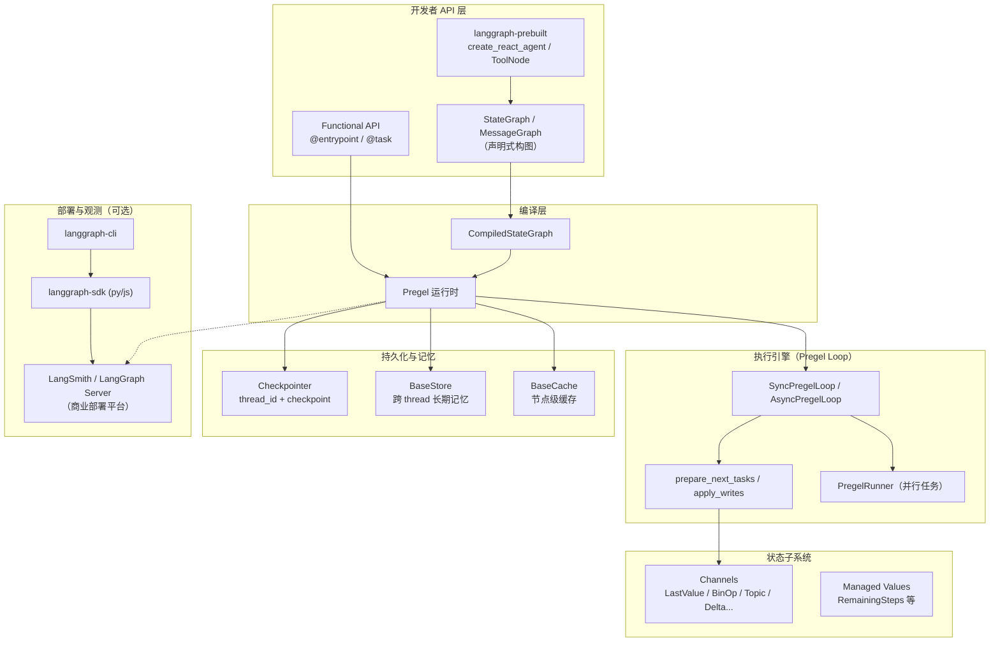

# LangGraph 项目深度分析

> 分析对象：`reference/langgraph`（LangChain Inc. 开源 monorepo）  
> 分析日期：2026-07-06  
> 用途：为多 Agent 团队编排与有状态工作流选型提供参考

---

## 1. 项目定位与愿景

### 一句话

**LangGraph = 面向长期运行、有状态 Agent 的低层编排框架（Low-level orchestration framework for building stateful agents）。**

### 核心哲学

| 维度 | 表述 |
|------|------|
| **抽象层级** | 刻意保持「低层」：不预设业务 Agent 形态，提供图执行、状态、持久化、中断等基础设施 |
| **计算模型** | 受 Google **Pregel**（BSP 超步）与 **Apache Beam** 启发；对外 API 借鉴 **NetworkX** |
| **状态观** | 节点通过读写 **共享状态（Channel）** 通信，而非直接互调 |
| **持久化观** | 执行即状态机；**Checkpoint** 使失败恢复、人机协同、时间旅行成为可能 |
| **生态位** | 可独立使用，也可与 LangChain / LangSmith / Deep Agents 组合；**不强制绑定 LangChain** |
| **与 Deep Agents 关系** | Deep Agents 是更高层封装（规划、子 Agent、文件系统）；LangGraph 是底层引擎 |

README 原话：

> *"Trusted by companies shaping the future of agents – including Klarna, Replit, Elastic, and more – LangGraph is a low-level orchestration framework for building, managing, and deploying long-running, stateful agents."*

---

## 2. 整体架构

### 2.1 架构图（Mermaid）



### 2.2 执行流（ASCII）

```text
invoke/stream 输入
    │
    ▼
┌─────────────────────────────────────┐
│  Superstep N（Pregel 一轮）          │
│  1. 从 checkpoint 恢复 channels      │
│  2. prepare_next_tasks（选可运行节点）│
│  3. 并行执行节点 → 产生 writes       │
│  4. apply_writes → 更新 channels   │
│  5. 写 checkpoint（按 durability）  │
│  6. 检查 interrupt / 递归深度       │
└─────────────────────────────────────┘
    │ 还有下一批节点？
    ▼
  结束 / 中断等待 resume
```

### 2.3 Monorepo 包结构

```text
langgraph/                          # 根仓库
├── libs/
│   ├── langgraph/                  # 核心框架 v1.2.7
│   ├── checkpoint/                 # Checkpointer/Store/Cache 接口 v4.1.1
│   ├── checkpoint-sqlite/          # SQLite 实现
│   ├── checkpoint-postgres/        # Postgres 实现
│   ├── checkpoint-conformance/     # 一致性测试套件
│   ├── prebuilt/                   # 高层 Agent 预制件 v1.1.0
│   ├── sdk-py/                     # LangGraph Server Python SDK
│   ├── sdk-js/                     # LangGraph Server JS SDK
│   └── cli/                        # langgraph CLI（本地/部署）
├── examples/                       # Jupyter 教程（multi-agent、RAG、plan-execute 等）
├── docs/                           # 文档已迁至 docs.langchain.com（仅 redirects）
├── README.md
├── LICENSE                         # MIT
└── Makefile / AGENTS.md
```

### 2.4 依赖关系

```text
checkpoint
├── checkpoint-postgres
├── checkpoint-sqlite
├── prebuilt
└── langgraph

prebuilt → langgraph
sdk-py → langgraph, cli
```

---

## 3. 核心概念与数据模型

### 3.1 StateGraph（构图 API）

`StateGraph` 是 **Builder**，必须 `.compile()` 后才可 `invoke/stream`。

```python
# 节点签名：State -> Partial<State>
class State(TypedDict):
    x: Annotated[list, reducer]  # Annotated 指定 reducer

graph = StateGraph(state_schema=State, context_schema=Context)
graph.add_node("A", node_fn)
graph.add_edge(START, "A")
graph.add_conditional_edges("A", router_fn)
compiled = graph.compile(checkpointer=..., store=...)
```

| 概念 | 说明 |
|------|------|
| **state_schema** | 图共享状态 schema（TypedDict / Pydantic / dataclass） |
| **context_schema** | 不可变运行时上下文（`user_id`、DB 连接等），通过 `Runtime[Context]` 注入 |
| **input_schema / output_schema** | 图输入/输出边界 |
| **Node** | `State -> Partial<State>` 或 `Command`；可带 retry/cache/timeout/error_handler |
| **Edge** | 普通边、条件边（返回下一节点名或 `Send` 列表） |
| **START / END** | 虚拟入口/出口节点 |
| **Subgraph** | 子图作为节点嵌入；checkpointer 可继承/覆盖 |

编译产物 `CompiledStateGraph` 本质是 **`Pregel` 实例**。

### 3.2 Channel（状态通道）

状态不是简单 dict，而是 **Channel 集合**。每个 state key 映射到一种 Channel 类型：

| Channel | 语义 |
|---------|------|
| `LastValue` | 每步最多一个写入，保留最后值（默认标量字段） |
| `BinaryOperatorAggregate` | 带 reducer 的聚合（如 `operator.add`、`add_messages`） |
| `Topic` | 多值累积 |
| `EphemeralValue` | 不跨 checkpoint 持久化 |
| `DeltaChannel`（beta） | 增量快照，优化大状态 |
| `NamedBarrierValue` | 同步屏障（多节点汇合） |

Reducer 通过 `Annotated[Type, reducer_fn]` 声明，在 `apply_writes` 时合并多节点写入。

### 3.3 Pregel 执行模型

| 类型 | 字段/含义 |
|------|-----------|
| **PregelTask** | 待执行/已执行任务描述 |
| **PregelExecutableTask** | 含 runnable、writes、triggers |
| **Checkpoint** | 某时刻全图 Channel 快照 |
| **ChannelVersions** | 每 channel 单调递增版本号 |
| **versions_seen** | 各节点已「见过」的 channel 版本，用于调度 |
| **Superstep** | 一批可并行节点执行 → 合并 writes → 新 checkpoint |

### 3.4 Checkpoint 数据模型

```python
class Checkpoint(TypedDict):
    v: int                          # 格式版本
    id: str                         # 唯一且单调递增
    ts: str                         # ISO 8601
    channel_values: dict[str, Any]  # channel 快照
    channel_versions: ChannelVersions
    versions_seen: dict[str, ChannelVersions]
    updated_channels: list[str] | None
```

| 配置键 | 作用 |
|--------|------|
| `thread_id` | 会话/线程主键（**必须**用于持久化） |
| `checkpoint_id` | 时间旅行：从特定 checkpoint 恢复 |
| `checkpoint_ns` | 子图命名空间（嵌套图隔离） |

`CheckpointMetadata` 记录 `source`（input/loop/update/fork）、`step`、`parents`、`run_id` 等。

### 3.5 控制原语

| 原语 | 用途 |
|------|------|
| **`Send(node, arg)`** | 动态 fan-out：向指定节点推送**独立子状态**（map-reduce、多 Agent 并行） |
| **`Command`** | 外部控制：`update` 状态、`resume` 中断、`goto` 跳转节点/`Send` |
| **`interrupt(value)`** | 节点内暂停，等待人工输入；恢复时**重跑整个节点** |
| **`GraphInterrupt`** | 中断异常，携带待处理 interrupt 列表 |

### 3.6 Store（长期记忆）

与 Checkpoint（短期/会话内）分离：

- **BaseStore**：层次化 namespace + KV + 可选向量检索
- 跨 `thread_id` 持久
- 节点可通过 `InjectedStore` / `Runtime.store` 访问

### 3.7 Managed Values

框架托管的只读状态（如 `RemainingSteps`），由 scratchpad 计算，不由用户 reducer 管理。

### 3.8 Prebuilt 高层模型

| 组件 | 说明 |
|------|------|
| `create_react_agent` | ReAct 循环图：LLM ↔ ToolNode |
| `ToolNode` | 工具执行节点，支持多 Agent supervisor 场景 |
| `tools_condition` | 标准路由：有 tool_calls 则走 tools，否则 END |
| `MessagesState` | `messages: Annotated[list, add_messages]` |
| `ValidationNode` | 结构化输出校验 |

> v1.0 起 `AgentState` 等类型逐步迁移至 `langchain.agents`，prebuilt 保留兼容层。

---

## 4. 关键技术机制

### 4.1 图执行

1. **Pull 调度**：根据 channel 版本变化决定哪些节点「该跑」
2. **Push 调度**：`Send` / `TASKS` channel 动态压入任务
3. **并行**：同 superstep 多任务由 `PregelRunner` + 线程池/async 执行
4. **递归限制**：`recursion_limit` 防止无限循环
5. **Durability 模式**：`sync` / `async` / `exit` 控制 checkpoint 写入时机

### 4.2 持久化（Durable Execution）

- 每 superstep 可写 checkpoint + pending_writes
- 失败后可从最近 checkpoint 恢复
- 支持 **time-travel**：`get_state` / `update_state` / fork checkpoint
- 实现：`InMemorySaver`、`SqliteSaver`、`PostgresSaver`（及 Redis cache）

### 4.3 Human-in-the-Loop

```text
节点执行 → interrupt() → GraphInterrupt → 状态持久化
    ↓
客户端展示 interrupt value
    ↓
Command(resume=...) → 从节点开头重执行
```

还支持 `interrupt_before` / `interrupt_after` 编译期断点。

### 4.4 Streaming

`stream_mode` 选项：

| 模式 | 输出 |
|------|------|
| `values` | 每步后完整 state |
| `updates` | 仅节点返回的增量 |
| `messages` | LLM token 级流式 |
| `custom` | 节点内 `StreamWriter` 自定义 |
| `checkpoints` | checkpoint 事件 |
| `tasks` | 任务起止与结果 |
| `debug` | checkpoints + tasks |

### 4.5 子图（Subgraph）

- 子图编译为嵌套 Pregel，`checkpoint_ns` 隔离状态
- `Command.PARENT` 可向父图回传控制
- 适合 **supervisor → worker** 层次多 Agent

### 4.6 Functional API

```python
@entrypoint(checkpointer=...)
def workflow(inputs):
    result = task(subtask)(inputs)
    return result
```

装饰器风格，底层仍编译为 Pregel；适合线性/少量分支工作流。

### 4.7 多 Agent 模式（文档/示例级）

仓库 `examples/multi_agent/` 含：

- **multi-agent-collaboration**：对等协作
- **hierarchical_agent_teams**：层次化团队

典型模式：

```text
Supervisor 节点（LLM + tools）
    ├─ tool: delegate_to_researcher → Send / subgraph
    ├─ tool: delegate_to_writer → Send / subgraph
    └─ 汇总结果写回主 state.messages
```

SDK 集成测试中有 `deep_agent`、`tools_agent` 等 supervisor 图。

### 4.8 部署与观测

| 组件 | 说明 |
|------|------|
| **langgraph-cli** | 本地 `langgraph dev`、打包部署 |
| **langgraph-sdk** | Threads / Runs / Assistants / Streaming API 客户端 |
| **LangSmith** | Trace、评估、Studio 可视化 |
| **LangGraph Server** | 商业 Agent Server（长运行、有状态部署） |

开源核心库 **不包含** Server 实现；Server 通过 CLI 的 `inmem` 可选依赖拉取 `langgraph-api`。

### 4.9 其他机制

- **RetryPolicy**：节点级重试
- **CachePolicy**：节点结果缓存（`BaseCache`）
- **TimeoutPolicy**：节点/任务超时
- **RemoteGraph**：远程图代理，SDK 协议调用
- **序列化**：`JsonPlusSerializer` / `ormsgpack`，支持加密 serializer

---

## 5. 技术栈

| 类别 | 选型 |
|------|------|
| **语言** | Python ≥3.10（主）；LangGraph.js 为独立仓库 |
| **构建** | hatchling、uv、Makefile |
| **核心依赖** | `langchain-core`、`pydantic` v2、`xxhash`、`ormsgpack` |
| **可选持久化** | SQLite、Postgres、Redis（cache） |
| **HTTP/流** | httpx、websockets、orjson |
| **测试** | pytest、pytest-asyncio、大量 integration/e2e |
| **Lint/类型** | ruff、ty |
| **许可证** | MIT |

---

## 6. 优势与局限

### 6.1 优势

| 优势 | 说明 |
|------|------|
| **执行语义严谨** | Pregel 超步 + channel 版本调度，并行与一致性有形式化基础 |
| **持久化一等公民** | checkpoint / thread / time-travel 是核心能力，非后装 |
| **HITL 原生** | interrupt + Command 协议清晰，适合审批、人工补全 |
| **可组合** | 子图、Send map-reduce、条件边，表达力强 |
| **流式完善** | 多 stream_mode，生产 UX 友好 |
| **生态成熟** | LangChain 集成、LangSmith 观测、企业案例多 |
| **生产级质量** | `Development Status :: 5 - Production/Stable`，测试覆盖极高 |
| **Harness 无关** | 图编排与 LLM 提供商解耦（通过 langchain-core Runnable） |

### 6.2 局限

| 局限 | 说明 |
|------|------|
| **低层框架** | 无 Team/Member/任务看板等领域模型，需自建上层 |
| **Python 中心** | 核心在 Python；若 TypeScript 为主栈，需桥接或选 LangGraph.js |
| **LangChain 引力** | 虽可脱离，但 prebuilt、消息、工具链路与 LangChain 耦合深 |
| **学习曲线陡** | Channel/reducer/checkpoint_ns/Send 等概念多 |
| **中断重跑语义** | `interrupt()` 恢复后整节点重执行，需注意副作用/idempotency |
| **部署分裂** | 开源库 vs LangGraph Server 商业部署，自托管需额外组件 |
| **无「团队养成」** | Store 是 KV/向量记忆，不是 Charter/Briefing/Ledger 式组织记忆 |
| **无内置 GUI** | 协作现场、看板、委托人交互需自建 Hub |
| **多租户/权限** | 开源层无 Team 级 ACL；Server 有 auth 但绑定平台 |

---

## 7. 与多 Agent 团队平台的关系

### 7.1 定位对照

| 维度 | LangGraph | 典型多 Agent 团队平台 |
|------|-----------|------------------------|
| **核心问题** | 怎么**执行**一个有状态 Agent 工作流 | 怎么**养**多支长期专业团队 |
| **一等对象** | Graph、Node、Channel、Checkpoint | Team、Member、Mission、Phase、Briefing |
| **协作语义** | 图边、Send、子图 | Thread、WorkflowRun、Ledger、WorkCard |
| **记忆** | Checkpoint（会话）+ Store（跨会话 KV） | Briefing（原则/模式/教训）+ Closeout 沉淀 |
| **人的角色** | interrupt/resume 断点 | 委托人、L0–L3 自治等级、拍板 |
| **执行引擎** | 内置 Pregel 执行器 | Harness 中立（Pi/Codex/Claude…） |

**结论**：LangGraph 是 **WorkflowRun 层候选引擎**，不是 **Team 平台替代品**。

### 7.2 可借鉴的设计

| LangGraph 机制 | 上层映射建议 |
|----------------|--------------|
| **Checkpoint + thread_id** | 执行实例的断点恢复；失败后续跑 |
| **interrupt / Command** | 审批闸门、委托人拍板、人工补全上下文 |
| **Send fan-out** | 同一阶段多 Member 并行 |
| **Subgraph** | 每支 Team 自定义阶段工作流封装为可复用子图 |
| **Store namespace** | 可作团队记忆底层存储之一 |
| **stream_mode** | Hub 实时展示 Agent 输出、任务进展 |
| **Durability** | 长时 Mission 跨天执行 |

### 7.3 不适合直接套用的部分

- **不要把 StateGraph 当成 Team 模型**：图节点 ≠ Member 身份；需显式建 Member persona、Charter
- **不要用 messages-reducer 代替 Ledger**：对话列表 ≠ append-only 责任/决策时间线
- **不要假设 LangGraph Store = Briefing**：需 Closeout 结构化沉淀与注入策略
- **Harness 中立**：若 Member 用 Pi/Codex，LangGraph 更适合作为「编排适配器」而非唯一运行时
- **各队各的方式**：LangGraph 倾向「编译期固定图」；Team 的 Phase 内容应来自配置/章程，动态生成或选择子图

### 7.4 集成架构草图（若采用）

```text
多 Agent 平台
  ├── Team / Mission / Phase / Member（领域层）
  ├── Ledger / Briefing / Board（协作与记忆层）
  └── EngineAdapter
        └── LangGraphAdapter（可选）
              ├── 按 Team 模板编译 StateGraph
              ├── thread_id = engagement_id
              ├── interrupt → Hub 待拍板
              └── 节点内调用 Pi/Codex 等 Harness 执行 Member 任务
```

### 7.5 与参考矩阵中其他项目的差异

- 比 **OpenTeams / Symphony** 更偏**执行运行时**，少**协作现场**
- 比 **Clowder / MultiCA** 更少**组织/角色养成**语义
- 与 **Paseo** 相似处在「图编排」；LangGraph 持久化与 HITL 更深
- 适合作为 **WorkflowRun 后端选项**，与 **Thread 模式**（轻量 @mention）互补

---

## 8. 版本、许可证与成熟度

| 项 | 值 |
|----|-----|
| **主包版本** | `langgraph` **1.2.7** |
| **checkpoint** | 4.1.1 |
| **prebuilt** | 1.1.0 |
| **许可证** | **MIT**（Copyright 2024 LangChain, Inc.） |
| **成熟度** | PyPI classifier: **Production/Stable**；Klarna/Replit/Elastic 等生产案例 |
| **文档** | 主站迁至 [docs.langchain.com](https://docs.langchain.com/oss/python/langgraph/overview) |
| **JS 版本** | 独立仓库 [langgraphjs](https://github.com/langchain-ai/langgraphjs) |
| **维护方** | LangChain Inc.，社区活跃（Forum、Academy、大量 examples） |
| **API 稳定性** | 有 deprecation 路径（如 v0.5→v1.0 config_schema→context_schema；AgentState 迁往 langchain.agents） |

---

## 9. 总结判断

| 问题 | 建议 |
|------|------|
| LangGraph 能否作为多团队平台核心？ | **否** — 它是编排引擎，不是多团队养成平台 |
| 是否值得引入？ | **是（可选）** — 作为 WorkflowRun 的 durable orchestration 后端 |
| 优先借鉴什么？ | Checkpoint 恢复、interrupt 审批、Send 并行、子图组合、流式输出 |
| 需要自建什么？ | Team/Member/Charter、Ledger、Briefing、Board、Harness 适配、Hub UI |
| 技术栈注意点 | 官方 Python 为主；若全栈 TS，评估 LangGraph.js 或 HTTP 调 LangGraph Server |

**一句话结论**：LangGraph 回答了「**有状态 Agent 工作流怎么可靠地跑起来**」；多 Agent 团队平台要回答「**多支专业团队怎么长期存在并进化**」。前者适合作为后者在 **WorkflowRun 路径**上的强力引擎，不应取代 Team 领域模型与 Hub 协作层。