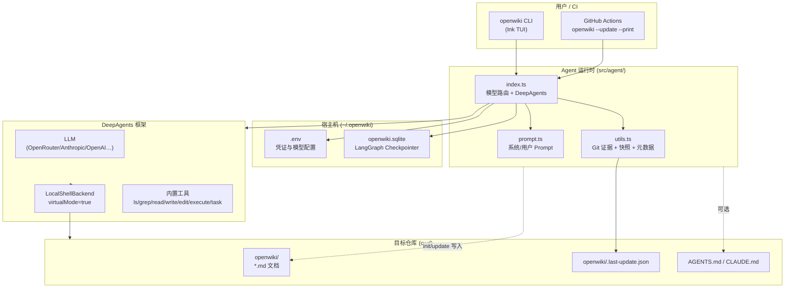

# OpenWiki 项目深度分析

> 分析对象：`reference/openwiki`（`langchain-ai/openwiki`）  
> 版本：0.0.1  
> 许可证：MIT  
> 关联：Agent 文档生成 / 代码库知识沉淀 / 为 Coding Agent 提供上下文

---

## 1. 项目定位与愿景

### 一句话

**OpenWiki = 专为 Coding Agent 编写与维护代码库文档的 CLI 工具。**

### 核心哲学

| 原则 | 含义 |
|------|------|
| **Agent-first 文档** | 文档首要服务对象是未来的 Coding Agent，其次才是人类；强调「从哪开始、改什么、注意什么」 |
| **仓库内嵌 Wiki** | 产出物落在目标仓库的 `openwiki/` 目录，与代码同版本、可 PR 审查 |
| **证据驱动** | 禁止臆造；所有重要结论必须来自源码、现有文档或 Git 历史 |
| **可维护优先** | 初始生成克制（≤8 页），更新时外科手术式修改，支持 no-op |
| **闭环接入** | 自动在 `AGENTS.md` / `CLAUDE.md` 注入 OpenWiki 入口，让其他 Agent 自然引用 |

OpenWiki **不是**通用多 Agent 编排平台，也不是 IDE 插件；它是 **单 Agent + 强 Prompt + 文件系统/Git 工具** 的垂直文档产品。

---

## 2. 整体架构

### 2.1 架构图（Mermaid）



### 2.2 包结构

```text
openwiki/
├── src/
│   ├── cli.tsx              # Ink 交互式终端 UI、运行生命周期
│   ├── commands.ts          # argv 解析、help 文本
│   ├── credentials.tsx      # 首次交互式凭证/模型/Provider 引导
│   ├── env.ts               # ~/.openwiki/.env 读写与诊断
│   ├── constants.ts         # Provider 配置、模型列表、环境变量键
│   └── agent/
│       ├── index.ts         # Agent 核心：模型创建、流式事件、fallback
│       ├── prompt.ts        # 系统/用户 Prompt 与模式指令
│       ├── utils.ts         # Git 摘要、内容快照、update no-op
│       └── types.ts         # OpenWikiCommand、RunContext 等类型
├── openwiki/                # 本仓库自身的生成文档（示例输出）
├── examples/
│   └── openwiki-update.yml  # 可复制到用户仓库的 CI 模板
├── test/
│   └── update-noop.test.ts  # update 跳过逻辑单测
├── package.json
├── README.md
├── DEVELOPMENT.md
├── AGENTS.md / CLAUDE.md    # Agent 入口指引（含 OpenWiki 段落）
└── .github/workflows/
    ├── checks.yml           # format + lint
    └── openwiki-update.yml  # 每日定时更新文档 PR
```

### 2.3 执行分层

| 层 | 职责 |
|----|------|
| **CLI 层** | 解析命令、TUI 渲染、凭证引导、流式展示 tool/text 事件 |
| **编排层** | 加载环境、收集 Git 上下文、选择模型、管理 thread/checkpoint |
| **Agent 层** | DeepAgents + 超长 system prompt，约束文档行为 |
| **产出层** | `openwiki/` Markdown + `.last-update.json` + 可选 `AGENTS.md` 补丁 |

---

## 3. 核心概念与数据模型

### 3.1 命令模式（OpenWikiCommand）

| 模式 | 触发 | 行为 |
|------|------|------|
| `chat` | `openwiki` 或带消息的对话 | 回答问题；**默认不**改文档，除非用户明确要求 |
| `init` | `openwiki --init` 或首次无 wiki | 从零构建 `openwiki/quickstart.md` 及章节页（≤8 页） |
| `update` | `openwiki --update` 或 CI 定时 | 基于 Git 增量，**仅修改**受影响的页面；可无操作 |

### 3.2 Wiki 目录约定

```text
openwiki/
├── quickstart.md          # 必填入口：概览 + 导航链接
├── architecture/          # 可选章节目录
├── agent/
├── cli/
├── operations/
├── ...                    # workflows/, domain/, api/, testing/ 等按仓库定制
└── .last-update.json      # 上次成功更新的元数据（CLI 写入，非 Agent 直接维护）
```

**文档质量规则（Prompt 内嵌）**：

- 禁止薄页/桩页；单文件目录需有实质内容
- 每概念一个 canonical 页面，避免重复
- init 时创建临时 `_plan.md`，完成后必须删除
- 不读 `.env`、密钥、token

### 3.3 元数据模型（UpdateMetadata）

```typescript
// src/agent/types.ts
type UpdateMetadata = {
  updatedAt: string;      // ISO 时间戳
  command: "init" | "update";
  gitHead?: string;       // 成功时的 git HEAD
  model: string;          // 使用的模型 ID
};
```

**写入条件**：仅当 `init`/`update` 运行后 `openwiki/` 内容 SHA-256 快照发生变化时才写入。避免 no-op 更新污染元数据、触发 CI 循环。

### 3.4 运行上下文（RunContext）

```typescript
type RunContext = {
  lastUpdate: UpdateMetadata | null;
  gitSummary: string;  // status、HEAD、log since lastHead、diff 等拼接块
};
```

Git 证据在 **Agent 启动前** 由宿主机 `utils.ts` 收集，保证 Prompt 输入稳定。

### 3.5 Thread / Checkpoint

- Thread ID：`openwiki-{sha256(cwd)[:32]}-{runId}`
- Checkpointer：`~/.openwiki/openwiki.sqlite`（`SqliteSaver`）
- 支持同仓库多轮 follow-up 对话；`/clear` 可重置 thread

### 3.6 AGENTS.md 注入段落（标准化）

OpenWiki 会在仓库根目录 `AGENTS.md` / `CLAUDE.md` 插入或刷新固定结构的 **OpenWiki** 章节，指向 `openwiki/quickstart.md`。这是将 Wiki 接入其他 Coding Agent 工作流的关键机制。

---

## 4. 关键技术机制

### 4.1 Agent 工作流

```text
1. loadOpenWikiEnv()           → 合并 ~/.openwiki/.env
2. [update] getUpdateNoopStatus → 无变更则跳过 Agent（省 API 费用）
3. resolveConfiguredProvider() + resolveModelId()
4. createRunContext()          → Git 摘要 + lastUpdate
5. createOpenWikiContentSnapshot()（前快照）
6. createDeepAgent({
     model, systemPrompt, checkpointer,
     backend: LocalShellBackend({ rootDir: cwd, virtualMode: true })
   })
7. agent.stream(messages, { streamMode: ["messages","tools"], subgraphs: true })
8. CLI 解析流 → text / tool_start / tool_end / debug 事件
9. 后快照对比 → 有变化则 writeLastUpdateMetadata()
```

**DeepAgents 工具集**（`tools: []` 表示用框架内置）：

- 文件：`ls`, `glob`, `grep`, `read_file`, `write_file`, `edit_file`
- Shell：`execute`（120s 超时，100KB 输出上限）
- 编排：`task`（子 Agent，只读调研）、`write_todos`

**子 Agent 纪律**（Prompt 规定）：

- init/update 可用 `task` 并行只读调研（默认 1–2 个，大仓库最多 3–4）
- 子 Agent **禁止写文件**；主 Agent 负责合成与写入 `openwiki/`

### 4.2 Wiki 生成策略

**Init**：

1. 清点：README、docs/、入口、配置、测试、schema
2. Git log/blame 理解「为何存在」
3. 写 `_plan.md` → `quickstart.md` → 章节页
4. 更新 `AGENTS.md`/`CLAUDE.md`
5. 删除 `_plan.md`

**Update**：

1. 读现有 wiki + `.last-update.json`
2. `git log <lastHead>..HEAD` 找增量
3. 建 docs impact plan：源变更 → 受影响页 → 是否编辑
4. **软 diff 预算**：<5 个源文件变更 → 最多改 1–2 页；>3 页需深思
5. 无相关变更 → 明确声明 wiki 已是最新，不编辑

### 4.3 CLI 机制

| 能力 | 实现要点 |
|------|----------|
| 交互 TUI | Ink + React；Markdown 流式渲染（marked） |
| 非交互 | `-p/--print` 输出最终文本；CI 友好 |
| 自动退出 | `--init`/`--update` 在 TTY 下成功后自动 exit（无需 `--print`） |
| Slash 命令 | `/provider` `/model` `/init` `/update` `/clear` `/help` `/exit` |
| 凭证引导 | `credentials.tsx` 箭头菜单选 Provider/Model |
| 开发模式 | `OPENWIKI_DEV=1` 启用 `--dry-run` |

### 4.4 Update No-op（双层优化）

**层 1 — CLI 预检**（`getUpdateNoopStatus`）：

- 工作区干净 + HEAD 未变 → 跳过
- 或：HEAD 变了但 commits 仅触及 `openwiki/` → 跳过（避免 wiki 自更新触发循环）

**层 2 — Agent 内 no-op**：

- Prompt 要求无实质变更时不编辑
- 内容快照未变 → 不写 `.last-update.json`

用户提供 `userMessage` 时 **不** 做 CLI 预检跳过（强制运行 Agent）。

### 4.5 CI 集成

`examples/openwiki-update.yml` / `.github/workflows/openwiki-update.yml`：

```yaml
schedule: "0 8 * * *"   # 每日 UTC 08:00
run: openwiki --update --print
env:
  OPENROUTER_API_KEY: ${{ secrets.OPENROUTER_API_KEY }}
  OPENWIKI_MODEL_ID: z-ai/glm-5.2
  LANGSMITH_API_KEY: ${{ secrets.LANGSMITH_API_KEY }}  # 可选追踪
```

配合 `peter-evans/create-pull-request` 仅提交 `openwiki/` 目录变更。

### 4.6 模型 Provider 与 Fallback

| Provider | SDK | 默认模型示例 |
|----------|-----|--------------|
| openrouter（默认） | ChatOpenRouter | z-ai/glm-5.2 |
| anthropic | ChatAnthropic | claude-sonnet-5 |
| openai | ChatOpenAI | gpt-5.5 |
| baseten / fireworks | ChatOpenAI + baseURL | GLM 5.2 / Kimi K2.7 |
| openai-compatible | ChatOpenAI + 必填 baseURL | 自定义（如 LiteLLM 网关） |

OpenRouter 5xx 时自动 fallback：`OPENROUTER_FALLBACK_MODEL_IDS`（gpt-5.4-mini → claude-sonnet-5）。

### 4.7 可观测性

- **LangSmith**：可选 `LANGSMITH_API_KEY` + `LANGCHAIN_PROJECT=openwiki`
- **调试**：`OPENWIKI_DEBUG=1` 输出 provider HTTP 诊断（密钥脱敏）
- **凭证诊断**：`OPENWIKI_DEBUG_CREDENTIALS=1`

---

## 5. 技术栈

| 类别 | 选型 |
|------|------|
| 语言 | TypeScript (ESM) |
| 运行时 | Node.js ≥ 20（CI 用 22） |
| 包管理 | pnpm 10 |
| CLI UI | Ink 5 + React 18 |
| Agent 框架 | **deepagents** 1.10+（LangChain 生态） |
| LLM 集成 | `@langchain/anthropic`, `@langchain/openai`, `@langchain/openrouter`, `langchain` |
| 状态持久化 | `@langchain/langgraph-checkpoint-sqlite` + better-sqlite3 |
| Markdown | marked 18 |
| 测试 | vitest 4 |
| 代码质量 | ESLint 10 + Prettier 3 + TypeScript 5.7 |

**发布**：npm 全局包 `openwiki`，bin 指向 `dist/cli.js`。

---

## 6. 优势与局限

### 6.1 优势

| 优势 | 说明 |
|------|------|
| **垂直场景打磨深** | Prompt 数百行，覆盖 init/update/chat、子 Agent、Git、AGENTS.md 注入等全流程 |
| **Agent 上下文友好** | 结构化 wiki + 强制 AGENTS.md 入口，直接降低其他 Agent 的探索成本 |
| **增量更新聪明** | Git 证据 + impact plan + diff 预算 + 双层 no-op，适合每日 CI |
| **开箱即用** | 交互式凭证、多 Provider、OpenRouter fallback、LangSmith 可选 |
| **安全边界清晰** | 禁止读密钥；仅允许写 `openwiki/` + 根级 AGENTS.md 段落 |
| **LangChain 官方背书** | `langchain-ai` 组织维护，与 DeepAgents 路线一致 |

### 6.2 局限

| 局限 | 说明 |
|------|------|
| **单 Agent 架构** | 非多角色协作编排；`task` 子 Agent 仅辅助只读调研 |
| **文档形态固定** | 输出 Markdown 文件树，无向量检索/RAG 服务 |
| **强依赖 LLM 质量** | 无结构化 schema 校验产出；准确性靠 Prompt + 人工 PR review |
| **测试覆盖薄** | 仅 `update-noop` 有单测；Agent/Prompt/CLI 无集成测试 |
| **版本极早** | 0.0.1，API 与 Prompt 仍快速迭代 |
| **Node 专属** | 非 Python/Java 仓库需额外适配（但文档本身是语言无关） |
| **凭证模型偏个人** | `~/.openwiki/.env` 适合开发者本机；团队 CI 靠 secrets 注入 |

---

## 7. 与多 Agent 团队编排的相关性

### 7.1 生态分层定位

```text
L4 工作与协作语义    ← 多专业团队、brainstorm→方案→实施
L3 编排与控制面
L2 多实例 / 协议桥接
L1 Agent 执行层      ← OpenWiki 所在层（单 Agent CLI + DeepAgents）
```

OpenWiki 属于 **L1 辅助能力**：为代码库生成 **Agent 可读的知识层**，而非团队编排引擎。

### 7.2 可借鉴的设计

| OpenWiki 机制 | 可吸收点 |
|---------------|----------|
| **`openwiki/` 约定目录** | 每支 Team 或 Platform 级 `wiki/` / `context/` 标准产物格式 |
| **AGENTS.md 自动注入** | Team `charter.md` / `members/*.md` 与平台级 `AGENTS.md` 联动，统一「先读哪」 |
| **`.last-update.json` + Git 增量** | Mission/Ledger 的版本戳；按 commit 触发「队记忆」刷新而非全量重算 |
| **内容快照 no-op** | 编排器避免无意义 re-run（省 token、减 PR 噪音） |
| **子 Agent 只读调研 + 主 Agent 写入** | 多成员 brainstorm 阶段：调研 Agent 并行读，Lead/Architect 合成写入 briefing |
| **Prompt 中的 diff 预算** | 更新队记忆/文档时的「外科手术式」编辑策略 |
| **CI 定时 PR 更新文档** | delivery 后自动刷新 `docs/` 或队宪 |

### 7.3 与团队平台的契合与差异

**契合**：

- 团队长期存在、自主进化 → OpenWiki 的 **持续 update + Git 驱动** 是「队知识进化」的一种实现范式
- 多领域编队都需要 **结构化产物与记忆** → Wiki 是低成本「队外显记忆」

**差异**：

| 维度 | OpenWiki | 多 Agent 团队平台 |
|------|----------|-------------------|
| Agent 数量 | 1（+ 临时只读 subagent） | 多成员、多角色、多阶段 |
| 协作语义 | 无 Thread/Mission/审批 | brainstorm → 方案 → 实施 |
| 产出 | 静态 Markdown | 剧本、章节、PR、队记忆等异构产物 |
| 编排 | 无 | Team YAML、phases、workflows |
| 运行时 | 独立 CLI | Platform + Harness 接入 |

### 7.4 建议用法

1. **为 monorepo 自身跑 OpenWiki**：生成 `openwiki/`，降低新 Agent 理解核心包与队配置的成本  
2. **应用开发队 delivery 流水线**：feature 合并后触发 `openwiki --update`，与交付产物对齐  
3. **抽象「Context Builder」**：借鉴 `createRunContext` + Git 摘要，作为上下文构建参考实现  
4. **不直接复用为编排核心**：OpenWiki 不能替代 Team/Phase/Member 模型；应作为 **知识层插件** 或 **Harness 侧车**

---

## 8. 版本、许可证与成熟度

| 项 | 值 |
|----|-----|
| **版本** | `0.0.1`（2026 年发布，package.json + `OPENWIKI_VERSION`） |
| **许可证** | MIT（Copyright 2026） |
| **维护方** | LangChain AI（`github.com/langchain-ai/openwiki`） |
| **最近提交** | 2026-07-05（Anthropic Opus model id 修复等） |
| **提交规模** | 约十余次有意义合并（0.0.1 release、多 Provider、no-op、OpenAI-compatible、Prompt 精简） |
| **npm** | 已发布，支持 `npm install -g openwiki` |
| **CI** | PR 上 format/lint；本仓库每日 openwiki-update workflow |
| **测试** | 1 个 vitest 文件（update-noop）；无 Agent 端到端测试 |
| **文档** | README + 自生成的 `openwiki/` 五页 + DEVELOPMENT.md |
| **成熟度评级** | **Early Alpha / 可用预览** — 适合尝鲜与 CI 试点，生产依赖需接受 Prompt 与 API 变动风险 |

### 成熟度判断依据

- ✅ 功能闭环完整：init / update / chat / CI / 多 Provider / checkpoint  
- ✅ 有实际 dogfooding（仓库内 `openwiki/` 与 workflow）  
- ⚠️ 版本 0.0.1，接口与 Prompt 仍在频繁 PR  
- ⚠️ 测试与可观测性偏开发者自助（DEBUG 开关）  
- ⚠️ 社区与生态体量尚小（对比 Pi、LangGraph 主仓）

---

## 9. 关键文件索引

| 文件 | 作用 |
|------|------|
| `README.md` | 用户安装、Quick Start、Provider 配置 |
| `DEVELOPMENT.md` | 本地 link、dry-run、重建 |
| `AGENTS.md` / `CLAUDE.md` | 其他 Agent 读仓库时的 OpenWiki 入口 |
| `src/agent/prompt.ts` | **产品灵魂**：全部文档行为约束 |
| `src/agent/index.ts` | Agent 运行时、模型 fallback、流解析 |
| `src/agent/utils.ts` | Git 证据、快照、no-op 逻辑 |
| `src/cli.tsx` | Ink UI（3000+ 行） |
| `src/constants.ts` | Provider/Model 单一配置源 |
| `examples/openwiki-update.yml` | 用户可复制 CI 模板 |
| `openwiki/quickstart.md` | 生成文档范例 |

---

## 10. 总结

OpenWiki 是 LangChain 生态下 **「Agent 文档工程师」** 的参考实现：用 DeepAgents + 极长 Prompt 把「读仓库、写 Wiki、接 AGENTS.md、跟 Git 更新」做成一条可本地、可 CI 的流水线。对多 Agent 团队平台而言，它 **不是** 编排竞品，而是 **队知识沉淀与上下文供给** 的高价值参考——尤其在 **增量更新、no-op、标准化 Agent 入口、子 Agent 只读并行** 四点，可直接翻译进 Context/Memory 子系统。