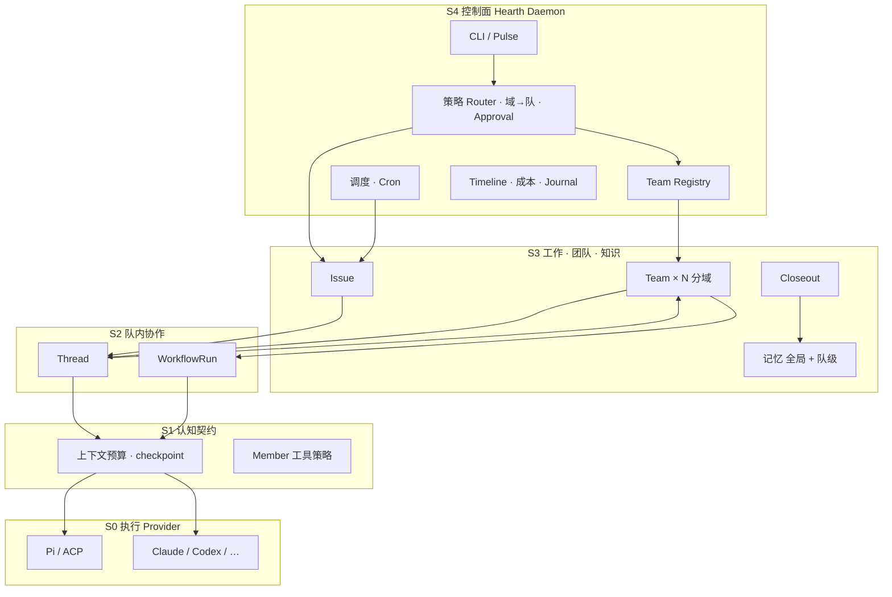
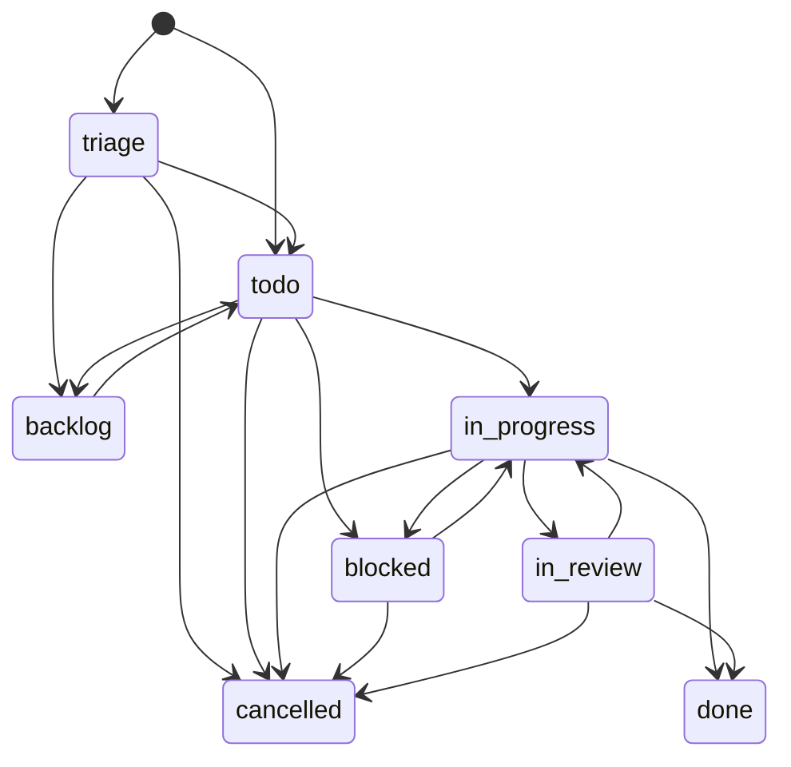

# Hearth — 个人 Agent 操作系统设计（M0.5.0）

> **状态：** 设计稿 M0.5.0（仅文档 + throwaway 原型，无产品实现）  
> **工作名：** Hearth（炉灶：数字生活的中心火源）  
> **日期：** 2026-07-12（M0.5.0：**Project 中心 · chat-first**；进 Project 默认落 Chat；Posting 为 Project 所有的一等关系实体；去 WorkItem，Thread 承载执行、Issue 为松耦合追踪卡；M1/M2/M3 合并为 **Project Chat 完整闭环**）  
> **约束：** 从零设计；编码 + 人生 + 编排控制面；不绑定 myteams；默认可信本机 + 审批门  
> **智慧来源：** `analysis/` 下 **27** 份项目分析（多源装配，无单一上游）；全量矩阵 → [`annex/analysis-synthesis.md`](./annex/analysis-synthesis.md)  
> **文档结构：** 本文 = **实现合同主轴**；深度展开见 [`annex/`](./annex/) 与 [`README.md`](./README.md)

### 版本修正摘要

| 版本 | 处理 |
|------|------|
| **M0.1** | 单文件拆主轴+annex；两轴 `orchestration`×`loop_policy`；WorkItem FSM；8 根冻结；Pulse 统一；Handoff 原子性草案 |
| **M0.2** | **7 根**（LoopState→Session 值对象）；**单一 autonomy 谓词**；**删 QAPS 权重比大小**；**M1 FSM 子集**；**M1 session-exit / Approval-block 原子性**；**Acceptance 最小 schema**；**M1 单 Member 模板**；路径/术语一致（memory）；悬空 §15 修复 |
| **M0.2.1** | M1 **动作等级表**；**重试默认**；`closeout_path`；`knowledge/` 布局；**Timeline 事件最小集**；**`hearth run` 建单语义**；T2 状态钉死；Handoff failed 钉死；QAPS/UI/LoopEng 编号对齐 |
| **M0.2.2** | **多 Provider 合同**：注册模型、解析序、Session 绑定不可变、CLI 覆盖、健康/fallback、适配契约指针 → [`annex/providers.md`](./annex/providers.md) |
| **M0.2.3** | **Pulse 提前**：M1 **必交** Live + Decisions（+ 可选本队 Work 列表）；M2 改为多队 + Overview 加厚；域能力顺序不变 |
| **M0.2.4** | **异步 CVO 循环**：记问题 → 打包 Goal 批量修 → 静默长跑 → 集中验收场；Pulse 服务「离开/回来」 |
| **M0.2.5** | **合同一致性**：未分队 inbox；重试/Handoff 失败事务；Approval deny；Provider fallback 与 orchestration 钳制语义对齐 |
| **M0.2.6** | 小本本收为 Draft 缓冲（Board 附属），不并列导航 |
| **M0.2.7** | **小本本 = Board 上 WorkItem 的 comment**（可标 issue）；取消全局 Draft 池；Bundle = 勾选 comments → 新 Goal 卡 |
| **M0.2.8** | **硬门不单独顶栏页**：并入 Pulse 硬门区 + Board 卡内；Decisions 仅为能力/队列名 |
| **M0.2.9** | **Project 一等聚合根**；WorkItem 挂 `project_id`；**Artifact 最小索引**（卡上 Files / 产出）；Workspace 仍 M3 升格 |
| **M0.2.10** | 汲取 **Codeg**：Automation 隔离模式；Session 委托字段预留；可选会话导入；Live HUD 指标；**不**改对话中心隐喻 |
| **M0.2.11** | 汲取 **Dyad**：`turn_mode` plan/ask/build；**apply_batch** 人审落盘；意图保护 UX；默认 path_deny 清单；commit 锚定；**不**改 App-builder 中心 |
| **M0.2.12** | 汲取 **Herdr**：Session **attention**（unseen complete）；状态**单权威**；detach≠stop；`hearth wait`；Project rollup；**不**用 TUI 多路取代 Board |
| **M0.2.13** | 汲取 **Neo Chat**：Skills≠Tools；**run_error 与 transcript 分离**；**context budget**；tool **risk**；`hearth doctor`；**不**改浏览器为真相库 |
| **M0.2.14** | **全 27 分析综合**：[`analysis-synthesis.md`](./annex/analysis-synthesis.md)；补 OpenWiki knowledge 刷新 / Hermes 记忆冻结 / Omnigent policy 单点 / Archon 混合步 / ClawTeam swarm 不变量 / Pi steering；附录 B 全覆盖；**不**增第 9 聚合根 |
| **M0.2.15** | **健壮性合同增量**（异步 CVO 前提）：**stall 检测**（`last_event_ts` + `stall_timeout`→`error`）；**审批 resume 幂等**（L0 exactly-once）；**凭证经纪**（secrets 不进 Session env/cwd，外发经 Daemon 代理）；**供应链信任**（pin + release-age + 安装脚本禁用 + Project Trust）；**隐私工厂强制**（`privacy=local_only` 解析序过滤 cloud）；**scars 召回**（写而能读）；**热记忆写满报错不静默丢**；**context 压缩契约**；**Class-Sweep**；术语/xref 一致性 pass；**不**增聚合根 |
| **M0.3.0** | **产物中心转向（结构性）**：**Artifact 升为 Project 所有的第 6 根（共 9 根）**（`project_id` 必填，`workitem_id` 降为可选溯源）；产物分 **medium**（text/novel/image/video/app/report/data/code/…）+ **preview**（reader/gallery/player/live-app/diff）+ **version 链** + **export/发布**；IA 翻转为 **Home（跨项目产物 + 硬门）→ Project（产物画廊 + 进展 + 预览）→ Artifact 预览器**；**Board 降为 Project 内「进展」子页**，非顶栏一等；**Return view 溶入 Home「新产物」**；WorkItem/引擎/事务不变 |
| **M0.4.0** | **Issue 中心转向（历史 IA）**：Board 落地；Issue 拉远=Board、拉近=Chat+活产物；域内核 9 根不变 |
| **M0.5.0** | **Project 中心 · chat-first（当前 IA）**：所有 Projects → Project Chat；Board / Artifacts / Workspace / Team / 设置为竖排 section；Posting 为 Project 所有的一等关系实体但非聚合根；原 M1/M2/M3 合并为 **Project Chat 完整闭环**；用户术语统一为负责人/接手/交回 |

**主轴原则：** 回答「Project Chat 完整闭环能创建什么、状态如何转、事务边界在哪」。跨队 Handoff（M4）与 swarm（M5）在主轴只留不变量；全文协议在 annex。

---

## 1. 愿景与定位

### 1.1 一句话

**Hearth 是本地优先的个人 Agent 操作系统：用 Daemon 控制面管账与调度；用可替换 Provider 执行；用 Project 承载一摊长期工作；用 Thread 承载对话与执行（接力链 Session），用 Issue 做与之松耦合的追踪卡；用 Artifact 保存项目拥有的耐久产物；用 Team / Soul / Posting 表达稳定编制与项目派驻；用可读记忆沉淀知识。Principal 是唯一 CVO，不当人肉路由器。**

> **M0.5.0 当前 IA：** Project 是中心，进入默认落 Chat；Board / Artifacts / Workspace / Team / 设置是 Project 内竖排 section。M0.3.0 与 M0.4.0 仅保留作历史追溯。**域内核见 [`../CONTEXT.md`](../CONTEXT.md) 与 §6.1 对象冻结**（Thread 承载执行、Issue 为松耦合追踪卡、无 WorkItem）；IA 基线见 [`annex/ui.md`](./annex/ui.md)。

### 1.2 是 / 不是

| Hearth **是** | Hearth **不是** |
|---------------|-----------------|
| 单租户、本机 Daemon 为心脏的 **Agent OS** | 多租户 SaaS / 云账号体系 |
| **多支常驻 Agent 团队**，按领域/事项分工 | 只有临时 @ 一下的无结构群聊 |
| **编排与推理分离**：控制面管账，Provider 推理 | 自研封闭 LLM 运行时（v1） |
| 编码任务与人生例行的 **统一工作平面** | 纯 coding IDE 插件，或纯聊天 bot |
| 可插拔 Provider（Pi / Claude Code / Codex / …） | 绑定单一 harness 的 hooks 宇宙 |
| 设计文档驱动的演进路线（M0–M5） | 已实现产品；也不是 myteams 产品绑定 |

### 1.3 与代表性开源的差异（同级对比）

| 维度 | Hearth | Paseo | Hermes | Clowder / OpenCrew | Multica / OpenTeams |
|------|--------|-------|--------|--------------------|---------------------|
| 心脏 | 自有 Daemon | Daemon | 自有宿主 | 平台层 / Slack+OpenClaw | 工单平台 / 工作台 |
| 主对象 | **Project** + **Thread** + **Issue** + **Artifact** + **Team/Posting** + Session | Agent 生命周期 | 对话 + 学习 | 身份 / 频道岗位 | Issue / 步骤图 |
| 多引擎工作台（对照） | 账本中心；委托/导入为旁路（Codeg 启发） | — | — | — | — |
| **多团队** | **一等：多 Team 分域** | 弱 | 弱 | 岗位/猫队（偏单工作区） | Squad / 模板队 |
| 多 Provider | 一等 | 一等 | 一等 | 多 CLI | 多 CLI |
| 人生语义 | 可选 Telos | 弱 | 中 | 弱 | 弱 |
| 租户模型 | **单 Principal 多团队** | 单用户 | 单用户 | 偏单工作区 | 可工作区隔离 |

**结论：** Hearth = **Paseo/Agno 式控制面 + Project 中心 chat-first + 多团队派驻 + Artifact 耐久产物 + Thread 执行账本 + Issue 松耦合追踪 + Hermes 式学习 + 可选人生层**。团队是常驻编制，不是可选装饰。深度对照见 [`annex/open-source.md`](./annex/open-source.md)。

---

## 2. 第一性原理

1. **Own your stack** — 会话、记忆、审批、追踪落在本机；不绑托管身份。  
2. **Harness 管账，模型花钱** — 预算、权限、策略、可观测在控制面强制，不靠模型自觉。  
3. **编排 ≠ 推理** — Daemon 调度；LLM 循环发生在 Provider 内。  
4. **管理产物与 Work，不盯 Agent** — 用户面对的是**可预览的产物**与执行账本，不是「哪个模型窗口」。  
5. **团队是编制，不是临时群** — Member 有身份、职责、工具策略与记忆边界；队长期存在并可进化。  
6. **多团队分域** — 不同事项进不同 Team；跨队协作是显式路由，不是默认一个大混响房。  
7. **动态范围** — 小修轻路径，重任务才计划门与多步；先删模式再优化模式。  
8. **可读记忆优先** — Markdown / 文件为真；向量检索可选叠加。  
9. **治理按权限分级** — 全局 Policy + 团队覆盖；不是全局「全自动」或「全人工」。  
10. **扩展靠 Skills / 团队模板 / Provider，不靠内核膨胀** — 最小内核，能力外溢。  
11. **配置与人格数据分区** — 系统升级永不覆盖 Principal 区与各队 `team.yaml` 人格。  
12. **可验证才算完成** — Acceptance 可探测；Closeout 结构化沉淀（可进队知识或全局记忆）。  
13. **设计 loop，而非逐轮 prompt** — Principal 的杠杆在停止条件、验证者、状态脊与心跳；Agent 在环内迭代。Hearth 让 loop **可声明、可观察、可中断、可改进**（业界映射见 [`annex/loop-engineering.md`](./annex/loop-engineering.md)）。  
14. **异步 CVO，不当人肉路由器** — 规划派活 → 静默长跑 → 逛成果时把问题记成 **Issue 上的 comment（口语：小本本）** → 勾选 comments **打成一张 Goal Issue** 再跑 → 回来半小时验收。不为「每轮等你点继续」优化。见 §4.6 · §6.5.6。

---

## 3. 智慧装配图（多源，无单一主参考）

按 **问题域** 选最强样本；每个子系统至少两个非同源项目。  
**全 27 份 analysis 的吸收/拒绝一行表** → [`annex/analysis-synthesis.md`](./annex/analysis-synthesis.md)。

| 子系统 | 主参考 | 次参考 | 刻意不采用 |
|--------|--------|--------|------------|
| 控制面 / Daemon | Paseo、Agno | — | LifeOS 寄生 hooks 为唯一 always-on；浏览器为真相（Neo） |
| Provider / 执行腰 | Pi、acpx | Omnigent 能力矩阵、Codeg ACP | 自研完整 agent loop（v1）；写死 AgentType |
| 可选图/中间件引擎 | LangGraph、Deep Agents | — | StateGraph/SubAgent = Team/Member 本体 |
| 工作对象 | Symphony、Multica | Antfarm | 完整 PM SaaS |
| **Agent 团队 / 多队** | **Clowder、OpenCrew、Multica Squad、Agno Team** | Antfarm 角色、OpenTeams 模板 | 强制 Slack；多租户猫咖 SaaS；单万能队 |
| 双模式协作 | OpenTeams | Archon DAG、CCG phase gate | 频道=岗位强绑定为唯一载体 |
| **Swarm 并行** | **ClawTeam** | git worktree 工程实践 | 默认 skip-permissions；共享目录假并行 |
| 策略路由 | CCG、agent-design-patterns | — | QAPS 权重第三轴；LifeOS E1–E5 / 巨型 ISC |
| 记忆学习 | Hermes、OpenHuman | **OpenWiki**、GenericAgent skills | 纯黑盒向量脑；可执行物叫 Skill |
| 人生语义 | OpenHuman、**LifeOS（切片）** | — | 全量 Algorithm 教义与输出模板门 |
| 治理 / 路径 | OpenCrew L0–L3、patterns C7 | Dyad path、Hermes 诚实威胁模型 | v1 强制 Docker；适配器私自放行 |
| 内环 / 预算 | GenericAgent | Pi loop、Ralph 新鲜上下文 | 无停止条件的裸 while 烧 token |
| 工作台机制切片 | Codeg | Paseo workspace | 对话侧栏取代 Board |
| 写盘/意图 UX | Dyad | Neo empty CTA | App-builder 中心产品 |
| 注意力 / 长跑 | Herdr | LifeOS Pulse 名 | TUI 多路取代 Board；关 UI=杀进程 |
| 聊天质量切片 | Neo Chat | — | 浏览器 DB / 聊天唯一主轴 |
| 隔离后端预留 | NanoClaw、Hermes multi-backend | — | Project Chat 完整闭环强制容器 |
| 设计时坐标 | agent-design-patterns | — | 当 runtime 库依赖 |

**装配一句话：** Paseo/Agno 控制面 + Symphony/Multica 工单脊 + Clowder/OpenCrew 编制 + Pi/acpx/Omnigent 执行腰 + Hermes/OpenHuman/OpenWiki 记忆 + GenericAgent 内环契约 + Codeg/Dyad/Herdr/Neo 机制切片；**中心 = Daemon 账本**。

**LifeOS 在 Hearth 中的位置：** 仅人生语义与「可见仪表」灵感之一；不主导 Daemon / Thread / Issue / Provider。官方术语见附录术语表；边界见 [`annex/open-source.md`](./annex/open-source.md)。

---

## 4. 用户与场景

### 4.1 角色

| 角色 | 职责 | Project Chat 完整闭环 |
|------|------|-----|
| **Principal** | 唯一人类 CVO：愿景、优先级、不可逆审批、验收；拥有多支团队 | 是 |
| **Team** | 常驻编制：领域、成员、默认策略、队级记忆与技能 | 是，多队可并行 |
| **Member** | 队内持久身份：职责、默认 Provider、工具/路径策略、人设 | 是，多 Member 接力 |
| **Lead** | 队内编排者（某 Member 的 role，非独立对象类型） | 与 responder 可同一人，也可分角色 |
| **Daemon** | 本机权威：队列、团队注册表、策略、事件、Pulse | 是 |
| **Provider** | 执行引擎实例 | 是 |
| **路由入口** | CLI / 未来对话入口做域路由；**不是**独立「DA 实体」 | 规则路由；可选幕僚见 §12.1 #3 |

> **M0.1+：** 取消独立「DA 一等角色」。全局澄清/早报由 **life-ops 或 ops 队** 承担，或 CLI 直接路由。是否设「幕僚长」见开放问题 §12.1 #3。

### 4.2 场景 A — 单人 Query（挂队）

**输入：**「app-dev 队，上周认证相关改动总结一下」

1. Router → `team_id=app-dev`（QAPS 仅作路由先验，不落库）  
2. 创建无 Issue Thread，负责人 = 队默认 responder  
3. 该 Member 启动 Thread 的首个 Session；`loop_policy=reactive` 或短 `autonomous`  
4. Closeout 挂 Thread，可选写入队知识  
5. 无 WorkflowRun；仍有真团队上下文（人设/策略/记忆边界）

### 4.3 场景 B — 编码 WorkflowRun

**输入：**「给登录加 OAuth」（未点名队）

1. 域分类 → `team_id=app-dev`  
2. 创建 Issue；可先开 Thread 澄清，也可直接从 Issue 创建 WorkflowRun  
3. Lead 产出 Plan Preview；Principal 批计划后固定 Definition 版本与 assignment snapshot；各步 `owner_member`  
4. 步内 `loop_policy=autonomous`；失败 escalate → Lead → Principal  
5. Closeout → 队 `knowledge/` + 可选全局记忆  

### 4.4 场景 C — 另一支队

**输入：**「帮我把这期短剧分镜大纲补全」

1. 域路由 → `Team=short-drama`（与 app-dev **隔离**）  
2. 不复用 app-dev 的 coding 人设/工具 deny  
3. 队内自由协作，或按需要创建短 WorkflowRun  
4. 两队可并行；Daemon 按 **队并发槽 + 全局槽** 限流  

### 4.5 场景 D — 跨队与人生例行（跨队 Handoff=M4）

**输入：** 早间 cron /「今日焦点」

1. life-ops / 系统 cron 汇总：各队 inbox 高优 + 可选 Telos 摘要  
2. Principal 勾选任务 → 已绑定对应 team  
3. **跨队（少见）：** 仅经 **Handoff**（§6.8），禁止两队共享 Session  

### 4.6 场景 E — 异步 CVO 循环（主路径产品意图）

> 用户心智：  
> **规划派活 → 批量跑 → 逛成果 → 问题记在小本本 → 一圈后打成一个 Goal 修掉 → 离开几小时 → 回来半小时验收。**

Hearth 支持这条节奏；默认不是「聊天陪跑」。

**心智主轴（M0.5.0，Project 中心 · chat-first）：**

| 层 | 是什么 | 人怎么叫 |
|----|--------|----------|
| **Project** | 长期容器：一个作品 / 产品 / 仓库；有主责 Team | 项目 |
| **Artifact** | 项目产出的**耐久产品**：小说 / 图片 / 视频 / App…；带版本 + 预览 | 产物、作品 |
| **Issue** | Board 上承诺推进的一件事；业务状态、负责人、Acceptance、硬门 | 任务卡 |
| **Thread** | 对话与执行线；多个 Session 组成接力链，可无 Issue | 对话线 |
| **Comment（卡上笔记）** | 挂在 Issue 上的评论；可标待修 | 口语 **小本本** |
| **硬门（Approval / need_input）** | 不批环就停；UI 在 Inbox + 对话流 | 待决策 |

**边界（防糊）：**

| | Team | Project | Artifact | Issue | Thread | Workspace |
|--|------|---------|----------|-------|--------|-----------|
| 回答 | **谁** | **哪摊活** | **产出了什么** | **承诺推进什么** | **怎么聊与执行** | **在哪写** |
| 寿命 | 常驻 | 常驻 | 常驻、跨多次执行 | 可跨多次执行 | 耐久对话线 | Session/worktree 沙箱 |

**产物 vs 追踪/执行：** 写一部小说是**一个 Artifact**跨多条 Thread、多个 Session 迭代；Issue 追踪承诺，Thread 承载执行，Artifact 才是耐久结果。

**关键简化：** 小本本 **不是** 全局第二列表，就是 **Board 卡上的 comment**。  
「打包修」= 勾选 issue comments → **新建 Goal Issue**（通常同 Project），认领后创建/绑定主 Thread。

```text
① Plan & Dispatch     建 Issue + 主 Thread 开跑
② Unattended Run      静默长跑
③ Walk & Capture      打开卡 / 产物 → 写 comment（issue），先不修
④ Bundle fix          勾选 issue comments → 新 Goal 卡上 Board
⑤ Unattended Fix      再跑数小时
⑥ Review Session      半小时勾 Acceptance；未过再 comment
⑦ 回到 ④ 或 ①
```

| 阶段 | 人做什么 | 系统做什么 | 界面落点 |
|------|----------|------------|----------|
| ① 派活 | 目标、Acceptance、队/Provider | Issue + Claim + 主 Thread + Session | Project Chat / Board |
| ② 静默跑 | 离开 | 环 + Timeline + 产出 Artifact 版本 | Home 有跑指示；项目 **Live** |
| ③ 逛与记 | **预览产物**（读/看/播/跑）；卡上写 comment | 追加 ArtifactVersion + IssueComment | 项目 **产物画廊** → 预览器；Issue 详情 Comments |
| ④ 打包 | 勾 issue comments、写 Goal 标题 | 新 Issue + Acceptance | 产物预览内 / 多选 **Bundle fix** |
| ⑤ 再跑 | 离开 | 同 ②（迭代同一 Artifact 新版本） | 项目 Live quiet |
| ⑥ 验收 | 对照产物勾清单；未过再 comment | in_review/done + 版本升 ready | **Review**（并排产物 + Acceptance） |

**静默策略：** 仅 L0 / 预算尽 / failed / 高优 need_input 进 **硬门队列**（Home 硬门区 / 卡内）。  

**回来看什么（取代旧 Return view）：** 人回来先看的是 **Home 的「新产物」**——各项目 `unseen` 的新 Artifact 版本（可直接预览），其次才是硬门 / 仍在跑 / open issues。旧「Return view = 完成/失败任务列表」溶进 Home：**产物优先于任务状态**（详见 §8 表面 + [`annex/ui.md`](./annex/ui.md)）。

**不变量：**

1. Comment **必须挂 `issue_id`**（没有「漂浮全局便签」一等路径）。  
2. 写 comment **不**自动开 Session、**不**自动新建 Board 卡。  
3. 仅 `kind=issue` 且未 resolved 的参与 Bundle；普通讨论 comment 不进 Acceptance。  
4. Bundle = **一张新 Goal 卡**，不是把 comment 变成 N 张碎卡。  
5. 跨卡打包：允许从 **多张 Issue 卡** 勾选 issue comments → 一张 fix Goal（仍落 Board）。

**Class-Sweep（M0.2.15，LifeOS 启发，UI 可选动作）：** 发现一个 issue 时，Bundle/Review 面**提示扫同类**——如「移动端 header 溢出」→「扫其他响应式断点同类缺陷再一起修」。落地 = 给 Goal 卡/verifier 一个 class-sweep brief（关同类再收），**不**改对象模型；对齐 LifeOS「关 ISC 前扫全部同类」+ Antfarm「Acceptance 机器可检」。

UI 见 [`annex/ui.md`](./annex/ui.md)；对象 §6.5.6。

---

## 5. 系统架构

### 5.1 五层栈（**导航图，非运行时枚举**）

栈分层记作 **S0–S4**，避免与自主等级 **L0–L3** 撞号（禁止 A0 等别名）。



### 5.2 产品表面（**产品心智，非聚合根**）

| 支柱 | 职责 | 域落点 |
|------|------|--------|
| **Projects / Chat** | 当前主表面：所有 Projects → Project，默认 Chat；Board / Artifacts / Workspace / Team / 设置为项目内 section | Project / Thread / Issue / Artifact / Team |
| **Brain** | 产品名：记忆/技能/可选 Telos 的 CVO 面 | 存储根 `~/.hearth/memory/` + `teams/*/memory/`；**不是**独立聚合根 |
| **Inbox** | CVO 注意力抽屉：@提及、硬门、执行完成；跨 Project 汇总需要介入的事件 | 事件投影；不成为完整活动流 |

**M0.5.0 IA 收敛：** Project 是顶层容器，进入默认落 Chat；Board / Artifacts / Workspace / Team / 设置降为 Project 内竖排 section。完整 IA 见 §8 + [`annex/ui.md`](./annex/ui.md)。

### 5.3 多团队拓扑

```text
Principal (CVO)
    │
    ├── Team: app-dev          domains: [coding, backend, pr]
    ├── Team: short-drama      …
    └── Team: life-ops         …
    │
    ├── Project: foo         medium=app    primary_team=app-dev
    │     ├── Artifact: web-app        (versions…)   ← 耐久产品
    │     ├── Issue: 加 OAuth
    │     └── Thread: OAuth 实现接力     → produced_by 更新上面 Artifact
    ├── Project: drama-s2    medium=video  primary_team=short-drama
    │     ├── Artifact: 第 3 集分镜
    │     └── Artifact: 预告片.mp4
    └── Project: novel-x     medium=novel  primary_team=writing
          └── Artifact: 长篇（初稿→润色→定稿 = 同一 Artifact 多版本）

Artifact  ──project_id──►  恰好一个 Project（必填；产物归项目所有）
Issue     ──project_id──►  一个 Project
Issue     ──thread_id?──►  默认一条主 Thread（不写死唯一限制）
Thread    ──project_id──►  一个 Project；`issue_id?` 可空
Project   ──primary_team_id / team_ids──► 主责队 + 协作队

Router: 意图/路径/标签 → team_id + project_id（可被 Principal 覆盖）
```

**不变量：**

1. **Team 是一等持久对象**（编制），**Project 是一等持久对象**（长期容器）。  
2. **多 Team 默认隔离**：会话、队知识、工具 deny 按队；cwd 默认来自 Project。  
3. **启动前必须分队且能解析 cwd**：`team_id` +（`project_id` 或 `cwd_override`）。  
4. **跨队必须显式**：Handoff 或 Principal 改派；禁止静默混上下文。  
5. **单 Principal**：团队不属于多人类租户。

### 5.4 进程 / 数据拓扑

```text
hearthd
  ├── teams/
  ├── issues/
  ├── threads/
  ├── approvals/
  ├── providers/
  ├── sessions/       # Session + 嵌入 LoopState
  ├── memory/         # 全局记忆（产品面 Brain）
  └── pulse/          # 事件与视图投影
```

### 5.5 刻意边界

- v1 **不**实现完整自有 ReAct 内核；Provider 复用。  
- v1 **不**做多人类租户 / 云 SaaS。  
- **不做**「只有一个万能队」的偷懒默认——至少支持 N≥2 模板队配置与运行。  
- 不绑定 myteams；不绑定 Slack 为唯一载体；**CLI + Home/Project/Artifact 预览器双轨必交**（非整站提前）。  
- **LangGraph / Deep Agents** 至多是 WorkflowRun / 成员执行的**可选后端**，永不替代 Team / Thread / Issue / Inbox（见 synthesis）。  
- **不**把 ClawTeam / acpx / Omnigent / OpenWiki 升为心脏——分别为 swarm 参考、ACP 腰、能力/策略参考、知识侧车。

### 5.6 运行时 vs 非运行时（防概念堆叠）

| 属于实现合同 / 运行时 | 属于导航 / 产品 / 设计注释（不落枚举字段） |
|----------------------|-------------------------------------------|
| Project / Team / Member / Provider / Thread / WorkflowDefinition / WorkflowRun / Session / Issue / Artifact / Approval + Posting | 栈 S0–S4 |
| `loop_policy`；Session owner=`thread_turn|workflow_attempt` | 产品三支柱 Studio/Brain/Pulse |
| 自主 L0–L3 与单一谓词 | UI Home/Project/Artifact 预览器 |
| Acceptance 挂 Issue；Closeout 挂 Thread | QAPS（路由先验标签，不落对象字段） |
| | Loop Engineering 叠环词汇（annex） |

---

## 6. 域模型（实现合同）

### 6.1 对象集合

实现合同只引入下列核心对象；不再用「几根」数字锁裁剪模型。Handoff 跨队仍属 M4、swarm 属 M5。

| # | 根对象 | 职责 |
|---|--------|------|
| 1 | **Daemon** | 单实例控制面进程与权威时钟/队列 |
| 2 | **Team** | 分域编制、策略默认、并发槽、记忆根 |
| 3 | **Member** | 队内身份、Provider 绑定、工具策略、人设路径 |
| 4 | **Provider** | 执行**适配器注册表**条目：transport、能力、health、tool 映射（§6.4.5） |
| 5 | **Project** | 长期容器（仓库/产品/倡议）；默认 `root_path`；与 Team 多对多可派；**Thread / Workflow / Issue / Artifact / Posting 的所有者** |
| 6 | **Artifact** | **项目所有的产出一等公民**；带 medium + 版本 + 预览；溯源回指 Thread Session 或 Workflow Attempt |
| 7 | **Session** | 一次隔离执行；owner 为 `thread_turn | workflow_attempt` 判别联合；`provider_id` 启动后不可变，绑定 cwd 与 LoopState |
| 8 | **Thread** | **自由协作载体**；拥有消息、Closeout 与多 Session 接力链；可无 Issue，可作为 Run 来源/Discussion，但不包含 Run |
| 9 | **Issue** | 与 Thread/WorkflowRun 松耦合的 Board 追踪卡；承载业务状态、负责人、验收清单与业务硬门 |
| 10 | **WorkflowDefinition** | 可版本化 Step DAG、角色要求与门控定义；不绑定具体 Thread 或成员 |
| 11 | **WorkflowRun** | Definition 固定版本的一次独立执行；拥有 Step/Attempt/diagnostics，可选关联 Thread/Issue |
| 12 | **Approval** | 治理门闩 |

**M0.3.0 转向（产物中心）：** Artifact 从附属索引升为**项目所有的一等根**。理由：小说 / 图片 / 视频 / 应用等**产物是耐久的产品**——耐久产品不该挂在一次性执行下。`Artifact.project_id` 必填、溯源可空（仅记「哪条 Thread / Session 产出或更新了它」）。

**M0.5.0 转向：** WorkItem 被拆解；Thread 承载自由协作，WorkflowRun 承载受控执行，Issue 承载业务追踪，三者松耦合。Session owner 为 Thread turn 或 Workflow attempt 二选一。见 ADR [0001](../docs/adr/0001-remove-workitem-thread-as-execution.md)、[0002](../docs/adr/0002-issue-status-vs-claim-lifecycle.md)、[0003](../docs/adr/0003-workflow-run-independent-from-thread.md)、[0004](../docs/adr/0004-project-chat-closed-loop-convergence.md)。

**LoopState 不是聚合根。** 它是 `Session.loop` 的**必填值对象**，对外有一等**可观察契约**（Timeline 事件、Pulse Loop HUD 字段）。无独立 id、无独立 store、生命周期 = Session。

**ThreadMessage / Acceptance / Closeout 不是聚合根**——ThreadMessage 是 Thread 的 append-only 子记录；Acceptance 挂 Issue，Closeout 挂 Thread 或 WorkflowRun。**ArtifactVersion** 是 Artifact 的附属值对象。**Claim 生命周期**是 Daemon 调度态，非聚合根；可内存运行但所有变化写 Timeline journal，重启从未终结 Session/Attempt 与关联 Issue/Thread/Run 重建。

**显式不做（降级为路径/字段，非独立根）：**

| 概念 | 处理 | 备注 |
|------|---------|----------|
| Posting | Project 所有的关系实体；保存 member / role / autonomy / skills / 权限 / 记忆切片引用 | 不升为独立聚合根 |
| Artifact **跨项目全局库** | 先做**项目内**产物画廊（§6.5.7，已升根）；跨项目聚合浏览随后 | 跨项目索引 |
| Handoff | 不做自动包；跨队 = Principal 指定 `team_id` 新建 + 粘贴摘要 | M4 |
| TeamTemplate | 目录拷贝蓝图即可，非运行时对象 | — |
| Skill（库） | 可选挂载目录；无 skill 提案流 | M4–M5 |
| Telos | 可选读文件；无人生产品面 | M4 |
| Loop template / Heartbeat 注册表 | cron 配置 → 开 Thread（可挂 Issue）；**不是**新聚合根 | 永不强制一等 |

### 6.2 完整概念表（含 later）

| 对象 | 定义 | 阶段 |
|------|------|------|
| **Principal** | 人；`~/.hearth/principal/` | 完整闭环 |
| **Daemon** | 本机单实例控制面 | 完整闭环 |
| **Team** | 常驻团队（**谁**） | 完整闭环 |
| **Member** | 队内持久 agent 身份 | 完整闭环 |
| **Role** | 可复用职责模板（lead/builder/verifier…） | 完整闭环 |
| **TeamTemplate** | 建队蓝图目录 | 完整闭环 |
| **Project** | 长期容器（什么产品/仓库） | 完整闭环 |
| **Provider** | 执行适配器 | 完整闭环 |
| **Thread** | 耐久对话与执行线；拥有 Session 接力链，`issue_id?` 可空 | 完整闭环 |
| **Session** | Thread 内一次隔离运行（含 LoopState 值对象） | 完整闭环 |
| **Issue** | Board 追踪卡；业务状态、负责人、Acceptance、硬门 | 完整闭环 |
| **Artifact** | 项目所有的产出一等公民（medium + 版本 + 预览） | 完整闭环 |
| **ArtifactVersion** | Artifact 的版本快照（附属值对象） | 完整闭环 |
| **LoopState** | 内环可观察状态（Session 值对象） | 完整闭环 |
| **Approval** | 治理门闩 | 完整闭环 |
| **Acceptance** | 可探测验收（Issue 附属） | 完整闭环 |
| **Closeout** | 执行收尾记录（Thread 附属） | 完整闭环 |
| **WorkflowRun / Step** | 队内重流程 | 完整闭环 |
| **Handoff** | 跨队结构化交接包 | M4 |
| **Workspace** | 执行工作空间对象（worktree/scratch 自动化） | 完整闭环 |
| **Skill** | 全局或队级程序性记忆 | M4 |
| **Telos** | 可选人生文档 | M4 |

### 6.2.1 Project

```text
Project {
  id,                          # 稳定 id，如 foo / life-notes
  name,                        # 显示名
  root_path,                   # 默认 cwd 根（绝对或 ~ 展开）
  medium?,                     # M0.3.0：项目主产物类型（novel/app/video/…）→ 决定项目页默认视图与新建产物默认
  primary_team_id?,            # M0.3.0：主责团队（「不同团队专注不同项目」）；= 旧 default_team_id
  team_ids: string[],          # 允许派活的队；空 = 仅 primary 或任意（配置策略）
  agents_entry?,               # 「先读哪」入口文件（root_path/AGENTS.md）；§6.11
  status: active | archived,
  description?,
  labels?: string[],
  pinned?: bool,               # Home 置顶
  created_at, updated_at
}
```

| 规则 | 含义 |
|------|------|
| **Project = 所有者** | Project 拥有 Artifact、Issue、Thread 与 Posting；是当前 UI 的中心容器 |
| **Project 有主责队** | `primary_team_id` = 日常默认派活队；`team_ids` 放开协作队；「不同团队专注不同项目」的落点 |
| **Project ≠ Issue/Thread** | Project 不进入 Board 状态机，也不是一条执行线 |
| **Project ≠ Workspace** | Project 是长期登记；Workspace 是某次执行的可写沙箱（常 fork 自 `root_path`） |
| **启动 Session** | 必须能解析 cwd（见下）；缺 Project 且无 override → 不得静默用 `/` |
| **Archive** | 不可新建 Issue/Thread/Run；进行中执行可完成；**产物仍可浏览/导出** |

**兼容：** `default_team_id` 旧字段读为 `primary_team_id`（迁移别名）。

**`Session.cwd` 解析序：**

```text
1. CLI/API 显式 --cwd
2. Thread.cwd_override
3. Workspace.root_path / Project.root_path
4. 失败 → 不建 Session；Claim 释放，关联 Issue 保持原业务状态或浮现 blocked
```

**与 Team.work_roots：** 保留为队级 **额外可写/可扫路径提示**（path policy 辅助），**不再**充当「项目」本体。新建编码类 Project 时，宜把 `root_path` 登记进相关队的 allow 路径。

**CLI（最小）：**

```text
hearth project ls|show|create|archive
hearth chat --project foo "…"    # 建 Thread + 首个 Session
hearth issue create --project foo --team app-dev "…"
```

**QAPS 的 P：** 仍是路由**瞬时标签**（「这像大项目活」），**不是** Project 实体 id。路由可在标签为 P 时优先要求/提示绑定 Project。

### 6.3 Team

**最小模板（单 Member，可交付）：**

```yaml
# teams/app-dev/team.yaml
id: app-dev
name: App Development
domains: [coding, backend, frontend, pr]
default_start: chat
autonomy_default: L2
concurrency: 1
lead: worker
default_responder: worker
members:
  - id: worker
    role: lead                 # 最小模板中编排与执行同一人
    provider: pi
    soul: members/worker/SOUL.md
memory_root: ./memory
skills_root: ./skills
work_roots: ["~/projects/foo"]
```

**多角色模板：** lead / builder / verifier 分 Member；WorkflowDefinition 声明角色要求，Run 启动时从 Project Postings 解析；builder≠verifier；verifier 无业务写权。见 [`annex/collab.md`](./annex/collab.md)。

| 字段 | 含义 |
|------|------|
| `domains` | 路由器匹配标签 |
| `lead` | 默认编排 Member id |
| `default_responder` | 新 Thread 默认执行者；缺省 = `lead` |
| `members[]` | 持久编制 |
| `default_start` | UI/CLI 默认入口建议：`chat` 或 `workflow`；只影响创建表单默认值，不写入 Thread/Run 作为模式 |
| `autonomy_default` | 队级允许上限（参与 min 合成） |
| `concurrency` | 队内并行 Session 上限 |
| `work_roots` | 写路径 blast radius |

### 6.4 Member

| 字段 | 含义 |
|------|------|
| `id` | 队内稳定句柄 |
| `role` | Role 模板 + 覆盖 |
| `provider` | **默认** Provider id（须已在 registry 且 enabled） |
| `soul` | 人设 Markdown 路径 |
| `tools_allow` / `tools_deny` | 工具策略 |
| `autonomy_cap` | 可选；进一步收紧允许上限 |

### 6.4.5 Provider（多引擎合同）

> 深度：传输层、事件流、tool_map、验收清单 → [`annex/providers.md`](./annex/providers.md)。  
> **不变量在主轴；适配细节在 annex。**

#### 定位

| 是 | 不是 |
|----|------|
| 本机可注册的**多个**执行引擎适配条目 | 云账号多租户模型厂 API 中台 |
| Member / CLI 可选绑定；Session 一次跑一个 | 内核内嵌的唯一 LLM runtime |
| 统一 `start/send/events/cancel/health` 契约 | 为某一 harness 写死 hooks 宇宙 |

**编排 ≠ 推理：** Daemon 不实现完整 agent loop；v1 **复用** Pi / Claude Code / Codex 等本机能力。

```text
Principal → hearthd → Team → Member
                              │
                              ▼ resolve provider_id
                         Provider Registry
                              │
                              ▼ Adapter(transport)
                         外部进程 / ACP
                         Session.loop = LoopState
```

#### Provider 记录（聚合根字段）

```text
Provider {
  id,                    # 稳定句柄，如 pi | claude | codex
  display_name?,
  enabled: bool,
  transport: acp | cli_json | cli_text | thin_drive,
  command, args[],       # 如何拉起
  locality: local | cloud,   # M0.2.15：推理是否离开本机（隐私解析用）
  capabilities: {
    native_multi_turn: bool,
    structured_events: bool,
    cost_events: bool,
    cancel: bool,
    pre_tool_gate?: bool  # 能否在 tool 执行前同步问 Daemon
  },
  tool_map: { native_name → action_id },
  # health 为运行时探测结果，可缓存，非必持久
}
```

存储：`~/.hearth/providers/<id>.toml`。  
CLI：`hearth provider add|ls|show|health|enable|disable`。

#### 解析序（创建 Session 时钉死）

```text
resolved_provider_id =
  0. 隐私工厂闸门（M0.2.15）：若 config.privacy.mode == local_only
       → 候选集先剔除所有 locality=cloud 的 Provider（含显式 --provider）
       → 显式请求 cloud 引擎在 local_only 下 = 拒绝启动，不是降级提示
  1. 显式 CLI/API：--provider <id>     # 最高（须通过 0 的闸门）
  2. Thread.provider_override?         # 可选；本执行线钉死引擎
  3. Posting.provider_override?        # 项目派驻覆盖
  4. Member.provider                   # 编制默认
  5. config.provider.default
  6. 若全局仅 1 个 enabled（且过闸门）→ 用之
  7. 否则错误：要求 --provider 或配置 default
```

**隐私工厂强制（OpenHuman 启发，M0.2.15）：** `local_only` 在**解析序构造 Provider 前**过滤。解析不出本机 Provider → 不建 Session，Claim 释放，关联 Issue 浮现 `blocked`（`reason=privacy_no_local_provider`），不静默回落云引擎。

**不变量：**

1. Session **一旦 `start`，`provider_id` 不可变**。换引擎 = **新 Session**（重试可保持同 provider；人可带新 `--provider` 重开）。  
2. 禁止一个 Session 内热切换引擎。  
3. **一 Member 一 Session（每次参与执行）**；禁止多 Member 共用**同一条** Session / transcript（见下「易误解说明」）。  
4. 跨队 **禁止** 合并 Session / transcript；与 Provider 种类无关。  
5. **隐私工厂强制：** `local_only` 过滤 cloud Provider；无候选时不建 Session，释放 Claim，关联 Issue blocked。  
5. **`local_only` 下 cloud Provider 不可解析**（闸门 0）；`privacy.mode=normal`（默认）不过滤。

#### 易误解：禁止「共用 Provider 会话」≠ 禁止「共用 Provider 类型」

先分清三层：

| 词 | 含义 |
|----|------|
| **Provider（类型/注册 id）** | 引擎型号，如 `claude`、`pi`——**可以**被多个 Member 选用 |
| **Provider 进程/连接** | 某次适配器拉起的底层运行实例 |
| **Session** | Hearth 的一次运行容器：`member_id` + `provider_id` + transcript + LoopState |

**规则禁的是 Session 层，不是型号层。**

| | 允许 ✅ | 禁止 ❌ |
|--|---------|---------|
| 型号 | builder 与 verifier **都**配置 `provider: claude` | — |
| 实例 | 各开 **Session#1 / Session#2**（两个进程或两次连接均可） | 只 `start` 一次，在同一 transcript 里轮流「你现在是 builder / verifier」 |
| 交棒 | Daemon 经 StepResult / Thread 摘要交接 | 模型直连另一 Member API，或把 A 的全量 tool trace 塞进 B |
| 人设 | 每个 Session 启动时只注入**该** Member 的 SOUL + 工具策略 | 一个 Inner 环中途换 SOUL 假扮另一 Member |

```text
✅ 正确（同型号也可以）
  builder  → Session#b → provider_id=claude  （可写）
  verifier → Session#v → provider_id=claude  （只读）  // 两个 Session
  交接：StepResult.summary + artifacts，不是共享 transcript

❌ 错误（共用一个 Provider 会话）
  Session#1 → claude
    user: 以 builder 身份实现…
    user: 现在改以 verifier 身份验收…   // 同一 member 槽位或无 member 边界
  → 权限、账本、验收边界全部糊掉
```

**一句话：** Provider 是引擎**型号**；Session 是**工位**；Member 是坐在工位上的**角色**。可以多人用同一型号，不能多人挤同一个工位、同一段对话历史。

协作侧全文与反模式列表见 [`annex/collab.md`](./annex/collab.md) §1 / §6。

#### Thread / Posting 可选字段

| 字段 | 说明 |
|------|------|
| `Thread.provider_override` | 本执行线偏好引擎 |
| `Posting.provider_override` | 该 Soul 在本 Project 的默认引擎覆盖 |

#### 适配契约（摘要）

```text
start(session_spec) -> ok
send(session_id, message)
events(session_id) -> stream   # turn / tool / checkpoint / cost / exit
cancel(session_id)
health() -> { ok, detail? }
```

- **传输优先级：** `acp` → `cli_json` → `cli_text` → `thin_drive`；避免 PTY 刮取作默认。  
- **thin_drive：** Provider 仅单次 prompt 时，Daemon 按 checkpoint 外驱下一 user；语义仍是 Inner 环。  
- **tool：** 原生名 → `action_id`（`tool_map` + 默认表）；未映射 → L0。再走 §6.7 谓词；需批则 T2。  
- **执行前治理：** L0 必须在副作用发生前经 T2 放行。无法强制时拒绝启动；Claim 释放，关联 Issue blocked。事后事件只作审计，不作授权。  
- **LoopState：** 无论底层谁，必须可填 turn / checkpoint / exit_reason（事件不足时 Adapter 合成）。

#### 健康、fallback、失败

```text
[provider]
default = "pi"
fallback = ["codex"]           # 仅当未显式 --provider 且未 provider_override 时
on_unhealthy = "blocked"       # blocked | failed
```

| 情况 | 行为 |
|------|------|
| `health` 失败且允许 fallback | 按列表试下一个 enabled |
| 仍失败 / 无 fallback | 不建 Session；Claim 释放/重试；Inbox 浮现，Issue 业务状态不变 |
| 运行中进程崩溃 | `exit_reason=error` → 重试策略（§6.10） |

#### 多引擎使用模式

| 模式 | 阶段 | 说明 |
|------|------|------|
| 单引擎跑通 | Project Chat 完整闭环 | ≥1 注册；Member 或 default 绑定 |
| CLI 覆盖 | Project Chat 完整闭环 | `hearth chat --provider codex "…"` |
| 同队多 Member 异引擎 | Project Chat 完整闭环 | 如 builder=claude，verifier=codex |
| Step 跟 Member 引擎 | Project Chat 完整闭环 | Workflow AI Step 按 assignment snapshot 创建 Session |
| Swarm 多引擎并行 | **M5** | 多 Session |

**推荐（非强制）：** 实现与验证使用不同 `provider_id`（跨模型复核），与 builder≠verifier 一致。

#### 成本归属

每次 Session 的成本事件（若有）记：`provider_id` + `thread_id` + `issue_id?` + `team_id`。  
无 cost 事件时 UI 标明「无计费信号」，可用 turn 作弱代理。

### 6.5 Thread、Issue、Acceptance 与状态机

#### 6.5.0 Acceptance（最小 schema，挂 Issue）

附属文档，路径 = `Issue.acceptance_path`（可内联存 issue 头部）。验收是承诺完成的度量，属于 **Issue**（追踪卡）而非 Thread（执行载体）。随手无 Issue 的 Thread 天然无 Acceptance。

```text
Acceptance {
  items: [
    { id, text, check: manual | command | none, command?: string, done: bool }
  ]
}
```

| 规则 | 含义 |
|------|------|
| `items` **为空** | **无强制验收** → Thread 里的 Soul 可直接把 Issue 推进到 `done` |
| `items` 非空且存在 `done=false` | Session 出口后 Soul 应把 Issue 推到 **`in_review`**，由人或 verifier 勾验收 |
| `check=command` | 可自动执行并写回结果；无法执行时按 manual 展示 |

Closeout（挂 **Thread**，最小 schema）：

```text
Closeout {
  summary: string
  paths: string[]          # 产出路径列表
  scars?: string[]
}
```

路径：`Thread.closeout_path`；缺省约定 `threads/<id>/closeout.md`。Closeout 是**执行收尾记录**，随 Thread 生命周期而生；默认 1 Issue ↔ 1 Thread 时 Closeout 一份，若一 Issue 关联多 Thread 则各自有 Closeout。

Closeout.`scars[]` 可 **一键变成该 Issue 上的 comment**（若 Thread 有关联 Issue），供后续 Bundle。  
Closeout.`paths[]` 在 Session 出口时应 **注册/更新为 Artifact**（§6.5.7），避免「收尾写了路径但项目产物页空白」。

#### 6.5.7 Artifact（项目所有的产出一等公民，M0.3.0 升格）

**定位翻转：** 旧版把 Artifact 当「执行附属索引」。**M0.3.0 起 Artifact 是项目所有的一等聚合根**——回答「这个**项目**产出了什么可看/可用/可导出的东西」。小说章节、封面图、渲染视频、可运行 App 都是**耐久产品**，独立于产生它的那次执行（Thread 里的某次 Session）而存在。

```text
Artifact {
  id,
  project_id,                  # 必填：产物归项目所有
  title,
  medium: novel | doc | image | video | audio | app | dataset | code | report | other,
                               # 决定预览器与画廊分组（§6.5.7 预览表）
  status: draft | in_progress | ready | published | superseded | archived,
  current_version_id?,         # 指向 versions[] 中「当前展示版」
  versions: ArtifactVersion[], # 有序版本历史（值对象，非独立根）
  labels?: string[],
  summary?,
  cover?: { path? | url? },    # 画廊缩略/封面（image medium 可 = 自身）
  pinned?: bool,               # 项目页置顶
  created_at, updated_at
}

ArtifactVersion {              # Artifact 附属值对象
  id, artifact_id,
  rev: int,                    # 从 1 递增
  path? | url?,                # 落盘路径（相对 Project.root_path）或外链
  render?: { path?, url?, kind },  # 可选：源→可预览渲染（如 mp4、静态站点、EPUB）
  produced_by?: { thread_id?, session_id?, member_id?, turn? },  # 溯源：回指哪条 Thread 的哪次 Session
  commit_hash?,                # 与代码版本锚定（§8.3）
  bytes?, hash?,
  note?,                       # 版本说明（「加了第 3 幕」「换配乐」）
  created_at
}
```

**核心不变量（防回退到任务中心）：**

1. **`project_id` 必填；产物脱离执行独立存在。** 删除产生它的 Thread **不**删产物。
2. **溯源在版本上，不在归属上。** `ArtifactVersion.produced_by` 记「哪条 Thread 的哪次 Session 更新了它」；一个产物可跨多条 Thread 迭代（写小说：初稿→润色→定稿可能在同一 Thread 的接力链里，也可能拆到多条 Thread）。
3. **版本不覆盖。** 新跑产出 = append 新 `ArtifactVersion` + 移动 `current_version_id`；旧版留存可回看/对比（呼应 Dyad versions↔commit）。
4. **medium 决定预览。** 见下预览表；未知 medium 降级为文件下载 + 元信息。

**medium → 预览器（前端合同）：**

| medium | 预览器 | 说明 |
|--------|--------|------|
| **novel / doc** | **Reader**：分章/分页阅读，字数、目录、版本 diff | Markdown/EPUB/txt |
| **image** | **Gallery**：缩略网格 + 灯箱 + 版本对比（前后） | png/jpg/svg/webp |
| **video / audio** | **Player**：内嵌播放 + 时间轴 + 版本切换 | mp4/webm/mp3；源需 `render` |
| **app / code** | **Live preview**：起本地预览进程 / iframe（Dyad 式）或截图占位 + 「运行」CTA | 网站/脚本/可执行 |
| **dataset / report** | **表格 / 结构视图** + 摘要 | csv/json/报告 |

**注册（保持轻）：** 工具 `publish_artifact(project_id, medium, path/url, …)`；或扫 `{cwd}/.hearth/out/**`；或 Closeout.paths 导入（导入时按扩展名猜 medium，人可改）。

**导出（前端要求）：** 每个产物版本有 **Export / 下载 / 复制链接**；Reader 可导 Markdown/EPUB；Gallery 可打包 zip；Player 给源文件；App 给构建产物或部署指针。「产物预览和输出」= 预览器 + 该导出条。

**存储：** `projects/<id>/artifacts/<artifact-id>/artifact.json`（含 versions[]）；大文件留原 `render`/`path`，json 只存指针 + hash。  
**CLI：** `hearth artifact ls --project foo` · `show <id>` · `add --project foo --medium novel --path …` · `version add <id> …` · `export <id> [--rev N]`。

**与 Thread / Issue：** Thread 里的某次 Session 完成时通过 `produced_by` 关联到它更新的 Artifact 版本；关联 Issue 的 Board 卡上仍能看「本单产出/更新了哪些产物」(经 Thread 反查)，但产物的**家**在项目产物页,不在卡内。

全文预览器/画廊/导出 UI 与跨项目聚合见 [`annex/artifacts.md`](./annex/artifacts.md) 与 [`annex/ui.md`](./annex/ui.md)。

#### 6.5.6 IssueComment（小本本 = 卡上 comment）与 Bundle fix（非新聚合根）

**定位（M0.2.7 钉死）：**

| | |
|--|--|
| **是** | 挂在 **Issue 上的评论流**；`kind=issue` 表示「待修、先不跑」 |
| **口语小本本** | 逛 Board/产物时往卡上写 issue comment 的习惯 |
| **不是** | 全局 Pad/Draft 第二列表；不是顶栏一等 App；不是每条立刻一张新卡 |
| **承诺边界** | 真正开修 = **Bundle** 成新 Goal Issue，或人直接 `issue create` |

```text
IssueComment {
  id,
  issue_id,                 # 必填：永远挂在某张 Board 卡上
  body,                     # 人话
  kind: note | issue,       # note=讨论/备忘；issue=待修项（默认可参与 bundle）
  status: open | bundled | done | discarded
  author: principal | system | member_id
  session_id?,
  source: principal | closeout_scar | import
  bundle_issue_id?,         # 打进哪张 Goal 卡
  acceptance_item_id?,      # 对应 Acceptance 项
  created_at, updated_at
}
```

| 操作 | 语义 |
|------|------|
| `issue comment add <issue> "…"` | 默认 `kind=issue` 可配；不启 Session、不新建 Board 卡 |
| `issue comment ls <issue> [--open-issues]` | 卡上评论流 |
| `issue comment bundle --ids … --title …` | 勾选 open comments（可跨卡）→ 新建 Goal Issue；Acceptance 每条对应一 comment |
| 验收 | Acceptance done 可联动 comment → `done` |

**存储：** `issues/<id>/comments.jsonl`。取消全局 `drafts/` / `pad/` 一等路径。

**与 Acceptance 的关系：**

- **Acceptance** = 本单「怎样算完成」的正式清单（可一开始就有）。  
- **issue comment** = 验收/逛的时候发现的 **额外问题**，先挂卡上，再决定是否打进下一张 Goal。  
- Bundle 时 issue body → 新单的 Acceptance.items。

**Bundle 结果 = 普通 Issue 上 Board：**

```text
hearth issue comment add is-12 "移动端 header 溢出版心" --kind issue
hearth issue comment add is-12 "暗色对比度不足" --kind issue
hearth issue comment bundle --ids c1,c2 --title "OAuth 验收问题一轮" --team app-dev --project foo [--start]
# → Board 新 Issue；Acceptance 2 项；认领后创建/绑定主 Thread
```

**跨卡：** 逛完 issue-12 与 issue-08，把两边 open comments 勾在一起 Bundle 成一张 fix Goal（允许）。

**废弃（相对 M0.2.4–0.2.6）：** 全局 PadNote / DraftNote 池、顶栏独立「小本本」导航、与 Board 并列的 Draft 宇宙。

#### 6.5.1 Issue 与 Thread 字段

| 对象 | 核心字段 |
|------|----------|
| **Issue** | `id, project_id, team_id?, title, status, assignee_member?, acceptance_path, priority, labels, primary_thread_id?, additional_thread_ids[]?` |
| **Thread** | `id, project_id, issue_id?, team_id, title, session_ids[], active_session_ids[], closeout_path?, provider_override?, cwd_override?, created_at, updated_at` |

**关系：** 默认一个 Issue 关联一条主 Thread；Session chain 足以承载写→审→改。模型不写死唯一限制，确需独立执行线时可关联额外 Thread。Thread 可无 Issue。

**启动前置：** Thread 必须有 Project、负责人 Posting，且能解析 Workspace/cwd。一条 Thread 权威持有多 Session 接力链。

#### 6.5.2 Board 状态（参考 Linear + Symphony）

##### 参考结论

**[Linear](https://linear.app/docs/configuring-workflows)** 固定 **类别顺序**，具体状态名可定制：

| 类别 type | 默认/常见状态 | 含义 |
|-----------|---------------|------|
| **Triage** | Triage | 新进料 inbox，先分诊再进 backlog/todo |
| **Backlog** | Backlog, Icebox | 已接受但未排期 |
| **Unstarted** | Todo | 准备开始、可被认领 |
| **Started** | In Progress, In Review, Ready to Merge | 已开工；含评审子态 |
| **Completed** | Done | 完成 |
| **Canceled** | Canceled, Won't Fix, … | 取消类终态 |
| **Duplicate** | Duplicate | 系统保留 |

**Symphony**（`analysis/symphony-分析.md`）关键拆分：

| 层 | 例子 | 含义 |
|----|------|------|
| **看板/Tracker 态** | Todo → In Progress → **Human Review** → Merging → Done | 人与调度共同看到的「事做到哪」 |
| **编排内部 Claim 态** | Unclaimed / Claimed / Running / RetryQueued / Blocked | **不**当 Board 列；防重复派发、重试、stall |

成功常停在 **Human Review**，不必等于 Done。Blocked 多半是「等人」，不是失败。

**对 Hearth 的设计含义：**

1. Board 列 = **Issue 业务状态**；Session pause/retry 与 Claim 生命周期不增 Board 列。  
2. 需要 **Human Review / 验收** 一等列（Symphony + 异步 CVO）。  
3. 需要 **Blocked** 一等列（Approval / need_input）——Agent OS 比纯 Linear 更重。  
4. 用 Linear 式 **category** 约束顺序；状态 id 用稳定英文 slug。  
5. 旧名兼容：`inbox→triage|todo`，`running→in_progress`，`verifying→in_review`。

##### 类别 + 状态（合同）

类别顺序固定（同 Linear）：

```text
triage → backlog → unstarted → started → completed → canceled
```

| status（存储 id） | category | Board 列名（建议） | 含义 |
|-------------------|----------|-------------------|------|
| **`triage`** | triage | Triage | 新进/未分诊；`team_id` 可 null；**不派 Session** |
| **`backlog`** | backlog | Backlog | 已认领进队，暂不跑（冰冻/降优先） |
| **`todo`** | unstarted | Todo | 可被 `start` / 调度认领 |
| **`in_progress`** | started | In Progress | 有执行意图；通常有或刚有 Session |
| **`blocked`** | started | Blocked | 业务上明确无法继续；只由 Principal/Soul 通过 tracker 显式设置 |
| **`in_review`** | started | In Review | Agent 告一段落；**等人验收**（≈ Symphony Human Review） |
| **`done`** | completed | Done | Acceptance 满足或人强制完成 |
| **`cancelled`** | canceled | Canceled | 人取消；终态 |

```text
triage → backlog | todo | cancelled
todo → in_progress | backlog | cancelled
in_progress ⇄ blocked → in_progress
in_progress → in_review | done | cancelled
in_review → done | in_progress | cancelled
*非终态 → cancelled
```

**不进 Board 列（执行层，见 Session/LoopState）：**  
`LoopState.status`（running/paused/halted…）、retry/attempt、Claimed 防重入——对应 Symphony 内部 claim，**不要**做成看板列。

WorkflowRun 的 `planned/running/blocked/failed` 与 Workspace 的 `awaiting_merge` 都是执行状态，只通过角标、Inbox 和关联对象投影，不扩展 Issue.status。

##### Board 默认列（产品）

| 模式 | 列 |
|------|-----|
| **默认** | Triage · Todo · In Progress · Blocked · In Review · Done |
| **精简** | 合并 Triage+Todo 显示为「Ready」仅 UI 分组，存储仍可两态 |
| **Backlog** | 默认折叠或次要视图（Linear Icebox 习惯） |
| **Canceled** | 默认滤掉，搜索可进 |

##### 与旧状态 id 映射（迁移）

| 旧 | 新 |
|----|-----|
| `inbox`（待分诊 / team null） | `triage` |
| `inbox`（已分队待开跑） | `todo` |
| `clarifying` | 取消独立态 → `todo` + issue comments / 硬门队列 |
| `planned` | `todo`；计划态属于 WorkflowRun |
| `running` | `in_progress` |
| `verifying` | `in_review` |
| `blocked` / `done` / `cancelled` | 同名 |
| `failed` | 不映射为 Issue 状态；保留原业务态并附执行诊断 |

##### Issue 业务转移（实现合同）

| 从 | 到 | 触发 | 前置 |
|----|----|------|------|
| — | `triage` | 创建且未分队 / 显式进料 | — |
| — | `todo` | 创建且已分队、不立即 start | `team_id` 非空；建议已绑 `project_id` |
| `triage` | `todo` | 指定 team / 分诊完成 | `team_id` 非空 |
| `triage` / `todo` | `backlog` | 人 defer | `team_id` 非空 |
| `backlog` | `todo` | 人提升优先 | — |
| `todo` | `in_progress` | Soul/Principal 用 tracker 工具推进 | 已有明确执行意图；可为 Thread 或 Run |
| `todo` / `triage` | `blocked` | Soul/Principal 明确业务无法继续 | 执行诊断已通过 Inbox/角标提供证据 |
| `in_progress` | `blocked` | Soul/Principal 明确业务等待外部条件 | Thread/Run 现场保留 |
| `blocked` | `in_progress` | Soul/Principal 用 tracker 恢复 | 外部条件已满足 |
| `in_progress` | `in_review` | Soul 完成本轮并用 tracker 交审 | Thread/Run Closeout 已写；通常停这里 |
| `in_progress` | `done` | Soul/Principal 明确判定无须人审 | Acceptance 已齐或无强制验收 |
| `in_review` | `done` | Principal 签收 / Acceptance 全勾 | — |
| `in_review` | `in_progress` | Soul/Principal 用 tracker 打回 | 新 Thread Session 或 Workflow Attempt |
| `in_review` | `cancelled` | 人判定不再推进 | — |
| `*` 非终态 | `cancelled` | Principal | — |

##### `hearth run` / 自动拉取语义

```text
hearth run [--issue IS] [--project PRJ] [--team T] [--cwd PATH] [--provider P] [--member M] "goal…"
  1. 解析 project_id
       - --project / Issue.project_id / 路由
  2. 解析 team_id
       - --team / Project.primary_team_id / 路由
  3. 若有 Issue：Claim Unclaimed→Claimed；默认复用/创建主 Thread
     若无 Issue：创建随手 Thread
  4. 解析 Posting/member/provider/Workspace
       - 不可用 → 不建 Session；Claim RetryQueued/Released；Issue 业务状态不变，Inbox 浮现执行诊断
  5. 成功 → Claim Running + Thread 新 Session
  6. Soul 用 tracker 将关联 Issue 推进到 in_progress
  7. Timeline
```

仅建追踪卡：`issue create --project … --team …` → 默认 `todo`；缺分诊信息可进 `triage`。认领/启动 Thread 不由 Daemon 硬编码 Issue 业务转移。

##### 状态机图（目标）



**不变量：**

1. **Session 完成 ≠ Issue `done`**；Soul 通常用 tracker 推进到 `in_review`。  
2. 终态：`done` / `cancelled`；执行失败只存在于 Session/Attempt/Run/Claim。  
3. 迁移写 Timeline。  
4. **Session pause/halt 不改 Board 列**；卡可仍为 `in_progress`，Live 显示 paused。  
5. **Claim 生命周期不进 Board**；可内存运行但写 Timeline journal，重启从未终结 Session/Attempt 与关联对象重建。  
6. Daemon 通过角标与 Inbox 浮现执行阻塞/失败，但不自动修改 Issue.status；所有业务转移由 Soul/Principal 工具完成。

### 6.6 执行表面 + 内环策略（取代 Thread 级 orchestration 枚举）

删除平级 **Strategy = chat|direct|guided|pipeline**，并删除 Thread 上的 `orchestration=solo|thread|pipeline`。Team 不是模式；Chat 与 WorkflowRun 是两个可关联但生命周期独立的执行表面。

#### 表面 A — Thread 自由协作

Thread 从一个负责人开始；通过 @、接手、交回自然增加参与者。单人或多人是运行事实，不是创建时必须选择并持久化的模式。

#### 表面 B — WorkflowRun 受控执行

WorkflowRun 固定引用 WorkflowDefinition 版本，拥有 Step / Attempt / Approval / diagnostics；可从 Runs、Issue、Automation 或 Thread 创建。Run 可选关联来源/Discussion Thread，但不隶属于 Thread。`swarm`（M5）是 Run/Step 的并行执行策略，不与 Thread/Workflow 平级。

#### `loop_policy`（内环驱动，Session / AI Step 级）

| 值 | 含义 | 典型 |
|----|------|------|
| **reactive** | 有限 turn；常由 @/消息触发 | Thread 互审、澄清 |
| **autonomous** | brief 后自转直到出口 | Workflow AI Step、Thread 内单人修 bug |
| **goal** | 带 deadline / max_cost；未到预算不轻易交差 | 长测补绿、研究扫一轮 |

#### 已删除或降级的概念

| 旧名 | 新落点 |
|------|--------|
| `strategy=chat` | 无 Issue 的直接 Thread |
| `strategy=direct` | 新建 Thread + 一个负责人 |
| `strategy=guided` | Thread + **轻 Acceptance 门**（items 非空）+ 常短停 |
| `strategy=pipeline` | 创建 WorkflowRun |
| 双轴认知坐标（Perception×Route…） | 设计注释 / 论文索引，**非运行时枚举** |

#### 路由默认（**无比「严/重」全序**）

**QAPS**（Query / Artifact / Project / System）= 路由器的**瞬时分类标签**，**不**写入任何领域对象字段，**不是**第三轴。

| 优先级 | 规则 |
|--------|------|
| 1 | 显式 CLI/API（`chat` 或 `workflow run`、`--team`、`--loop-policy`） |
| 2 | 用户所在表面：Chat composer 默认继续 Thread；Runs/Workflow CTA 默认 Plan Preview |
| 3 | 队 `default_start` 只预选表单，不构成领域模式；QAPS 可给建议 |
| 4 | 分类不确定 → 新建/继续 Thread 并留 `triage`/`todo` 问人；禁止自动创建重型 Run |

| QAPS | 建议入口 | 默认 loop_policy | 自主 floor 提示 |
|------|----------|------------------|-----------------|
| **Q** Query | Thread | reactive 或短 autonomous | — |
| **A** Artifact | Thread；复杂交付可建议 Run | autonomous | — |
| **P** Project（标签，≠ 实体） | 建议 Plan Preview，并要求绑定 **Project 实体** | autonomous | Run 启动计划门常 **L0** |
| **S** System | Thread；高风险多步可建议 Run | autonomous | 相关动作常 **L0** |

**运行时校验：** Thread 创建需可解析负责人 Posting；WorkflowRun 启动需固定 Definition 版本、输入、Team、角色绑定、Workspace 与权限。`swarm` 执行策略在 M5 前拒绝。

**禁止：** 把「改一行文案」自动升级为 WorkflowRun；不确定时停留在 Thread。

### 6.7 自主等级（**单一谓词**）

| 级 | 文案 | 数值 | 含义 | 示例 |
|----|------|------|------|------|
| **L0** | 最严 | 0 | 须人批 | 外发、删数据、force push、改密钥、写身份/Telos、建队/改编制、WorkflowRun 开跑、跨队 handoff accept（可配） |
| **L1** | | 1 | 可逆自动 | 读、搜、草稿、只读 git |
| **L2** | | 2 | 可回滚自动 | 队 work_roots 内改码、本地 commit、测试 |
| **L3** | 最松 | 3 | 预授权高自主 | 队级 cron、预授权流水线 |

**数字越小越严。** 每个 `action_id` 在 Daemon 注册表中声明固有 `level ∈ {0,1,2,3}`。未注册动作默认 **L0**。

```text
# 唯一合成（允许上限：三者取最严 = 最小数值）
allowed = min(
  global.autonomy_default,          # config: autonomy.default → 数值 0..3
  team.autonomy_default,
  member.autonomy_cap ?? 3
)

# 本动作有效需求（Thread 或 Posting 可抬高门槛，不能放宽 allowed）
required = max(
  action.level,
  thread.autonomy_floor ?? posting.autonomy_floor ?? 0
)

# 唯一放行谓词（L0 是不可由 autonomy 配置放宽的硬门）
may_execute_without_approval = (action.level != 0) and (required <= allowed)

if may_execute_without_approval:
    自动执行
else:
    走 §6.10 T2（Approval + 状态）
```

**校验例：** `allowed=L2` 时，L1/L2 可自动；L3 需审批；L0 因硬门始终需审批。

#### 动作等级表（最小可实现集）

未列出的工具/动作 → **L0**。Provider 原生工具名映射到下表 `action_id`（适配层负责）。

| action_id | level | 说明 |
|-----------|-------|------|
| `fs.read` | L1 | 读文件（含 work_roots 外只读策略由路径策略另控） |
| `fs.search` / `grep` | L1 | 搜索 |
| `fs.write` / `fs.edit` | L2 | 写/改；路径须在 `team.work_roots` 内，否则 **L0** |
| `fs.delete` | L0 | 删除 |
| `git.status` / `git.diff` / `git.log` | L1 | 只读 git |
| `git.add` / `git.commit` | L2 | 本地暂存/提交（work_roots 内） |
| `git.push` | L0 | 含 force |
| `git.reset_hard` / `git.clean` | L0 | 破坏性 |
| `net.fetch` | L1 | 只读 HTTP（可配） |
| `net.egress` / `net.post` | L0 | 外发、webhook、发邮 |
| `shell.run` | L2 | 通用 shell；若命令匹配危险模式 → 升 **L0** |
| `test.run` | L2 | 测试 |
| `principal.write` / `telos.write` | L0 | 写身份/Telos |
| `team.mutate` | L0 | 建队/改编制/改 autonomy |
| `memory.promote_global` | L0 | 队知识晋升全局 |
| `skills.install` | L0 | 安装技能 |
| `handoff.accept` | L0 | M4；可配 |
| `workflow.start` | L0 | 启动受控 WorkflowRun |

**路径叠加：** `fs.write` 目标 ∉ `work_roots` → 按 **L0** 处理（即使表内 L2）。

**废弃：**  
- `autonomy_required = max(全局, 队, Member)` 而不说明语义  
- `effective_need` / `L0_for_that_gate` 等第二套公式  
- 含糊的「取更严者」而不给数值全序  
- 字母 **A0** 等别名（一律 **L0–L3**）

Approval 记录字段：

```text
Approval {
  id,
  action,               # action_id
  required,             # 本动作有效需求（数值）
  allowed_at_request,   # 当时的 allowed
  scope: { team_id?, path?, issue_id?, thread_id?, session_id? },
  status: pending | granted | denied,
  evidence?
}
```

### 6.8 域路由与跨队

#### 域路由

```text
输入
  → 显式 --team / @team
  → 否则 Domain Classifier：路径/repo、关键词、标签、最近焦点
  → 唯一命中 → 绑定 team_id
  → 多命中 / 零命中 → 创建 `team_id=null` 的 triage Issue，问 Principal
  → Principal 选队后写入 team_id；未分队前禁止 start / Session
  → 禁止静默丢进「默认万能队」（config.require_team_match）
```

#### Handoff（**M4**；主轴只留不变量）

- 跨队 **仅**经结构化 Handoff 包（或 Principal 在目标 Project 新建 Issue + 主 Thread 并粘贴摘要）。  
- **禁止**合并两队 Session transcript。  
- **accept 必须原子**（创建目标 Issue + Thread，或显式接管目标 Thread；写 Handoff.accepted；按策略关闭源执行线）；失败先回滚 accept，再以独立事务记录 Handoff.failed。  
- 完整字段与事务步骤见 [`annex/collab.md`](./annex/collab.md) **§10 Handoff**。

Project Chat 完整闭环不实现 Handoff 对象；跨队由 Principal 在目标 Project 新建 Issue + Thread，或显式改派未启动的 Thread。

### 6.9 队内协作不变量

主轴不变量：

1. Member 各有 Session；默认不共享完整 transcript  
2. 互发只经 Daemon（Thread / Step），禁止模型直连另一 Member API  
3. 交接优先结构化字段与路径，其次摘要  
4. 注入下游禁止默认甩全量 tool trace  
5. **实现≠验证：** builder 与 verifier 不得同一 `member_id`  

**WorkflowRun / Step：** Step 有 `owner_member`、`loop_policy?`、`on_fail`；交棒用 StepResult（summary/fields/artifacts），默认不注入 raw transcript。全文见 [`annex/collab.md`](./annex/collab.md)。

### 6.10 Session、LoopState 与事务边界

```text
Session {
  id, team_id, member_id,
  owner: { thread_id } | { workflow_run_id, step_id },  # 二选一
  issue_id?,              # 可从 Thread 或 WorkflowRun 关联关系冗余
  cwd,                    # 解析自 Workspace / Project / cwd_override
  project_id,             # 冗余自 owner
  parent_session_id?,     # 委托/子跑（Codeg 式 one-shot 委托）
  delegation_call_id?,    # 关联父环 tool 调用；非聚合根
  git_branch?, worktree_path?,
  provider_id,            # 启动时解析并钉死；生命周期内不可变（§6.4.5）
  turn_mode?,             # build | plan | ask（§8.3）；默认 build
  attention?,             # none | needs_input | running | unseen_complete（§8.4）
  provider_session_ref?,  # 引擎原生 resume 指针（§8.4）
  context_snapshot_id?,   # M0.2.14：启动时冻结的 memory/skills 注入集 id（§6.11）
  run_error?,             # { code, message, retriable, at } — 与 transcript 分离（§8.5）
  loop: LoopState         # 必填值对象，非独立根
}

LoopState {
  status: running | paused | blocked | done | failed | halted
  turn, max_turns,
  max_tool_rounds?,       # M0.2.13+；tool↔model 子环上限（§8.5）
  budget: { deadline?, max_cost_usd?, max_tool_calls? },
  working_checkpoint: string,   # 有界
  last_tool?: { name, summary, ok },
  last_event_ts,          # M0.2.15：最近一次 ProviderEvent 墙钟；stall 检测用
  pending_approval_id?: string, # status=paused 且因审批时必填
  exit_reason?: done | max_turns | budget | halt | need_input | error | stall
}
```

#### Stall 检测（Symphony / Antfarm Medic / ClawTeam LeaderWatcher，M0.2.15）

**问题：** Provider 进程挂起但**不 exit、不产事件**时，`max_turns` / budget 都不触发——Session 永停 `running`，Thread 的执行投影看起来仍在跑。异步 CVO（人离开数小时）下这是致命的：回来看到「在跑」，其实早已僵死。因此 stall 检测是**异步 CVO 的前提，非 M5 Medic 的一部分**。

```text
Daemon 心跳（每 tick）对每个 status=running 的 Session:
  if now - loop.last_event_ts > config.loop.stall_timeout:
    cancel(session)                       # 尽力；不阻塞 tick
    合成 exit_reason = stall               # 归入 retry_on（等价 error）
    走 T1（重试或记录执行失败）
```

- 每条 `ProviderEvent`（turn/tool/checkpoint/cost/…）刷新 `last_event_ts`。  
- `paused` / `blocked`（等人）**不计** stall——那是有意等待，非僵死。  
- `stall` ∈ `retry_on`；重试耗尽 → Claim 释放并写执行失败/Inbox，关联 Issue 业务状态不变。  
- **完整 Medic**（僵尸清理、孤儿 cron、跨 Session 复位）仍 M5；此处只做「无事件超时 → 认赔重试」这一条最小兜底。

**注入控制（Pi 语义，M0.2.14 钉死）：**

| 通道 | 含义 | API 心智 |
|------|------|----------|
| **steering / nudge** | 环仍在跑时注入短约束（不结束 Session） | `hearth loop nudge` |
| **follow-up** | 环已 exit 后的新 user 输入 → **新 turn 或新 Session**（按策略） | 不得与 nudge 混名 |

#### LoopState.status 钉死（禁止「paused 或 blocked」二选一）

| 情况 | `Session.loop.status` | 关联 Issue | 说明 |
|------|----------------------|------------|------|
| 正常执行 | `running` | Soul 按业务需要推进，Daemon 不代推 | Claim=`Running` |
| **Approval 挂起**（T2） | **`paused`** | 不变；Inbox/角标浮现 | `pending_approval_id` 必填 |
| **人 pause**（T3） | **`paused`** | 不变 | 无 Approval；Pulse 显示 paused |
| **`need_input`** | **`blocked`** | 不变；Inbox/角标浮现 | 等人话/材料，非审批 |
| 人 halt | `halted` | 不变 | 可 resume |
| 成功出口 | `done` | Soul 用 tracker 推到 `in_review` 或 `done` | T1 不硬编码业务转移 |
| 失败出口 | `failed` | 重试耗尽后记录 Session/Attempt/Run 失败与 Inbox | T1 |

**内环：** 在 `max_turns` / budget / halt 前可连续 tool turn。  
**外环：** Daemon 管 Claim、Thread/Session 执行、Approval 与并发槽；Issue 的常规业务状态由 Soul/Principal 用 tracker 工具推进。

| `exit_reason` | 外环处理 |
|---------------|------------|
| `done` | 写 Session 出口与 Thread Closeout；Soul 按 Acceptance 用 tracker 推 Issue |
| `need_input` | LoopState=`blocked`；Inbox/Pulse 待决策；Issue 业务状态不自动变化 |
| `max_turns` / `budget` / `error` | 见**重试策略** |
| `stall` | 墙钟无事件超时（下）；合成为 `error` 语义进重试；耗尽后释放 Claim并记录执行失败 |
| `halt` | LoopState=`halted`；Issue 不变，直至人 `resume` 或 `cancel` |

#### Stall 检测（M0.2.15；异步 CVO 前提）

> 来源：Symphony `stall_timeout_ms`、Antfarm Medic、ClawTeam LeaderWatcher。  
> **问题：** Provider 进程挂起但**不 exit**（不产事件、不崩），Session 永停 `running`，Thread 的执行投影也会误报在跑。异步 CVO 下人离开数小时，回来才发现其实早已僵死。Adapter「事件不足合成 exit_reason」的前提是进程真的退出——挂起进程不触发。

```text
LoopState.last_event_ts     # 每收到一条 ProviderEvent 刷新
config: loop.stall_timeout = "10m"   # 默认无事件墙钟阈值（见重试块）

Daemon 心跳（权威时钟）扫活跃 Session:
  if now - last_event_ts > stall_timeout and status == running:
    cancel(session)                     # 尽力杀 Provider 进程
    exit_reason = stall → 走 T1（按 retry_on 含 stall）
```

**不变量：**

1. Stall 检测是 **Daemon 侧墙钟**，不依赖 Provider 自报（僵死进程不会自报）。
2. `stall` ∈ `retry_on` 默认集；重试新 Session 可注入上一 `working_checkpoint`。
3. Medic（M5）是 stall 检测的**加强**（复位、根因、告警），**不是**前提——stall→error 是 Project Chat 完整闭环必做，否则异步 CVO 的「离开」不安全。
4. 有 `deadline` 的 `goal` loop：deadline 到 = `budget` 出口，与 stall 正交。

#### 重试策略（默认）

```text
config:
  loop.max_attempts_per_thread = 3       # 含首次；即最多再自动重试 2 次
  loop.retry_on = [max_turns, budget, error, stall]  # need_input / halt 不自动重试
  loop.stall_timeout_secs = 900               # M0.2.15：15min 无 ProviderEvent → 合成 stall（见上）

当 exit_reason ∈ retry_on:
  if thread.attempt < max_attempts:
    T1 同一持久化事务:
      - 当前 Session.loop → failed（或 done 语义的终态快照）
      - attempt += 1
      - 创建新 Session 记录（可注入上一 checkpoint 摘要，loop.status=running）
      - Thread.sessions 追加新 Session
      - Claim → RetryQueued → Running
      - Timeline: session.exit + session.started + thread.attempt + claim.transition
  else:
    Claim → Released；写 Session/Attempt/Run 失败与 Inbox；Issue 业务状态不变
    Timeline: claim.released + execution.failed
```

Provider 适配契约、事件类型、tool_map、thin_drive：**§6.4.5** + [`annex/providers.md`](./annex/providers.md)。  
Session 出口时 Adapter 必须给出可映射的 `exit_reason`（或 Adapter 合成）。

**重试启动边界：** 上述事务只提交 Hearth 持久状态，不跨 Provider 外部调用持锁。事务提交后拉起新 Provider 进程；若拉起失败，新 Session 立即以 `exit_reason=error` 再进入 T1。若持久化事务失败，不拉起新进程。

#### 事务：Session 出口 / 审批挂起（实现合同）

与 Handoff 同级的**原子性**要求。单事务（或文件锁临界区）内完成，失败则整笔回滚，不留半更新。

**T1 — Session 正常/异常出口**

```text
输入: session_id, exit_reason, loop 快照, 可选 closeout 草稿
原子:
  1. 写 Session.loop（status + exit_reason + checkpoint）
  2. 若 exit_reason ∈ retry_on 且 attempt 未耗尽 → 走重试分支（上表）
     否则释放 Claim；重试耗尽时写执行失败与 Inbox
  3. 更新 owner：Thread.sessions 接力链或 Workflow Step Attempt 投影
  4. 可选写 Thread/Run closeout
  5. Timeline 事件（同一 commit）
失败 → 回滚；Session、owner、Claim 与关联 Issue 保持出口前状态

成功出口不按 Acceptance 自动改 Issue：Thread 或 WorkflowRun 中工作的 Soul 通过 tracker 工具把关联 Issue 推到 `in_review` 或 `done`。
```

**T2 — L0 或 required > allowed 审批挂起**

```text
输入: session_id, action, required, allowed
原子:
  1. 创建 Approval{ pending, … }
  2. Session.loop.status → paused
  3. Session.loop.pending_approval_id → Approval.id
  4. Claim → Blocked；关联 Issue 可浮现为 blocked（若尚非 blocked）
  5. Timeline: approval.created + claim.transition + issue.transition? + session.loop
失败 → 不创建 Approval，不改状态
```

**T3 — pause / halt（人）**

```text
pause: Session.loop.status → paused；不设 pending_approval_id；Issue 不变
halt:  Session.loop.status → halted；Issue 不变
+ Timeline
```

**T4 — Approval grant / deny 与 resume**

```text
grant + resume:
  Approval → granted
  Session.loop.status → running；清 pending_approval_id
  Claim → Running；Issue 不自动回到 in_progress，Soul 恢复后按业务语义用 tracker 推进
  Timeline

deny:
  Approval → denied
  默认:
    Session.loop 保持 paused；清 pending_approval_id
    Claim 进入 blocked attention；关联 Issue.status 保持不变；Timeline reason=approval_denied
    待人 cancel / 改目标 / nudge；再次请求同一 L0 动作须创建新 Approval
```

**Resume 幂等契约（M0.2.15；LangGraph 「resume 重跑整节点」告警）：**

> LangGraph 的核心陷阱：`interrupt()` resume 时**重跑整个 node**，节点须幂等。Hearth 的 L0 授权粒度是「**一次特定副作用意图**」：grant 决策幂等，Hearth resume dispatch 至多一次；外部目标必须提供幂等键、状态查询或人工 reconciliation。

| transport 门型 | grant 后语义 | 契约 |
|----------------|--------------|------|
| `pre_tool_gate=true`（同步门） | Provider 阻塞在该 tool 前等放行 → Hearth 放行一次 | at-most-once dispatch；目标结果仍须可核验 |
| 等价强制门（wrapper/proxy） | Adapter 缓存被拦截的调用；grant → 执行**该缓存调用一次**，不回放整轮 | Adapter 保证不重放 |
| `thin_drive` / 事后事件 | 外驱下一 user 可能导致模型**重新决定/重发**该动作 | **approval-unsafe**：见下 |

**不变量：**

1. Adapter 必须保证一个 `Approval.id` 对应的 L0 动作在 Hearth 侧 **至多 dispatch 一次**，不得因 resume 重放整轮而重复派发。  
2. 外部目标必须支持 idempotency key、结果查询或明确的人工 reconciliation；无法提供副作用前强制门的 transport 标为 **approval-unsafe**，不得暴露映射为 L0 的工具。  
3. Approval 记录 `action_call_ref`、dispatch token 与 target idempotency key。崩溃后无法证明目标结果时进入 attention，不以“可能没执行”为由盲目重放。

### 6.11 记忆与学习（摘要）

| 层 | 内容 | 路径 |
|----|------|------|
| 全局热 | Principal 偏好、跨队稳定事实 | `~/.hearth/memory/` |
| 队热 | 队约定、栈偏好、领域词汇 | `teams/<id>/memory/` |
| 冷 | 按 team 过滤的会话 FTS | `memory/cold.sqlite` 等 |
| 程序性 | 全局/队 Skills 目录（**纯文本**，§8.5） | `skills/`、`teams/*/skills/` |
| 可选人生 | Telos（全局） | `principal/telos/` |
| 沉淀 | 默认队 **knowledge**；晋升全局需批 | `teams/<id>/knowledge/`（Closeout / 人批写入） |

**产品名 Brain** = 上述记忆面的 CVO 称呼；**存储与代码路径统一用 `memory/`**，不建第二棵 `brain/` 目录。队级沉淀目录固定为 **`knowledge/`**（与热记忆 `memory/` 分开）。

写入三档：`auto` | `audit` | `approve`。  
**M0.2.14 默认收紧：** 身份、Telos、编制、外发、**知识晋升全局**、**skill 固化 / 安装** = **`approve`**（Hermes 学习写回纪律 + Neo Skills 边界）。队内 knowledge 追加可为 `audit`（可配）。

#### 热记忆有界 + 写满策略（Hermes / LifeOS，M0.2.15）

> 三源独立警告:坏偏好会经学习闭环**钙化复利**(Hermes「bad preference calcify」、LifeOS 4 档写权、ADP Failure Journal「坏知识复利」)。

| 规则 | 含义 |
|------|------|
| **有界** | 全局热 / 队热各有字符上限(如 Hermes `MEMORY.md`≈2.2k)；**不是**无限追加 |
| **写满 → 报错逼合并** | 达上限时**报错**要求 agent/人合并精炼,**绝不静默丢尾**(Hermes:满即 error) |
| **整卡替换式 curation** | 更新是「替换整条卡」而非无限追加;「遗忘 = 省略」(LifeOS whole-card-replacement) |
| **身份/偏好写入默认 `audit` 以上** | 防钙化;高价值条目走 approve |
| **诚实边界** | 热记忆一旦注入 Session **即离开本机**(进 Provider);与 §8.5 隐私文案一致 |

#### Scars 召回（写而能读；ADP Failure Journal）

> ADP 核心句:**「record-without-recall = 只是可观测;recall 才让日志变成经验。」** 现状 `Closeout.scars[]` / issue comment / 队 `knowledge/` **全是写入路径,无召回路径**——scars 写完躺在 knowledge/ 里,新 Session 不会注入。

```text
Session.start 上下文拼装（受 context budget 约束）:
  → 按 team + 路径/标签相似度召回近期 scars（有界 N 条）
  → 强制纳入「高风险类别」scar（对齐 ADP recall_for_task）
  → 作为 Contextual Experience Replay 注入 system 面
```

**不变量:** 召回**只读注入**已有 scars,不新增聚合根。写满策略同上(scars 也有界,满则合并)。

#### Session 记忆冻结（Hermes 启发，M0.2.14）

1. `Session.start` 时解析并**冻结**本跑注入集：SOUL、选中 skills（渐进披露：仅 description 常驻，正文按需）、memory 切片、`agents_entry` 正文。  
2. 写入 `Session.context_snapshot_id`（或等价清单哈希）；**本 Session 内**学习写回 / 人改 memory **不**热替换已注入 system 面。  
3. 下一 Session（含重试新 Session）再读盘生成新快照。  
4. 与 §8.5 **context budget** 同一规划器消费该快照。

#### 入口文件（OpenWiki / 仓约定，M0.2.14）

| 字段 | 含义 |
|------|------|
| `Team.agents_entry?` | 队「先读哪」路径（如 `teams/app-dev/AGENTS.md`） |
| `Project.agents_entry?` | 仓/产品入口（如 `root_path/AGENTS.md`） |

Context planner **优先**纳入入口文件（受 budget 约束）；**不**替代 Member.soul。

#### Knowledge 刷新（OpenWiki 侧车，非新根）

可选 AutomationRecipe 或 CLI：`hearth knowledge refresh --project foo`：

- 输入：git 增量 / 路径集合；输出：更新 `knowledge/` 或 Project 文档树  
- **内容快照未变 → no-op**（不烧 token、不刷 Timeline 噪声）  
- 默认 **只写** knowledge 约定目录；禁止当编排引擎  

#### 渐进式 Skill 披露（Pi / Hermes）

| 级 | 注入 |
|----|------|
| catalog | 名称 + 一句话 description（常驻候选） |
| body | 用户或路由选中后注入全文 |
| never | 可执行声明 → **拒绝装载**（§8.5） |

### 6.12 信任与威胁（摘要）

- **默认：本机用户权限 = Agent 权限**；控制面提供 Approval + 审计，**不假装**应用层 allowlist = OS 隔离（Hermes 诚实威胁模型）。  
- 预留 `ExecutionBackend: local | docker | remote`（M5；NanoClaw/Hermes multi-backend 思想）。  
- 提示注入：外部内容只读；git push 默认 L0；Skills 安装扫描后置。  
- **禁止**适配器或 Provider 在 Daemon **policy evaluate** 之外执行已映射的副作用工具（Omnigent 单点；§6.7 + providers）。  
- Swarm / 多 CLI 模板 **禁止**默认 `skip_permissions`（ClawTeam 开发默认不照搬）。

#### 凭证经纪（Credential brokering，M0.2.15）

> 来源：Symphony `linear_graphql`（Daemon 持 token，agent 只发 GraphQL，永不读盘上 token）、NanoClaw OneCLI vault 注入、Hermes「MCP stdio env 默认剥离 secrets」。  
> **定位：** 与完整沙箱正交的**廉价高价值**隔离——不等 M5 ExecutionBackend。

1. **secrets 不进 Session：** 密钥/token **不**注入 Provider 进程 env,**不**落在 `Session.cwd` 可读区;默认 path_deny 已拒 `.env*`/`*.key`/`*.pem`(§8.3),此处补齐**主动供给侧**。
2. **外发经代理：** `net.egress` / webhook / 发邮 / 带凭证 API(均 L0)由 **Daemon 代理执行**(broker):Provider 发结构化请求 → Daemon 用自持凭证调用 → 只回结果。Provider 拿不到裸 token。
3. **无 broker 时:** 若某 L0 外发动作既无 broker、又需把凭证暴露给 Provider 才能跑 → 按 §6.4.5「无等价强制门」处理:禁用该工具或拒绝 start,不得静默把 token 塞进 env。
4. **审计:** broker 调用记 Timeline(action + scope,**不记** secret 值)。

#### 扩展供应链信任（Supply chain,M0.2.15）

> 来源:Pi(exact-pin、`min-release-age`、shrinkwrap、`npm ci --ignore-scripts`、`audit signatures`)、Hermes(因 PyPI 投毒事件 exact-pin + allowlist 懒安装)、NanoClaw(`minimumReleaseAge` + `onlyBuiltDependencies` 白名单)、Pi Project Trust。  
> **动机:** Hearth 加载社区 **Provider 适配器 / `hearth-mcp` / Skills**;「own your stack」若对扩展依赖零条款则名实不符。

| 条款 | 默认 |
|------|---------|
| **版本固定** | Provider/Skill/MCP 依赖 exact-pin(禁开放 range) |
| **release-age gate** | 新版本须发布满 N 天(默认 ≥2)才自动采纳;更新的立即采纳需显式 `--allow-fresh` |
| **安装脚本** | 默认禁用第三方 install 脚本(`--ignore-scripts` 等价);需脚本者显式 allowlist |
| **Project Trust** | 项目本地 `.hearth/` 扩展/skills 是否加载,受 `trust.json`(按规范化路径)控制;非交互模式(`-p`/rpc)**永不**弹窗,依赖预置 trust 或 `--approve`(Pi 模型) |
| **`skills.install` / MCP add** | 仍 L0(§6.7);安装前扫描注入/exfil 模式 |

**不变量:** 供应链条款是**默认收紧、可显式放宽**,不是可选加固;放宽留审计痕。

---

## 7. 存储与配置布局

```text
~/.hearth/
  config.toml
  providers/                  # <id>.toml 注册表（§6.4.5）
    pi.toml
    claude.toml
  projects/
    <id>/
      project.yaml            # id, name, root_path, medium?, primary_team_id, agents_entry?, …
      artifacts/              # M0.3.0：产物归项目所有（§6.5.7）
        <artifact-id>/
          artifact.json       # medium, status, versions[], current_version_id…
          # 大文件留原 render/path，json 只存指针 + hash
  teams/
    app-dev/
      team.yaml               # members[].provider → registry id
      members/<id>/SOUL.md
      memory/                  # 队热记忆
      knowledge/               # Closeout / 沉淀（非热层）
      skills/
    _templates/
  issues/
    <id>/
      issue.json               # project_id, team_id?, status, owner, acceptance…
      acceptance.md
      comments.jsonl           # §6.5.6
  threads/
    <id>/
      thread.json              # project_id, issue_id?, sessions[], messages…
      closeout.md
      produced.jsonl           # artifact_id + rev 溯源指针（产物本体在 projects/<id>/artifacts/）
  sessions/                   # Session 记录（内嵌 LoopState）
  workspaces/                 # Workspace 对象与沙箱索引
  workflows/                  # WorkflowRun / Step
  approvals/
  memory/                     # 全局记忆（Brain 产品面）
    principal.md
    memory.md
    cold.sqlite
  skills/
  principal/                  # ★ 永不覆盖
    identity.md
    preferences.md
    telos/
  pulse/
  journal/                    # 或 timeline.jsonl
  timeline.jsonl              # append-only 事件流
  artifacts/by-project/       # 可选全局索引
```

**分区：** `principal/` 与各队 `team.yaml` + `members/*/SOUL.md` 属用户资产；升级不覆盖。

### 7.1 `config.toml` 键（最小）

```toml
[autonomy]
default = 2                    # L2；数值 0..3 = L0..L3

[router]
require_team_match = true

[loop]
default_mode = "autonomous"
max_turns = 40
max_cost_usd_per_thread = 5
max_attempts_per_thread = 3
stall_timeout = "10m"          # M0.2.15：无 ProviderEvent 超时 → 合成 stall（§6.10）
# retry_on 固定默认见 §6.10（含 stall），可不配

[concurrency]
global_sessions = 4

[provider]
default = "pi"
fallback = []                  # 例: ["codex", "pi"]；仅无显式绑定时生效
on_unhealthy = "blocked"       # blocked | failed

[privacy]
mode = "normal"                # normal | local_only — M0.2.15；local_only 时解析序过滤 cloud Provider（§6.4.5）

[supply_chain]                 # M0.2.15；扩展信任默认收紧（§6.12）
min_release_age_days = 2       # 新版本须发布满 N 天才自动采纳
ignore_install_scripts = true  # 默认禁用第三方安装脚本
default_project_trust = false  # 项目本地 .hearth/ 扩展默认不加载，除非 trust.json 或 --approve

[cvo]
attention = "quiet"            # quiet | normal — 异步 CVO 默认 quiet
# batch_max_cost_usd = 15      # 可选：打包 Goal 默认预算提示
```

---

## 8. 可观测与成本

| 信号 | 用途 |
|------|------|
| Timeline | 有序事件；多客户端 catch-up |
| Session journal | 可回放（Provider 侧或旁路日志） |
| 成本账 | 按 Team / Thread / Issue（若有关联）/ Provider |
| Approval 审计 | 合规与复盘 |
| Stall 检测 | Daemon 墙钟无事件超时 → `exit_reason=stall` → 重试（§6.10） |
| Medic | M5：卡死复位/根因/告警（stall 检测的加强，非替代） |

### 8.1 Timeline 最小事件集

存储：`~/.hearth/timeline.jsonl`（或等价 SQLite）。每条至少：

```text
{ seq, ts, type, project_id?, team_id?, issue_id?, thread_id?, session_id?, member_id?, actor, payload }
```

| type | 何时 | payload 要点 |
|------|------|----------------|
| `issue.created` | 建追踪卡 | title, team_id?, status |
| `issue.transition` | 业务状态或 Daemon blocked/failed 浮现 | from, to, reason?, actor |
| `thread.created` | 建执行/对话线 | issue_id?, title, kind |
| `thread.attempt` | 自动/手动重试 | attempt |
| `thread.closeout` | 写执行收尾 | summary, paths? |
| `claim.transition` | 认领、运行、重试、阻塞、释放 | from, to, reason? |
| `session.started` | Session 创建并绑定 | member_id, provider_id |
| `session.exit` | T1 | exit_reason, loop 摘要 |
| `session.stall` | Daemon 墙钟超时检测（§6.10） | last_event_ts, timeout_secs |
| `session.loop` | pause/halt/resume、审批挂起 | status, pending_approval_id? |
| `loop.turn` | 每 turn 结束（可采样） | turn, tool?, ok? |
| `approval.created` | T2 | action, required, allowed |
| `approval.resolved` | grant/deny | status |
| `comment.added` / `comment.bundled` / `comment.done` | Issue 评论 | comment_id, issue_id |
| `cost.sample` | 可选 | usd, tokens? |

**Inbox** = CVO 注意力表面（@提及 + 硬门 + 执行完成）；它是跨 Project 抽屉，不是主入口。主入口是 **所有 Projects**。

#### IA（M0.5.0 Project 中心 · chat-first）

```text
所有 Projects（项目网格 + 跨项目状态摘要）
  → 进入 Project，默认落 Chat
┌ Rail ┬ Project section + thread ┬ Chat 主舞台 ┬ 活产物预览 ┐
│项目  │ Chat / Board / Artifacts │ 对话与执行   │预览/文件   │
│Inbox │ Workspace / Team / 设置  │负责人/接手   │版本/来源   │
└──────┴──────────────────────────┴──────────────┴────────────┘
```

#### Project Chat 完整闭环必交表面（与域内核双轨，不可只做 CLI）

| 表面 | 必交 | 说明 |
|------|------|------|
| **CLI** | 是 | `chat` / `issue` / `thread` / `live` / `loop` / `approve` / `project` / **`artifact`（ls/show/add/version/export）** |
| **所有 Projects（主入口）** | 是 | 项目网格 + 跨项目运行/介入摘要；点击进入 Project |
| **Project Chat（默认）** | 是 | 投影 Thread/Session 接力链；composer + 结构化错误/审批；有产物时右侧预览 |
| **Artifact 预览器** | 是 | 按 medium 的 reader/gallery/player/live-app；**版本切换 + Export**（「产物预览和输出」） |
| **Inbox 抽屉** | 是 | @提及、L0 / need_input、执行完成；跨 Project 汇总 |
| **Live HUD** | 是 | turn / budget / checkpoint；tokens / duration / context%（建议）；Pause / Halt / Nudge |
| **Board section** | 是 | Project 内竖排 section；卡内硬门 / Comments / Bundle Goal |
| **Artifacts section** | 是 | 项目产物索引；Chat 右侧展示当前活产物 |
| **Workspace section** | 是 | 投影 Workspace、`root_path` / `cwd` / 改动 / commit 锚 |
| **Team / 项目设置** | 是 | Posting、项目级 role/autonomy/skills/权限/记忆切片 |
| **卡上 comment / issue** | 是 | 挂 Issue；角标 open comments；非全局小本本 App |
| **Review 验收场** | 是 | 勾 Acceptance；未过加 issue comment；可从产物预览器直接发起 |
| 顶栏独立 Decisions 页 | **否** | 硬门在 Inbox/对话流 + `approve` CLI |
| 跨项目产物聚合库 | 可选 | 所有 Projects 至少提供摘要；完整聚合浏览可后续加厚 |
| Workspace 聚合对象 | 是 | section 投影一等 Workspace 对象 |
| 无 Issue Thread / 多 Session 耐久接力 | 是 | Thread 可无 Issue；接力发生在同一 Thread 的 Session chain 内 |

**导航主轴（钉死）：** **所有 Projects → Project Chat** 是产品主动线；Board / Artifacts / Workspace / Team / 设置是 Project 内 section，不是顶部平级宇宙。人回来先看 Inbox 中需要介入的事件，再回到对应 Project Chat。

**注意力模式（config）：**

```toml
[cvo]
attention = "quiet"   # quiet | normal
# quiet: 默认不推「可忽略」事件；仅 L0 / 预算尽 / failed / 高优 need_input / 新产物就绪
# normal: 注意力区更吵（演示/结对时）
```

**不变量：** UI **只投影** Daemon；**禁止** Web 直连 Provider。  
没有 Live HUD 的「全自动」= 黑盒烧钱，**不算 Project Chat 完整闭环完成**。  
没有 **Artifact 预览器 + 版本 + Export** 的「跑完了」= 产物看不见、导不出，**不算 Project Chat 完整闭环完成**。  
没有卡上 issue comment 的「逛完再修」会逼人当场开聊或乱建碎卡，**违背异步 CVO（§4.6）**。

**Loop HUD 必显（running|paused）：** turn i/N · budget · checkpoint · Pause/Nudge/Halt · 最近 tool · exit_reason · 审批则挂 Approval。  
**建议增补（M0.2.10 / Codeg SessionStats）：** total_tokens · duration_ms · context_window_usage_percent（有则显）。

完整界面见 [`annex/ui.md`](./annex/ui.md)；产物模型见 [`annex/artifacts.md`](./annex/artifacts.md)。

### 8.2 Automation 与隔离（M0.2.10，Codeg 启发，非新聚合根）

可复用「派活配方」——保存 composer/run 参数，按需或 cron 触发；**不**替代 Issue 或 Thread。

```text
AutomationRecipe {           # 配置对象 / 文件，非聚合根
  id, name, enabled,
  project_id, team_id?,
  member_id? | provider_id?,
  prompt | prompt_path,
  loop_policy?,
  isolation: shared | worktree_per_run,
  branch?,
  trigger: manual | cron,
  cron?, timezone?
}
```

| isolation | 语义 | 阶段 |
|-----------|------|------|
| **shared** | `Session.cwd = Project.root_path`（或配方 cwd） | Project Chat 完整闭环 |
| **worktree_per_run** | 每次 fire `git worktree add`；cwd=新树；创建 Workspace 并挂 `Session.worktree_path` | Project Chat 完整闭环 |

**不变量：** fire 必须先建或绑定 Thread，可选建/绑定 Issue，再启 Session；结果写 Timeline + Artifact/Closeout。同一 recipe 并发 fire 须串行或显式允许（Codeg `fire_lock` 模式）。

**委托（Delegation）：**

```text
# 父 Session 内 tool「delegate」→ 子 Session（可不同 provider）
# v1 = one-shot：子 attempt 结束 → 摘要回父（→ comment 或 artifact）
# 非队级 Handoff；不静默改 Issue 业务状态
Session.parent_session_id / delegation_call_id  # 见 §6.10
```

可选进程：`hearth-mcp` 注入 Provider MCP 配置（类 Codeg `codeg-mcp`）；缺失则委托降级跳过。

**会话导入（可选）：** 索引本机 Claude/Codex 等历史 transcript → 只读挂 Project，**不**自动变成 Thread 或 Issue。

### 8.3 Turn mode · Apply 门闩 · 意图保护（M0.2.11，Dyad 启发）

> 底稿：[`analysis/dyad-分析.md`](../analysis/dyad-分析.md)  
> **不**把 Hearth 变成 App Builder；吸收 **人审落盘 / 只读回合 / 意图不丢**。

#### Turn mode（Session 或单次 run 参数）

| mode | 工具面 | 典型用途 |
|------|--------|----------|
| **build** | 写工具按 autonomy + L0 | 默认实现 |
| **plan** | **过滤 `modifiesState` 工具**；可写计划文档到 comment/Artifact draft | 先方案后动手 |
| **ask** | 只读（读文件/搜/答疑） | 逛代码不改盘 |

实现提示（Dyad）：工具定义带 `modifiesState`；`buildAgentToolSet` 按 mode 过滤。Hearth 对齐 Member tools 矩阵 + Session.`turn_mode`。

#### Apply batch（可选审批 kind）

当配置 `apply_policy=review`（Team / Posting / Thread 级）或 Provider 以「变更包」协议输出多文件写时：

```text
1. Session 产生 proposed_changes[]（path, op, summary）— 尚未写盘
2. Session → paused；Claim → Blocked；关联 Issue 可浮现为 blocked；Approval.kind = apply_batch（或复用 L0 桶 + 专用 UI）
3. 人在卡内/Pulse Grant → processor 写盘 → Artifact/Closeout 更新；可选 git commit
4. Deny → 丢弃提议；Session 可 paused 待改 prompt
```

**与 L0 关系：** 单次危险 tool 仍走 L0；apply_batch 管 **批量/结构性写盘** 的人审节奏（Dyad `approvalState` on message）。  
默认可 `apply_policy=auto`（仅 L0 拦）；`review` 为可配置。

#### 意图保护（UX 合同）

| 要 | 不要 |
|----|------|
| 缺 Provider / 未绑 Project / 缺 Node 依赖 → **一屏一主 CTA**，完成后 **回到原 Thread/prompt** | 静默 no-op；清空用户刚写的目标 |
| empty / error / blocked **命名原因 + 下一步** | 只抛原始堆栈给 CVO |
| 中断流（装依赖、登 key）可 **resume intent** | 强制从零新建 Work |

#### 默认 path 护栏（可进 Member/Project policy）

拒绝（默认 deny 提示，可队级收紧）：`.env*`、`.git/`、`node_modules/`、`.ssh/`、`.aws/`、`*.pem`/`*.key`、家目录逃逸、`..` 穿越。  
写路径 **realpath 后** 必须落在 Project write_roots（Dyad sandbox capabilities）。

#### Commit 锚定

Session 出口或 apply 成功后：Closeout 或 Timeline 记 `commit_hash?`；Artifact 可链到该 hash。便于「这轮对话对应哪版代码」。

### 8.4 注意力态势 · Detach · Wait（M0.2.12，Herdr 启发）

> 底稿：[`analysis/herdr-分析.md`](../analysis/herdr-分析.md)  
> **不**把 Hearth 做成终端多路复用器；吸收 **并行 agent 的注意力语言** 与 **可离开的长跑**。

#### Issue 业务态 vs Thread/Session 执行投影

| 层 | 回答 | 例子 |
|----|------|------|
| **Issue.status** | 承诺做到哪（业务真相） | blocked / in_progress / in_review / done |
| **Claim 生命周期** | 谁在跑、重试与释放（内存调度） | Claimed / Running / RetryQueued / Released |
| **Session.loop.status** | 内环执行态 | running / paused / blocked / done |
| **Session.attention**（M0.2.12） | CVO **是否还该看** | 见下表 |

```text
Session.attention:  # 观察字段，非聚合根
  none |            # 无需额外注意（已见 / 安静）
  needs_input |     # ≈ Herdr blocked（与 Approval 队列并存）
  running |         # Live 在跑
  unseen_complete   # 已结束/可验收，人尚未「看过」→ Return 待逛
```

| Herdr | Hearth 映射 |
|-------|-------------|
| blocked | Issue/Session blocked + Inbox 硬门（优先） |
| working | Live + attention=running |
| done（未见） | Session 已 exit 且 attention=**unseen_complete**；Issue 可在 in_review |
| idle（已见） | attention=none；安静 |

**看见规则（建议）：** 打开该 Thread / Inbox Live 焦点 / **预览该产物新版本** / `hearth thread open` → `unseen_complete` → `none`。  
**产物 unseen（M0.3.0）：** 新 `ArtifactVersion` 落地即标该产物 `unseen`；人在 **Home 新产物 / Project 画廊** 预览后清除。这是 Home「新产物」流的数据源。  
**Home 汇总（取代旧 Return view）：** **新产物版本数（产物优先）** + 硬门数 + 仍在跑 + open issues（对齐 Herdr 侧栏 rollup）。

#### 状态单权威（Adapter 合同）

每个活跃 Session **一条** 状态权威链，禁止双源打架：

1. Provider **结构化事件**（推荐：tool/approval/exit）  
2. 否则 Daemon 从 **Session.loop + Approval 队列** 推导  
3. **禁止** 同时用「扫终端假屏」覆盖结构化事件（Herdr：lifecycle 与 screen 互斥）

Screen/启发式检测若引入，仅作无事件源时的 fallback。

#### Detach ≠ Stop

| 动作 | 含义 |
|------|------|
| **Detach attention** | 人离开 Pulse/CLI；**Session 继续**（异步 CVO） |
| **Stop / cancel / halt** | 显式停环；写 Timeline |

UX/文档禁止把「关 Pulse 页」实现成 kill Session。

#### Wait 原语（CLI）

```text
hearth wait issue --id issue-12 --status blocked|in_review|done
hearth wait thread --id th-12 --session-exit
hearth wait session --id sess-… --exit
hearth wait gates --count 0          # 可选：硬门清空
```

用于脚本编排与并行修（Herdr `wait agent-status` 同类）。**不**替代 Approval 语义。

#### Provider session 恢复指针

```text
Session.provider_session_ref?   # 引擎原生 resume id/path（Claude/Codex/…）
```

Daemon 重启后：若 ref 有效可 `resume`；否则新 Session + 旧 ref 仅审计。对齐 Herdr native resume + Codeg 会话索引。

#### 可选执行表面

| 选项 | 说明 |
|------|------|
| 默认 | hearthd 直接 spawn Provider |
| 可选 | 在 **Herdr pane** 内启动 Provider（人用 TUI 盯；Hearth 仍管 Thread/Issue 账本） |
| 集成 | 进程 env 可注入 `HEARTH_*`；**不** fork AGPL 进内核 |

### 8.5 Skills ≠ Tools · 错误分离 · Context Budget · Doctor（M0.2.13，Neo Chat 启发）

> 底稿：[`analysis/neo-chat-分析.md`](../analysis/neo-chat-分析.md)  
> **不**把 Hearth 做成浏览器聊天 SaaS；吸收 **技能/工具分界、错误模型、上下文规划、实例健康**。

#### Skills（文本）vs Tools（可执行）

| | **Skill** | **Tool / MCP** |
|--|-----------|----------------|
| 内容 | 指令、检查表、领域文 | 可调用的动作 |
| 运行时 | **只**注入 prompt / 上下文 | Adapter / MCP 执行 |
| 禁止 | 声明脚本、网络、任意写盘为 skill 本体 | — |
| 落点 | `skills/` · 队 knowledge | Member.tools · Provider tools |

装载 skill 时 **规范化拒绝**「可执行技能」伪装（Neo：text-only skills）。  
可执行能力必须走 **tool 注册 + autonomy/L0**。

#### 错误与 transcript 分离

```text
# 禁止：把应用/Provider 失败写进「assistant 可见正文」伪装成模型输出
Session / Timeline:
  run_error?: { code, message, retriable, at }
  # 或 Message/事件 type=run.failed
```

UI/Pulse 渲染 **可恢复错误块**（retry / open logs）；Live 与 transcript 保持干净。对齐 Neo `generationError`。

#### Context budget（单一规划器）

| 槽 | 用途 |
|----|------|
| system / skills | 人设 + 已选 skills |
| history | 近期 turns（可压缩） |
| attachments / files | 显式附带 |
| search / RAG | 检索块（若启用） |
| tools | tool 结果摘要预算 |
| **reserve_output** | 为模型输出留白 |

规则：各模块 **不得**私自截断；统一经 `context_budget.plan(...)`（概念名）。  
无 token 元数据时用稳定字符估算。与 Live **context%** HUD（M0.2.10）对齐。

#### Context 压缩契约（M0.2.15；长自主 Session 前提）

> 来源：Pi（`contextTokens > window - reserve` 触发，结构化 summary + `CompactionEntry`，保护近 ~20k、不拆 tool pair）、Deep Agents（Summarization middleware + 大 tool 输出 offload 到 backend 文件 + DeltaChannel 把 checkpoint 从 O(N²) 降 O(N)）、GA（`working_checkpoint` 每轮重注入）。  
> **动机：** 异步 CVO 默认长跑，压缩是刚需；无契约则各 Adapter 各自截断，丢目标或炸预算。

```text
触发：本 turn 预估 context_tokens > context_window - reserve_output → 压缩
过程：
  1. 先 flush 待写 memory（Hermes：压缩前先落记忆，避免连同历史一起被摘掉）
  2. 结构化摘要旧 history → 追加 CompactionEntry（非删除，可回放）
  3. 保护近 N 条（默认 ~20k tokens）；禁止拆断 tool_call / tool_result 配对
  4. 大 tool 输出 offload 到 {cwd}/.hearth/out/**，transcript 只留指针 + summary
     （复用 Artifact 机制，§6.5.7；避免大输出直接吃窗口）
  5. working_checkpoint 每轮重注入，压缩不丢它
```

**不变量：**

1. 压缩 **不**热替换已冻结的 system 注入面（§6.11 记忆冻结）；只作用于 history/tool 槽。  
2. offload 指针可回取（hash 寻址）；摘要有损但原文可查。  
3. context% HUD 应反映压缩前后（让 CVO 看到「快满了」而非黑盒）。

#### Tool risk 元数据

```text
ToolSpec.risk?: read | write | destructive | external
# 缺省：读类 read；改盘 write；删除 destructive；外发网络 external
```

用于：默认建议 autonomy、Pulse 提示、与 L0 表交叉校验。  
**不**替代 L0 硬门；`destructive`/`external` 常抬门槛。

#### Tool 子环有界

在 `max_turns` 之外（或之内）显式 **`max_tool_rounds`**，防止 tool→model→tool 递归失控（Neo tool-round ceiling）。

#### `hearth doctor`（实例健康）

非密钥就绪检查（类 Neo `/api/health`）：

- Daemon 存活 · 配置可读  
- Provider 注册/health  
- 默认 Team / Project 可解析  
- 路径可写（work / memory）  
- 预算/并发配置合法  

供 CLI 与后段 Ops；**不**暴露密钥。

#### 记忆进模型的诚实边界

写入 Brain/memory 的条目若注入 Session，**即离开本机隐私边界**（进 Provider）。文档与 UI 需可感知（Neo memory 说明）。

### 8.6 全量综合合同钉死（M0.2.14）

> 矩阵与反模式：[`annex/analysis-synthesis.md`](./annex/analysis-synthesis.md)  
> 边界短文：[`annex/open-source.md`](./annex/open-source.md) §4  

此前 M0.2.10–13 已合同化 Codeg / Dyad / Herdr / Neo。本小节钉死「分析有、合同曾偏薄」的剩余项（**不**新增聚合根）。

#### Policy 单点（Omnigent / 主轴 §6.7）

```text
任何 Adapter 在调用「已映射 action_id」的副作用前：
  → 必须请求 Daemon evaluate（required/allowed / L0 / path / turn_mode）
  → 禁止本地 YOLO 旁路
无 pre_tool_gate 能力的 Provider：须有等价强制门，否则禁用该 tool 或拒绝 start
```

#### Adapter conformance（acpx / Omnigent 思想）

最小清单（与 [`providers.md`](./annex/providers.md) 验收对齐）：`health` · `start/cancel` · `events→LoopState` · `exit_reason 可映射` · tool_map ·（能则）pre_tool_gate。  
后段可加自动化 conformance suite；**不是**新聚合根。

#### Pipeline 步骤类型（Archon）

```text
Step.kind: ai | command | approval
  ai       → Member Session（loop_policy）
  command  → 确定性 bash/test/git（无 LLM；失败 on_fail）
  approval → 创建 Approval / 计划门（HARD STOP）
```

Pipeline 在 Project Chat 完整闭环实现轻量 DAG；不得用多张 Issue 模拟同一条执行线的内部步骤。

#### Swarm 不变量（ClawTeam，M5）

1. 并行工人 **各 worktree / cwd**（禁止共享脏树靠 prompt 分隔）。  
2. 互发只经 **Daemon**（Thread / Step / mailbox 语义），不直连。  
3. 权限默认走 Hearth L0–L3；**禁止**模板默认 skip-permissions。  
4. Lead 汇总步单独 Session；不与 worker 共用 transcript。

#### 调度 claim ≠ Board 展示（Symphony）

Claim/lease 用于防双派、重试与释放；**人对齐的业务真相**仍是 Issue.status + Acceptance，执行真相由 Thread/Session 投影。Claim **不**单独做 CVO 导航页。

#### 图引擎定位（LangGraph / Deep Agents）

| 可用 | 不可用 |
|------|--------|
| WorkflowRun 执行器 / 成员侧 middleware 灵感 | 替代 Team 编制、Issue 业务真相、Thread 执行账本、Inbox |

---

## 9. 协作与工作空间（主轴只留指针）

| 主题 | 主轴不变量 | 详情 |
|------|------------|------|
| 队内协议 | Session 隔离、Daemon 中转、工件优先 | [`annex/collab.md`](./annex/collab.md) |
| Thread | 完整闭环；Session done 不等于 Issue done；@触发接力 | 同上 |
| Thread → 创建 Run | 新建 WorkflowRun；Thread 不转换，可选作为来源/Discussion | 同上（含原子性） |
| Project / Workspace / Artifact | 都在完整闭环；Artifact 由 Project 所有，Workspace 是执行沙箱对象 | [`annex/workspace.md`](./annex/workspace.md) · [`annex/artifacts.md`](./annex/artifacts.md) |
| 跨队 Handoff 事务 | §6.8 一行；全文 annex | [`annex/collab.md`](./annex/collab.md) |
| **多 Provider** | 注册、解析序、Session 钉死、健康 | [`annex/providers.md`](./annex/providers.md) |
| **产物预览 / 画廊 / 导出** | medium · 版本 · 预览器 · Home/Project IA | [`annex/artifacts.md`](./annex/artifacts.md) · [`annex/ui.md`](./annex/ui.md) |
| **异步 CVO / IssueComment / 验收场** | §4.6 · §6.5.6 · §8 | [`annex/ui.md`](./annex/ui.md) |

---

## 10. 执行环（主轴摘要）

```text
外环 Daemon: Claim · Thread/Session · 路由 · Approval · 并发
        │
        ▼ Session
内环 Provider: while turn/budget/!halt: LLM ↔ tools → checkpoint
```

| 配置建议 | 默认 |
|----------|------|
| `loop.default_mode` | autonomous（solo coding） |
| `loop.max_turns` | 40 |
| `loop.thread_max_turns` | 8 |
| `loop.max_cost_usd_per_thread` | 5 |
| `loop.max_attempts_per_thread` | 3 |
| `autonomy.default` | 2（L2） |
| `cvo.attention` | `quiet`（异步 CVO 默认） |
| 批量 Goal 建议 `max_turns` / 预算 | 高于单次 Query；可配 `loop.batch_max_cost_usd` |

**禁止：** 一个 Inner 环（单 Session）假扮多个 Member 换人设。  
（多人可用同一 Provider **型号**；不可共用同一 Session——§6.4.5。）

**与异步 CVO：** 执行环默认假设人**不在键盘旁**；出口写 Timeline，硬门进 **Inbox/Issue 卡内队列**，软问题进 **Issue comment**，不进「等你回车」。

业界 Loop Engineering 映射（非新聚合根）见 [`annex/loop-engineering.md`](./annex/loop-engineering.md)。

---

## 11. 演进路线

M1/M2/M3 已合并为一个正式开发阶段：**Project Chat 完整闭环**。基础控制面、多队、Thread 接力链、独立 WorkflowRun、Workspace、完整 Review 与多 medium 预览必须作为一个端到端产品闭环交付；不再接受先做临时对象模型再迁移。仅跨队 Handoff 与 swarm 继续后置。

| 阶段 | 目标 | 可验证成功标准 |
|------|------|----------------|
| **M0.2–M0.2.15** | 实现合同 + 异步 CVO + Project/Artifact + 四切片 + 全 27 综合 + 健壮性合同 | synthesis 矩阵齐；stall/幂等/凭证/隐私 钉死 |
| **M0.3.0** | **产物中心转向**：Artifact 升第 6 根（共 9 根，Project 所有）；IA 翻转 Home→Project→Artifact 预览器；medium/version/export | 产物脱离任务独立；预览器分 medium；Board 降 Project 子页 |
| **Project Chat 完整闭环** | Daemon + CLI + Project Chat + Issue Board + Thread/Session 接力链 + WorkflowDefinition/Run + Workspace/worktree + Artifact 多 medium 预览/版本/导出 + Review + 多队 + knowledge refresh | Thread 可无 Issue；Run 可无 Thread；两队隔离；OAuth 类 WorkflowRun；reader/gallery/player/live-app 可预览；T1–T4、policy、stall 与凭证合同可验证 |
| **M4** | Handoff + Telos/早报 + 跨队学习写回产品化 | 跨队结构化交接可回滚 |
| **M5** | **ClawTeam 式** Swarm、Medic、ExecutionBackend、skill 固化 + 审计/IM | 卡死可复位；worktree 并行 |

### 11.1 完整闭环内部开发顺序（非里程碑）

以下只是同一阶段内的垂直切片，不允许形成可长期保留的临时领域模型；每个切片都使用最终的 Project / Issue / Thread / WorkflowDefinition / WorkflowRun / Session / Claim / Artifact / Workspace 对象：

| 顺序 | 垂直切片 | 可验证出口 |
|------|----------|------------|
| 1 | Project Chat 骨架 | Project 可创建无 Issue Thread；首 Session 可运行、恢复并写 Timeline |
| 2 | Issue 执行闭环 | Issue → Claim → 主 Thread → Session → Closeout → In Review 全链可测 |
| 3 | 多 Soul 接力 | 同一 Thread 内独立 Session 接手/交回；跨模型复核不共享 transcript |
| 4 | Artifact 闭环 | publish、版本、预览、Export、Thread/Session 溯源与 unseen 回声可测 |
| 5 | Workspace + WorkflowRun | workflow_attempt Workspace；ai/command/approval Step；builder≠verifier |
| 6 | 产品收口 | Board、Inbox、Live HUD、Review、Posting 设置全部投影同一 Daemon 真相 |

**阶段完成门：** 六个切片全部通过才算 Project Chat 完整闭环完成；只完成页面壳、solo 路径或单一预览器不构成阶段交付。

---

## 12. 开放问题与决策日志

### 12.1 开放问题

1. **默认模板队清单**（建议至少 app-dev + life-ops 或 research）；默认 Provider id 随本机安装（`provider.default`，解析序已定）  
2. **Issue / Thread / Timeline 存储：** 文件 vs SQLite  
3. **是否需要全局「幕僚长」会话**（非独立实体，而是 ops 队 Lead 绑定）  
4. **工作名 Hearth 是否保留**  
5. 是否需要 `clarifying` 业务态，还是仅用 `triage` + Inbox 文案  
6. **各 Provider 家族官方 CLI 参数**（随上游变；适配器 + 集成测试为准，不写死主轴）  
7. 委托首版只做 one-shot，还是允许多轮子 Thread  
8. 会话导入是否进入必交范围（只读索引，不自动建 Thread）  
9. **AutomationRecipe** 存 `~/.hearth/automations/` 还是 SQLite  
10. **apply_policy 默认** `auto` 还是编码类队默认 `review`（Dyad 式人批）  
11. `turn_mode` 是否在 CLI 暴露 `--mode plan|ask|build`  
12. `Session.attention / unseen_complete` 的清除规则是否需用户可配置  
13. 是否一等支持 **Herdr 作为执行宿主**（spawn 进 pane）还是仅文档互操作  
14. **max_tool_rounds** 默认值与是否写入 config.toml  
15. Skill 规范是否强制校验（拒可执行声明）  
16. Knowledge refresh 默认挂 **Automation** 还是独立 `hearth knowledge` 子命令  
17. WorkflowRun 是否提供 **LangGraph 可选适配**（默认可为自研轻量 DAG）  
18. ClawTeam 级 swarm 是否允许 **opt-in** 降低权限模板（仍禁止作默认）  

### 12.2 决策日志

| 日期 | 决策 |
|------|------|
| 2026-07-10 | 从零设计个人 OS；不绑 myteams |
| 2026-07-10 | 编码 + 人生 + 控制面；可信本机 + 审批 |
| 2026-07-10 | **否决 LifeOS-centric**；多源装配 |
| 2026-07-10 | 工作名 Hearth |
| 2026-07-10 | **Team/Member 一等；多支分域团队**；跨队须 Handoff |
| 2026-07-10 | **M0.1：** 折叠为 orchestration × loop_policy；正式 WorkItem FSM；Pulse 统一；深度内容 annex 化 |
| 2026-07-10 | **M0.1：** 取消 DA 一等角色叙事；Loop template / Heartbeat 注册表不升聚合根 |
| 2026-07-10 | **M0.1：** Handoff accept 原子性与失败回滚写进合同 |
| 2026-07-10 | **M0.2：** LoopState 降为 Session 值对象；**7 根** |
| 2026-07-10 | **M0.2：** 单一 autonomy 谓词 `required <= allowed`；删除 effective_need / L0_for_that_gate |
| 2026-07-10 | **M0.2：** 删除 QAPS 与队默认的「更重」权重表；运行时钳制已实现 orchestration |
| 2026-07-10 | **M0.2：** M1 FSM 子集；目标全机保留为 later；pause 不新增 WorkItem 态 |
| 2026-07-10 | **M0.2：** T1–T4 事务（session 出口 / 审批挂起 / pause / grant） |
| 2026-07-10 | **M0.2：** Acceptance 最小 schema；空 items ⇒ 可跳过 verifying |
| 2026-07-10 | **M0.2：** M1 单 Member 模板；`active_session_id` 取代权威 session 列表 |
| 2026-07-10 | **M0.2：** 存储路径统一 `memory/`；Brain 仅为产品名 |
| 2026-07-10 | **M0.2.1：** M1 动作等级表；重试 max_attempts=3；closeout_path；knowledge/；Timeline 事件集；run 建单语义；LoopState paused/blocked 钉死；Handoff failed 钉死；禁 A0 别名 |
| 2026-07-10 | **M0.2.2：** 多 Provider：Registry + 解析序 + Session.provider_id 不可变 + CLI `--provider` + health/fallback + annex/providers 适配契约 |
| 2026-07-11 | **M0.2.3：** 单一 autonomy 谓词增加不可配置放宽的 L0 硬门；L0 必须执行前授权；无同步门时须有等价强制门，否则禁用相关工具/拒绝启动；`hearth run` 先建 WorkItem，Provider 不可用提交 `inbox→blocked|failed` 且不建 Session |
| 2026-07-11 | **M0.2.3：** Pulse 提前为 M1 必交（Live + Decisions）；M2=多队+Overview 加厚；UI 只投影 Daemon，禁直连 Provider |
| 2026-07-11 | **M0.2.4：** 异步 CVO 循环一等；记问题→打包 Goal；quiet；Return + Review |
| 2026-07-11 | **M0.2.5：** 路由未决 WorkItem 允许 `team_id=null` 且仅停 inbox；启动前必须分队；`handoff.accept` 默认 L0 |
| 2026-07-11 | **M0.2.5：** 重试持久状态纳入 T1，Provider 启动在提交后；Approval deny 清 pending 指针；Handoff 失败用独立失败记录事务 |
| 2026-07-11 | **M0.2.5：** 显式请求未实现 orchestration 时拒绝；Provider fallback 不覆盖 `provider_override`；注册 schema 补 `pre_tool_gate` |
| 2026-07-11 | **M0.2.6：** 小本本曾收为 Draft 缓冲（过渡） |
| 2026-07-11 | **M0.2.7：** 小本本 = WorkItem **comment**（kind=issue）；取消全局 draft/pad 池；Bundle = 勾选 comments → Goal 卡 |
| 2026-07-11 | **M0.2.7：** Board 状态对齐 Linear 类别 + Symphony 看板/调度分离；`triage/todo/in_progress/blocked/in_review/done/failed/cancelled` |
| 2026-07-11 | **M0.2.8：** 硬门 UI 收拢到 Pulse + 卡内；取消主导航独立 Decisions 页 |
| 2026-07-11 | **M0.2.9：** **Project** 升为 M1 第 8 根；WorkItem.`project_id`；**Artifact** 最小索引（卡 Files）；Workspace 仍 M3；QAPS-P ≠ Project 实体 |
| 2026-07-11 | **M0.2.10：** 汲取 Codeg（`analysis/codeg-分析.md`）：Automation isolation；Session 委托字段；Live HUD 指标；可选导入；**拒绝**对话中心取代 Board |
| 2026-07-11 | **M0.2.11：** 汲取 Dyad（`analysis/dyad-分析.md`）：turn_mode；apply_batch；意图保护 UX；默认 path_deny；commit 锚定；**拒绝** App-builder 中心取代 Board |
| 2026-07-11 | **M0.2.12：** 汲取 Herdr（`analysis/herdr-分析.md`）：Session.attention / unseen_complete；状态单权威；detach≠stop；wait 原语；**拒绝** TUI 多路取代 Board |
| 2026-07-11 | **M0.2.13：** 汲取 Neo Chat（`analysis/neo-chat-分析.md`）：Skills≠Tools；run_error 分离；context budget；tool risk；doctor；**拒绝**浏览器为真相库 |
| 2026-07-11 | **M0.2.14：** **全 27 份 analysis 综合梳理**；新增 `annex/analysis-synthesis.md`；补齐 OpenWiki knowledge 刷新、Hermes 记忆冻结、Omnigent policy 单点、Archon 混合步、ClawTeam swarm 不变量、Pi steering/follow-up；附录 B 全覆盖；**拒绝**增第 9 聚合根；LangGraph/DA 仅可选执行后端 |
| 2026-07-11 | **M0.2.15：** **健壮性合同增量**（异步 CVO「可离开」的前提）：**stall 检测**（`LoopState.last_event_ts` + Daemon 墙钟 `stall_timeout`→合成 `stall`∈`retry_on`，Symphony/Antfarm/ClawTeam）；**审批 resume 幂等**（L0 授权 = 一次特定副作用 exactly-once，LangGraph 整节点重跑陷阱）；**凭证经纪**（secrets 不进 Session env/cwd，外发经 Daemon broker，Symphony/NanoClaw/Hermes）；**扩展供应链信任**（exact-pin + release-age + 禁安装脚本 + Project Trust，Pi/Hermes/NanoClaw）；**隐私工厂强制**（`privacy=local_only` 在解析序过滤 cloud Provider，OpenHuman factory-level）；**scars 召回**（M4 写而能读，ADP Failure Journals）；**热记忆写满报错不静默丢 + 整卡替换 curation**（Hermes/LifeOS）；**context 压缩契约**（reserve 阈值 + 结构化摘要 + 大 tool 输出 offload，Pi/Deep Agents）；**Class-Sweep**（Bundle/Review 可选同类扫描，LifeOS）；术语/xref 一致性 pass（域路由/附录 C 的 inbox→triage、悬空 §6.5.5→§6.5.2、collab §6.5.3→§6.5.2）；**拒绝**增聚合根 |
| 2026-07-11 | **M0.3.0：** **产物中心转向（结构性）**。根因：旧模型把耐久产物挂在一次性 WorkItem 下、主表面是任务看板——与「小说/图片/视频/App 多形态产物 + 主入口/项目入口/预览」不匹配。**Artifact 升为 Project 所有的第 6 根（共 9 根）**：`project_id` 必填、`workitem_id` 降为版本级溯源；`medium` + `ArtifactVersion` 链 + 预览器（reader/gallery/player/live-app）+ 导出；存储迁到 `projects/<id>/artifacts/`。**IA 翻转：** Home（跨项目新产物 + 硬门）→ Project（产物画廊默认 + 进展子页）→ Artifact 预览器；Board 降为 Project 内「进展」Tab；Return view 溶入 Home「新产物」。**三支柱：** Studio 取代 Workbench 为产品主轴；Pulse 降为注意力条。引擎（Daemon/Session/Approval/T1–T4）不变。新建 [`annex/artifacts.md`](./annex/artifacts.md)；重写 [`annex/ui.md`](./annex/ui.md) |
| 2026-07-11 | **M0.3.0 一致性 pass：** 统一「第 6 根（共 9 根）」措辞（去掉误写「第 9 聚合根」）；§5.2 xref 由错误的 §8.5.5 改为 §8「IA 三层 / M1 必交表面」；§5.6「8 聚合根」→「9 聚合根」；open-source / analysis-synthesis / collab / providers 对齐产物中心；prototype NOTES 标明壳未跟 M0.3.0 IA |
| 2026-07-12 | **M0.5.0 去 WorkItem + 阶段合并：** Thread 承载对话、执行、Session 接力链、Artifact 溯源与 Closeout；Issue 承载业务状态、负责人、Acceptance 与硬门；Claim 生命周期承载认领、重试与释放。默认一个 Issue 一条主 Thread，接力靠该 Thread 内 Session chain；不设数据库唯一硬约束，确有独立执行线时可附加 Thread；Thread 可无 Issue。原 M1/M2/M3 合并为 **Project Chat 完整闭环**，仅 Handoff=M4、swarm=M5。 |
| 2026-07-12 | **Workflow/Team 边界修订（ADR 0003）：** Thread 只承载自由协作；WorkflowRun 独立承载固定版本 Step DAG，可无 Thread。Team/Posting 是两种执行表面的共同人员与能力供给，不是运行模式；删除 Thread 级 `orchestration=solo|thread|pipeline`。 |

---

## 附录 A — 术语表（主轴）

| 术语 | 含义 |
|------|------|
| Principal | 主人 / 唯一 CVO |
| Team / Soul(Member) | 分域团队 / 队内持久身份；UI 称 Soul，实现合同称 Member |
| Posting | Soul × Project 的派驻关系实体；Project 所有，非独立聚合根 |
| Lead | Member 的 role，队内编排者 |
| Daemon / hearthd | 本机控制面 |
| Provider | 可替换执行引擎的**注册与适配条目**（多实例并存） |
| provider_id | Session 启动时钉死的引擎 id |
| Adapter | 将统一契约落到 ACP/CLI 的薄层（非聚合根） |
| Project | 长期容器（作品/产品/仓库）；拥有 Issue、Thread、Artifact 与 Posting |
| Issue | Board 追踪卡；承载业务状态、负责人、Acceptance 与硬门；默认一条主 Thread，不设唯一硬约束 |
| Thread | 耐久自由协作线；拥有多 Session 接力链；可无 Issue，可作为 Run 来源/Discussion，但不包含 Run |
| WorkflowDefinition | 可版本化 Step DAG 与角色/门控要求；不绑定具体 Team 成员或 Thread |
| WorkflowRun | Definition 固定版本的一次独立执行；拥有 Step/Attempt/Approval/diagnostics，可选关联 Thread/Issue |
| Claim 生命周期 | Daemon 内存调度态；认领、防双派、重试、阻塞与释放；正交于 Issue.status |
| Artifact | **项目所有的产出一等公民**（M0.3.0 升根）；`medium` + 版本链 + 预览；耐久产品 |
| ArtifactVersion | Artifact 附属值对象；append 不覆盖；`produced_by` 溯源到 Thread/Session |
| medium | novel/doc/image/video/audio/app/… — 决定预览器与画廊分组 |
| loop_policy | 内环驱动：reactive/autonomous/goal |
| LoopState | 内环可观察状态（**Session 值对象**） |
| Session | 一次 Provider 隔离运行（绑定 cwd）；归属 Thread 接力或 Workflow AI Step（二选一） |
| Approval | 治理门闩 |
| Acceptance / Closeout | Issue 附属的可探测验收 / Thread 或 WorkflowRun 的结构化收尾 |
| Inbox | 跨 Project 的介入事件抽屉：@提及、硬门、执行完成 |
| 所有 Projects | 主入口：项目网格 + 跨项目状态摘要 |
| Board | Issue 看板；Project 内竖排 section |
| IssueComment | Issue 卡上评论；`kind=issue` = 待修（口语：小本本） |
| Bundle fix | 勾选 issue comments → **新建 Goal Issue** + Acceptance |
| quiet attention | 静默策略：仅硬门打断 |
| Review 验收场 | 集中半小时勾 Acceptance；未过加 issue comment |
| Brain | **产品名**：全局 + 队级记忆/技能面；存储 = `memory/` |
| Handoff | 跨队结构化交接（M4） |
| QAPS | Query/Artifact/Project/System **路由先验标签**（不落库；**P ≠ Project 实体**） |
| L0–L3 | 自主等级（数字越小越严） |
| S0–S4 | 架构栈分层（导航用，非自主等级） |
| Workspace | 执行沙箱对象；界面 section 投影 `Project.root_path`、`Session.cwd` 与文件产出 |
| AutomationRecipe | 可复用派活配方 + isolation（非根；Codeg 启发） |
| Delegation | 跨 Provider 子 Session one-shot（字段预留；MCP 可选注入） |
| turn_mode | build \| plan \| ask：工具面过滤（Dyad 启发） |
| apply_batch | 批量写盘人审门闩（可选 Approval kind） |
| Session.attention | none / needs_input / running / unseen_complete（Herdr 启发） |
| detach | 离开注意力但不杀 Session |
| Skill（文本） | 只注入上下文；不可执行 |
| Tool.risk | read \| write \| destructive \| external |
| context budget | 统一上下文槽位规划 |
| hearth doctor | 实例非密钥健康检查 |
| context_snapshot_id | Session 启动时冻结的注入集 |
| agents_entry | Team/Project「先读哪」入口文件 |
| knowledge refresh | OpenWiki 式增量刷新 knowledge（no-op 友好） |
| Step.kind | ai \| command \| approval（WorkflowRun） |
| steering / nudge | 环内注入；≠ follow-up |
| policy evaluate | Daemon 唯一工具副作用门 |
| stall 检测 | Daemon 墙钟无事件超时 → 合成 `exit_reason=stall`（M0.2.15） |
| 凭证经纪 | secrets 不进 Session；外发经 Daemon 代理执行（M0.2.15） |
| privacy=local_only | 解析序过滤 cloud Provider 的工厂级强制（M0.2.15） |
| Class-Sweep | 关单前扫同类缺陷；发现一个 → 批量成 Goal（M0.2.15） |

完整协作/UI 术语见各 annex。全量竞品矩阵见 [`annex/analysis-synthesis.md`](./annex/analysis-synthesis.md)。

## 附录 B — analysis 索引（全 27）

> 状态：**A** 已进合同 · **P** 阶段预留 · **R** 明确拒绝产品中心。细节一行表见 synthesis。

| 文件 | Hearth 用途 | 状态 |
|------|-------------|------|
| `paseo-分析.md` | Daemon、Provider、Timeline | A |
| `pi-分析.md` | 薄 harness、nudge/steering、Skill 披露 | A |
| `acpx-分析.md` | ACP transport、conformance | A |
| `agno-分析.md` | 控制面、Team 语义、HITL | A |
| `langgraph-分析.md` | 可选 WorkflowRun 引擎 | P |
| `deepagents-分析.md` | middleware / backend 思想；≠ Team | P |
| `omnigent-分析.md` | capabilities、policy 单点 | A |
| `symphony-分析.md` | Work 一等、无人值守、claim≠Board | A |
| `multica-分析.md` | Issue/Squad、本地 daemon 派活 | A |
| `antfarm-分析.md` | 流水线角色、Medic | P/A |
| `openteams-分析.md` | thread/pipeline 双模式 | A |
| `Archon-分析.md` | DAG + command/approval 步 | P |
| `ccg-workflow-分析.md` | Intent→策略偏轻 | A |
| `clowder-ai-分析.md` | 多队身份、CVO、Hard Rails | A |
| `ClawTeam-分析.md` | M5 swarm / worktree / 邮局 | P |
| `opencrew-分析.md` | L0–L3、KO、治理文 | A |
| `hermes-agent-分析.md` | 热冷记忆、冻结快照、诚实威胁模型 | A |
| `openhuman-分析.md` | 可读 Brain | A |
| `openwiki-分析.md` | knowledge 刷新、agents_entry | A |
| `genericagent-分析.md` | LoopState、goal、checkpoint | A |
| `nanoclaw-分析.md` | ExecutionBackend 预留 | P |
| `LifeOS-分析.md` | Pulse/Telos **切片**；非底座 | A/R |
| `agent-design-patterns-分析.md` | 设计时坐标 | A |
| `codeg-分析.md` | Automation、委托、HUD | A |
| `dyad-分析.md` | turn_mode、apply_batch、path | A |
| `herdr-分析.md` | attention、detach、wait | A |
| `neo-chat-分析.md` | Skills≠Tools、budget、doctor | A |

## 附录 C — Project Chat 完整闭环草图（非实现承诺）

```bash
hearthd
hearth provider add pi
hearth provider add claude --transport cli_json   # 可选第二引擎
hearth provider ls
hearth provider health

hearth team create --template app-dev
hearth team ls
hearth team show app-dev

# 无 Issue Thread：同事务创建 Thread + 首 Session
hearth chat --project foo --team app-dev "总结本周 git 日志"

# 覆盖 Member 默认引擎（写入 Session.provider_id，启动后不可变）
hearth chat --project foo --team app-dev --provider claude "用 Claude 重述同一目标"

# Issue 驱动：默认创建一条主 Thread；不设数据库唯一约束
hearth issue create --project foo --team app-dev "接入 OAuth"
hearth issue start issue-12                 # 建/绑定主 Thread + 首 Session

# 受控执行：可从 Issue/Thread 创建，也可无 Thread 直接启动
hearth workflow run oauth-delivery --project foo --issue issue-12 --team app-dev
hearth workflow run oauth-delivery --project foo --source-thread th-12 --discussion-thread th-12

# 域路由失败: Issue team_id=null，停 triage，不启 Session
hearth issue create --project film "补全这期分镜大纲"
hearth issue assign <id> --team short-drama

hearth issue ls --team app-dev
hearth issue show <id>
hearth thread show <thread-id>
hearth live                     # CLI 态势（与 Web Pulse Live 同真相）
hearth loop pause|resume|halt <session>
hearth approve list|grant|deny
hearth memory show --team app-dev
hearth cost --provider pi
hearth timeline --team app-dev  # 可选
# Soul 在 Thread 中工作后用 tracker 推 Issue 业务态；Daemon 不代推
hearth issue transition issue-12 --to in_review
# Web: 打开 Issue 卡 → Comments
hearth issue comment add issue-12 "移动端 header 溢出" --kind issue
hearth issue comment ls issue-12 --open
hearth issue comment bundle --ids c1,c2 --title "验收问题一轮" --start
# → Board 上新 Goal Issue
```

---

*M0.5.0 主轴：Project 中心 · chat-first；Thread 承载自由协作与 Session 接力链，WorkflowRun 独立承载受控 DAG，Team/Posting 为两者提供执行者；Issue 承载业务追踪并与 Thread/Run 松耦合。Workspace、Workflow、多队、Review 与多 medium Artifact 共同组成 **Project Chat 完整闭环**。见 [`../CONTEXT.md`](../CONTEXT.md) · [ADR 0003](../docs/adr/0003-workflow-run-independent-from-thread.md) · [`annex/collab.md`](./annex/collab.md) · [`annex/ui.md`](./annex/ui.md)。*
